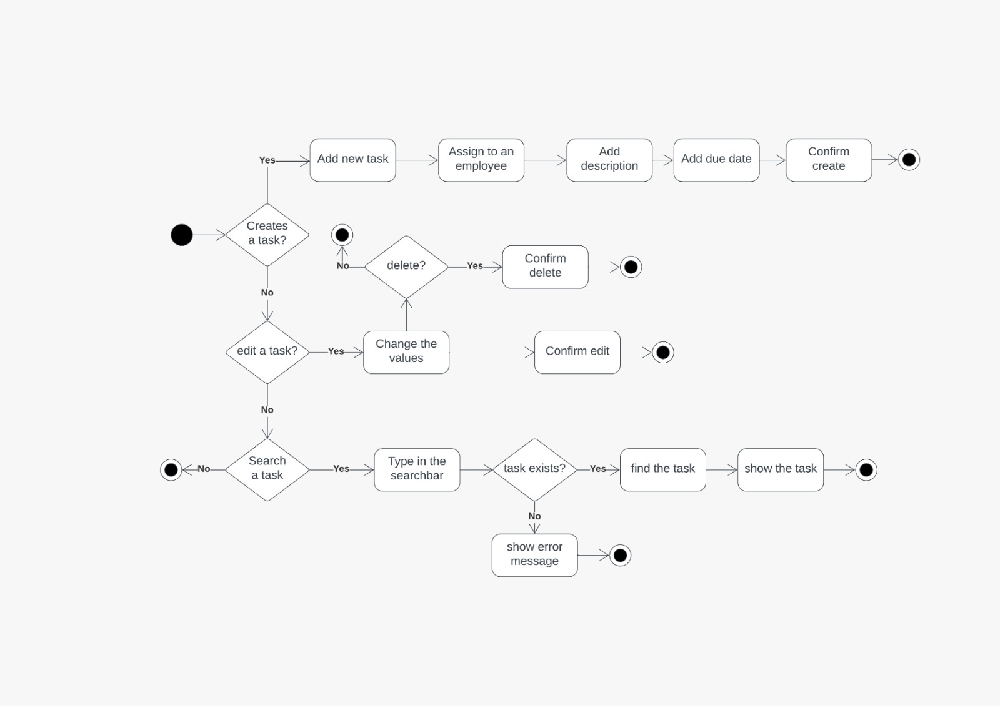
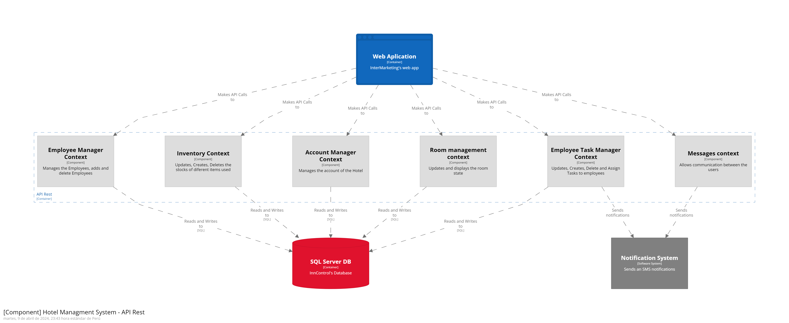
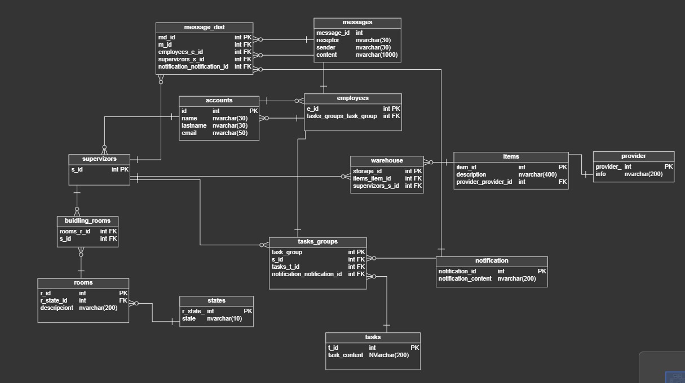
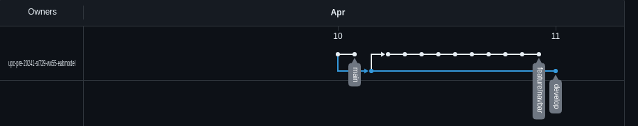
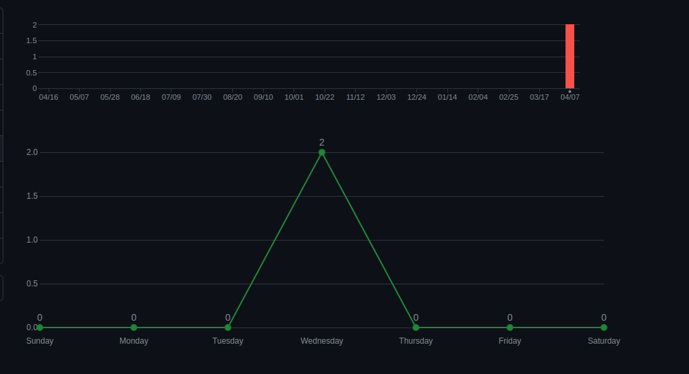

# <center>COURSE PROJECT</center>

<p align="center">
    <strong>Universidad Peruana de Ciencias Aplicadas</strong><br>
    <br>
    <strong>Ingeniería de Software</strong><br>
    <strong>OpenSource - WX55</strong><br>
    <strong>Profesor: Angel Augusto Velasquez Nuñez </strong><br>
    <br>INFORME
</p>


<center>

#### Startup: **EABMODEL**

#### Product: **INNCONTROL**

</center>

# Team  Members:

<div align="center">

|             Member             |    Code    |
|:------------------------------:|:----------:|
| Alex Ramon Alberto Avila Asto  | u20221a322 |
|   Sebastian Ramirez Hoffmann   |  u2011894  |
| Piero Fernando Periche Quiroga | u202210192 |
|  Manuel Sebastian Peña Rivera  | U202210138 |
|    Josue Hidalgo Bustamante    | U20219880  |

</div>

# Registro de Versiones del Informe

<div align="center">

| Version | Fecha      | Autor   | Descripcion de Modificacion |
|---------|------------|---------|-----------------------------|
| 0.0     | 24/03/2024 | Alex |  Crea documento      |
| 0.4     | 10/04/2024 | Sebastian R | Se aplican mejoras a las secciones del chapter 1 y 2 siendo especificamente Journey Mapping, Entrevistas y Competidores        |
| 0.5     | 10/03/2024 | Sebastian P | Se realiza un review a los mockups y wireframes         |
| 0.6     | 10/03/2024 | Josue | Realiza cambios en diagramas de clases y user flow        |
| 0.7     | 11/03/2024 | Sebastian | Se realizan cambios a la investigacion y el lean UX        |
| 0.8     | 10/03/2024 | Piero |  Se realizan cambios a toda la seccion 5.1       |
| 1.1     | 24/04/2024 | Sebastian | Realiza correcciones observadas en clase      |
| 1.2    | 27/04/2024 | Sebastian | Finaliza proceso LeanUX corregido      |


</div>

# Project Report Collaboration Insights

Repositorio: (https://github.com/upc-pre-20241-si729-wx55-eabmodel/report-project)

### TB1

Para la entrega del TB1 se han hecho las respectivas divisiones por cada capitulo con el objetivo de tener un workflow saludable y se pueda realizar una retroalimentacion activa, para cada actividad asignada se ha entregado un conjunto de sub indices por cada capitulo a los integrantes del grupo dejando la posibilidad de realizar correcciones entre los mismos integrantes.

Se muestran evidencias de los commits realizados en la entrega de la TB1

  

[Colaboraciones del repositorio]

  
[Registro de los commits donde se realizaron la mayor cantidad]

En ambos casos se puede observar el incremento de modificaciones y revisiones en la primera semana de abril.

---

### TP1

---

# Contenido

[Registro de Versiones del Informe](#registro-de-versiones-del-informe)

[Project Report Collaboration Insights](#project-report-collaboration-insights)

[Student Outcome](#student-outcome)

[Capítulo I: Introducción](#capítulo-i-introducción)

[1.1 Startup Profile](#11-startup-profile)  
[1.1.1. Descripción de la Startup](#111-descripción-de-la-startup)  
[1.1.2. Perfiles de integrantes del equipo](#112-perfiles-de-integrantes-del-equipo)

[1.2. Solution Profile](#12-solution-profile)  
[1.2.1 Antecedentes y problemática](#121-antecedentes-y-problemática)  
[1.2.2 Lean UX Process.](#122-lean-ux-process)  
[1.2.2.1. Lean UX Problem Statements.](#1221-lean-ux-problem-statements)  
[1.2.2.2. Lean UX Assumptions.](#1222-lean-ux-assumptions)  
[1.2.2.3. Lean UX Hypothesis Statements.](#1223-lean-ux-hypothesis-statements)  
[1.2.2.4. Lean UX Canvas.](#1224-lean-ux-canvas)

[1.3. Segmentos objetivo.](#13-segmentos-objetivo)

[Capítulo II: Requirements Elicitation & Analysis](#capítulo-ii-requirements-elicitation--analysis)

[2.1. Competidores](#21-competidores)  
[2.1.1. Análisis competitivo]()  
[2.1.2. Estrategias y tácticas frente a competidores](#211-análisis-competitivo)

[2.2. Entrevistas](#22-entrevistas)  
[2.2.1. Diseño de entrevistas](#221-diseño-de-entrevistas)    
[2.2.3. Análisis de entrevistas](#223-análisis-de-entrevistas)

[2.3. Needfinding](#23-needfinding)  
[2.3.1. User Personas](#231-user-personas)  
[2.3.2. User Task Matrix](#232-user-task-matrix)  
[2.3.3. User Journey Mapping](#233-user-journey-mapping)  
[2.3.4. Empathy Mapping](#234-empathy-mapping)  
[2.3.5. As-is Scenario Mapping](#235-as-is-scenario-mapping)

[2.4. Ubiquitous Language](#24-ubiquitous-language)

[Capítulo III: Requirements Specificatio](#capítulo-iii-requirements-specification)

[3.1. To-Be Scenario Mapping](#31-to-be-scenario-mapping)

[3.2. User Stories](#32-user-stories)

[3.3. Impact Mapping](#33-impact-mapping)

[3.4. Product Backlog](#34-product-backlog)

[Capítulo IV: Product Desig](#capítulo-iv-product-design)

[4.1. Style Guidelines](#41-style-guidelines)  
[4.1.1. General Style Guidelines](#411-general-style-guidelines)  
[4.1.2. Web Style Guidelines](#412-web-style-guidelines)

[4.2. Information Architecture](#42-information-architecture)  
[4.2.1. Organization Systems](#421-organization-systems)  
[4.2.2. Labeling Systems](#422-labeling-systems)  
[4.2.3. SEO Tags and Meta Tag](#423-seo-tags-and-meta-tags)  
[4.2.4. Searching Systems](#424-searching-systems)   
[4.2.5. Navigation Systems](#425-navigation-systems)

[4.3. Landing Page UI Design](#43-landing-page-ui-design)   
[4.3.1. Landing Page Wireframe](#431-landing-page-wireframe)  
[4.3.2. Landing Page Mock-up](#432-landing-page-mock-up)

[4.4. Web Applications UX/UI Design](#44-web-applications-uxui-design)  
[4.4.1. Web Applications Wireframes](#441-web-applications-wireframes)  
[4.4.2. Web Applications Wireflow Diagrams](#442-web-applications-wireflow-diagrams)  
[4.4.3. Web Applications Mock-ups](#442-web-applications-mock-ups)   
[4.4.4. Web Applications User Flow Diagrams](#443-web-applications-user-flow-diagrams)

[4.5. Web Applications Prototyping](#45-web-applications-prototyping)

[4.6. Domain-Driven Software Architecture](#46-domain-driven-software-architecture)  
[4.6.1. Software Architecture Context Diagram](#461-software-architecture-context-diagram)  
[4.6.2. Software Architecture Container Diagrams](#462-software-architecture-container-diagrams)  
[4.6.3. Software Architecture Components Diagrams](#463-software-architecture-components-diagrams)

[4.7. Software Object-Oriented Design](#47-software-object-oriented-design)  
[4.7.1. Class Diagrams](#471-class-diagrams)  
[4.7.2. Class Dictionary](#472-class-dictionary)

[4.8. Database Design](#48-database-design)  
[4.8.1. Database Diagram](#481-database-diagram)

[Capítulo V: Product Implementation, Validation & Deploymen](#capítulo-v-product-implementation-validation--deployment)

[5.1. Software Configuration Management](#51-software-configuration-management)  
[5.1.1. Software Development Environment Configuration](#511-software-development-environment-configuration)  
[5.1.2. Source Code Management](#512-source-code-management)  
[5.1.3. Source Code Style Guide & Conventions](#513-source-code-style-guide--conventions)  
[5.1.4. Software Deployment Configuration](#514-software-deployment-configuration)

[5.2. Landing Page, Services & Applications Implementation](#52-landing-page-services--applications-implementation)  
[5.2.X. Sprint ](#52x-sprint-n)  
[5.2.X.1. Sprint Planning n](#52x1-sprint-planning-n)  
[5.2.X.2. Sprint Backlog n](#52x2-sprint-backlog-n)  
[5.2.X.3. Development Evidence for Sprint Review](#52x3-development-evidence-for-sprint-review)  
[5.2.X.4. Testing Suite Evidence for Sprint Review](#52x4-testing-suite-evidence-for-sprint-review)  
[5.2.X.5. Execution Evidence for Sprint Review](#52x5-execution-evidence-for-sprint-review)  
[5.2.X.6. Services Documentation Evidence for Sprint Review](#52x6-services-documentation-evidence-for-sprint-review)  
[5.2.X.7. Software Deployment Evidence for Sprint Review](#52x7-software-deployment-evidence-for-sprint-review)  
[5.2.X.8. Team Collaboration Insights during Sprint](#52x8-team-collaboration-insights-during-sprint)

[5.3. Validation Interviews](#53-validation-interviews)  
[5.3.1. Diseño de Entrevistas](#531-diseño-de-entrevistas)  
[5.3.2. Registro de Entrevistas](#532-registro-de-entrevistas)  
[5.3.3. Evaluaciones según heurísticas](#533-evaluaciones-según-heurísticas)

[5.4. Video About-the-Product](#54-video-about-the-product)

[Conclusiones](#conclusiones)

[Conclusiones y recomendaciones](#conclusiones-y-recomendaciones)

[Video About-the-Team](#video-about-the-team)

[Bibliografía](#bibliografía)

[Anexos](#anexos)

# Student Outcome

| Criterio Especifico                                                                                                                                  | Acciones Realizadas                                                                                                                                                                                                                                                                                                                                                                                                                                                                                                                                                      | Conclusiones                                                                                                                                                                                                                                                                                                                                                                                                                                                                                                                                                                                                                                   |
|------------------------------------------------------------------------------------------------------------------------------------------------------|--------------------------------------------------------------------------------------------------------------------------------------------------------------------------------------------------------------------------------------------------------------------------------------------------------------------------------------------------------------------------------------------------------------------------------------------------------------------------------------------------------------------------------------------------------------------------|------------------------------------------------------------------------------------------------------------------------------------------------------------------------------------------------------------------------------------------------------------------------------------------------------------------------------------------------------------------------------------------------------------------------------------------------------------------------------------------------------------------------------------------------------------------------------------------------------------------------------------------------|
| Participa en equipos multidisciplinarios con eficacia, eficiencia y objetividad, en el marco de un proyecto en soluciones de ingeniería de software. | **Sebastian Ramirez Hoffmann**: [<br> **TB1:** <br>  Como team leader tuve la asignacion de proporcionarle sus partes a mis compañeros, de estas tareas asignadas realice los sub indices del **capitulo 1** especificamente siendo Lean UX Process y parte de las correcciones de antecedentes y problematica.<br> Del **capitulo 2** participe en el analisis de competidores y realice partes del needfinding de las entrevistas, asimismo como el recuadro As-Is.<br> Del **capitulo 3** realice To-Be scenario mapping.<br> Finalmente participe activamente en el **capitulo 4** en el subindice 4.6 y parte del 4.6 participando en los diagramas de contenedores y contexto asimismo como en el diagrama de base de datos. Respecto al **capitulo 5** apoye realizando revisiones del capitulo y mis aportes a la Landing Page ] <br><br> **Manuel Sebastian Peña Rivera**: <br> *TB1:*  Participe en secciones del capitulo 1,2, 3 y 4 que contienen entrevistas, empathy map, product backlog, impact map, user task matrix, general style guidelines, web applications desktop and mobile wireframes, web applications desktop and mobile mockups, user flow<br/> **Alex Avila Asto**: <br/> TB1: Participe en las secciones del capitulo 2 y 5                                                                                | **SebastianRamirezHoffmann**:<br>  Como conclusion fue gracias a mi participacion en los primeros capitulos, los cuales dejan una idea general de lo que somos como empresa y lo que representa nuestro producto ayudandome a poder dar observaciones y controles de calidad asi como observaciones de lo que mis compañeros van realizando  <br><br> **Manuel Sebastian Peña Rivera**:<br> Realizar la investigación necesaria para el proyecto permite conocer la realidad de los desafíos que presentan y como nuestro programa puede solucionar el problema es nuestro objetivo en mente  <br/> **Alex Avila Asto**: <br/> Al realizar el informe adquire informacion valiosa con la cual me di cuenta que el rubo hotelero presenta bastante problemas con respecto a la implentacion de la tecnologia. |
| Conoce al menos un sector empresarial o dominio de aplicación de soluciones de software.                                                             | **Sebastian Ramirez Hoffmann**:[<br> **TB1:**<br> He realizado parte de la investigacion del proyecto tanto entrevistas como revisar articulos, por lo que he revisado estadisticas en base a la importancia del producto en el mercado, asimismo con el analisis de competidores apoye a darles la idea general del proyecto a mis colegas, al tener familiares que se especializan en el mercado orientado a nuestro producto recibi ideas externas por parte de estos mismos para comunicar a mis compañeros en congregaciones que se dieron en grupo.]<br> **Manuel Sebastian Peña Rivera**:<br>  No solo la investigación realizada, sino que la entrevista que realice me permitió conocer sobre las dificultades y experiencia laboral del gerente en el rubro de hospedaje. <br/>**Alex Avila Asto**:<br/>El rubo de mi familia es hotelero, lo cual me ayudo para poder realizar junto con mis compañero el informe. | **SebastianRamirezHoffmann**:<br>Fue gracias a las investigaciones que que logre tener una idea mas concreta de lo que debemos de hacer como empresa para asegurar la efectividad de nuestro proyecto tomando en consideracion las necesidades y competidores existentes en el mercado.<br> Manuel Sebastian Peña Rivera:<br> Con la información reunida de la entrevista espero poder adaptar las necesidades al proyecto y que nuestro proyecto le sirva para mejorar la eficiencia de su trabajo <br/> **Alex Avila Ast**o: Con esta informacion estoy convencido que nuestro proyecto tendra un buen impacto en el rubo hotelero.                                                                                                                                                                 |

# Capítulo I: Introducción

## 1.1. Startup Profile

### 1.1.1. Descripción de la Startup

Nuestra startup "InnControl" es un servicio de gestion orientado a negocios en el rubro de hospedajes u hotelería el
cual provee un seguimiento de inventario, empleados, espacios, tiempos y servicios utilizados en el proceso del
servicio. Asimismo mantendrá igualmente un contacto tanto con los empleados como sus gerentes.
gerentes.

#### 1.1.2. Perfiles de integrantes del equipo

| Miembros del equipo                                                                                                   | Codigo Estudiante | Carrera                | Conocimientos / Habilidades                                                              |
|-----------------------------------------------------------------------------------------------------------------------|-------------------|------------------------|------------------------------------------------------------------------------------------|
| Avila Asto, Alex Ramon Alberto <br/>                    | U20221a322        | Ingeniería de software | C++, Python, Kotlin, Dart, SQL, MongoDB, Java. Responsabilidad y trabajo en equipo.      |
| Peña Rivera, Manuel Sebastian <br/>                     | U202210138        | Ingeniería de software | C++, Python, MongoDB, SQL, Assembler. Responsabilidad y Buena Comunicación               | 
| Ramírez Hoffmann, Sebastián <br/>  | U20221894         | Ingeniería de software | C++, Python, Js, Reactjs, NodeJs, expressjs, MongoDB, SQL.  Paciencia, Liderazgo, Logico |
| Periche Quiroga, Piero <br/>       | U202210192        | Ingeniería de software | C++, SQL, Js. Responsabilidad y buen ambiente de equipo                                  |
| Hidalgo Bustamante, Josue                                | U20219880         | Ingeniería de software | C++, SQL,  MongoDB, Js, Reactjs, NodeJs,. Paciencia y Responsabilidad.                   |

## 1.2. Solution Profile

### 1.2.1 Antecedentes y problemática

En el Peru se ha detectado una falta de inversion turistica menciona María Alejandra Gonzales(2023) donde podemos
observar asimismo a Blanca Chavez Vocera de la asociacion de hoteles, restaurantes y afines la visible preocupacion de
una falta de incentivos economicos debido a las crisis que hemos sufrido ultimamente. Al existir esta problematica la
mejor opcion es demostrar las capacidades de adaptacion y efectividad de gestion por parte de los mismos hoteles y
hostales en mejorar sus servicios reduciendo costos y aumentando la calidad.

La industria hotelera esta actualizandose implementando la digitalizacion y reduciendo el tiempo en las operaciones de
gestion. Segun Eva Lacalle (2023), "La tecnología ayuda a ofrecer un servicio fluido, proporciona mayor independencia a
los huéspedes, automatiza tareas tediosas y brinda una mejor experiencia para todas las partes involucradas."
adicionalmente menciona como los beneficios del uso tecnologico aumenta la competitividad en el mercado generando de
esta manera un flujo constante de mejora.

En 2024 el equpo de BIMnD comparte como la digitalizacion ayuda a la sostenibilidad de los establecimientos hoteleros y
como por medio de distintas tecnologias se llega a aplicar funcionalidades futuristas como vienen siendo tours
digitales, o gestionamiento en 3D. Estas funcionalidades se llegan a implementar en algunos lugares de europa y aumentan
considerablemente la eficiencia de sus establecimientos.

| ¿What? - ¿Cuál es el problema?           | El proyecto EABMODEL con su plataforma InnControl busca mejorar la problematica la cual trata de una mala gestion dentro del sector hotelero, el cual genera una mala coordinacion y por lo tanto afecta a la experiencia del usuario.                                                                                                                           |
|------------------------------------------|------------------------------------------------------------------------------------------------------------------------------------------------------------------------------------------------------------------------------------------------------------------------------------------------------------------------------------------------------------------|
| ¿Who? - ¿Quienes son los beneficiarios?  | InnControl es un servicio de gestión orientado a negocios en el rubro de hospedaje u hotelería el cual provee un seguimiento de inventario, empleados, espacios, tiempos y servicios utilizados en los procesos. Asimismo mantendrá igualmente un contacto tanto con los proveedores del negocio como sus mismo empleados y gerentes.                            |
| ¿Where? - ¿Donde se origina el problema? | La problemática se extiende a nivel global en entornos hoteleros, donde la falta de coordinacion o de gestion dentro de una empresa afecta a la eficiencia y a la experiencia del usuario. InnControl ofrece una solucion aplicable en cualquier ubicacion que cuente con servicios de hospedaje y hoteleria, mejorando la coordinacion y los procesos empleados |
| ¿When? - ¿Cuando se origina el problema? | La necesidad de esta solucion surge en el contexto actual de la atencion en los hospedajes u hoteles, donde la urgencia de modernizar y organizar procesos es evidente. La ayuda y herramientas de InnControl es relevante, ya que ofrece mejoras inmediatas en la coordinacion y eficiencia de la atencion dentro del sector.                                   |
| ¿Why? - ¿Por qué se origina el problema? | La falta de coordinacion, la desconexión en la atencion hotelera y los procesos manuales motivan la busqueda de una solucion. InnControl aborda estas problemáticas para mejorar la calidad de atención, proporcionar una operativa mas eficiente y preparar el sector para una atencion mas conectada.                                                          |
| ¿How? - ¿Como se origina el problema?    | InnControl implementa tecnologia para digitalizar la gestion de inventario, espacios, tiempos y servicios usados en los procesos. La plataforma facilita la colaboracion entre proovedores del negocio, asi como sus empleados y gerentes.                                                                                                                       |
| ¿How much?                               | El proyecto busca maximizar el valor proporcionado en terminos de eficiencia operativa y mejora en la atencion hotelera. En el ambito economico es crucial reducir costos asociados a procesos ineficientes y errores en la gestion.                                                                                                                             |

5 w's 2 h

Concientiza de la importancia de las ONG.

Why (¿Porque se está haciendo?): Se hace esta aplicacion web con el objetivo de que los establecimientos de hoteleria o
de hospedaje tengan una plataforma de gestion accesible, facil de utilizar y eficiente para realizar un conjunto de
actividades tales como la gestion de inventario, tiempos de habitacion, horarios de limpieza y servicio y entre otros
distintos procedimientos que normalmente se hacen de manera estatica, con nosotros esto pasa a ser mas dinamico y
modificable segun las necesidades del usuario.

When (¿Cuándo se usa?): Se usa cuando el usuario tenga la necesidad de gestionar distintos procesos de administracion de
su negocio de hospedaje u hoteleria, en los tiempos donde hay un incremento en la clientela o cuando el negocio requiere
hacer distintas cantidades de procesos de manera rapida.

Where (¿Dónde se usa?): El uso esta diseñado para Perú inicialmente ya que ademas de poder realizar un seguimiento local
del funcionamiento de la aplicacion web tambien se podra mejorar el estado actual de nuevos emprendimientos de hospedaje
y hoteleria.

Who (¿Quién lo usa?): Lo usan como administradores los gerentes o supervisores de los establecimientos ya que este
servicio es una herramienta para ellos, si bien se pueden automatizar funciones como la notificacion para empleados, lo
principal seria que los mismos supervizores hagan seguimiento de los procesos que se estan llevando al cabo en caso de
que se tenga que hacer alguna operacion manual.

How Much (¿Cuánto costaría?): La aplicacion web tendra sus funcionalidades core a forma de un pago inicial y luego
mensual proporcional a la cantidad de habitaciones que tenga que gestionar el negocio, es decir entre mas cuartos se
encuentren presentes el servicio tendra que almacenar mas procesos para cada habitacion, por esta razon se implementara
un paquete para asi poder fomentar la accesibilidad a los nuevos emprendimientos. Los paquetes de suscripcion variaran
de entre hostal, hotel, y sus respectivas tarifas por cantidad de habitaciones.

How (¿Cómo se lleva al cabo?) La aplicacion web tendra su espacio workspace donde el gestor podra revisar los distintos
procesos que se estan llevando al cabo, es decir diferentes recuadros mostrando estos procesos como por ejemplo, el
siguiente envio programado de inventario, horarios de limpieza o checkout inminentes, habitaciones libres, en proceso de
limpieza o ocupadas, habitaciones que esten solicitando algun servicio adicional (esto en caso el establecimiento lo
ofrezca) entre otros. Las habitaciones tendran que ser registradas de manera semi automatica donde se tendran que
especificar cuantos cuartos hay por piso y que servicio proporcionan, una vez se haga esto se generaran todos los
cuartos con sus distintos numeros de habitacion, servicios y estado. Tambien existiran los demas cuadros en la
aplicacion web donde se tendra que especificar los horarios donde se deban de hacer los registros de inventario y el
suministro de estos junto con otros procesos adicionales como lavanderia, manutencion de plantas u alguna otra
funcionalidad que desee agregar el gestor.

### 1.2.2 Lean UX Process.

#### 1.2.2.1. Lean UX Problem Statement.


En el estado actual de la industria de hoteleria y hospedaje muchos establecimientos enfrentan desafíos significativos en la gestión interna
de sus operaciones. La falta de coordinación y eficiencia en la gestión del inventario, el personal, los espacios y los
servicios afecta negativamente tanto la experiencia del usuario como la eficiencia operativa. Esta falta de coordinación
puede llevar a errores en la asignación de recursos, retrasos en la atención al cliente y una experiencia general
insatisfactoria para los huéspedes.

Lo que otros productos han fallado en realizar son los rapidos cambios en la digitalizacion dejando sus softwares obsoletos o con cambios que resultan ser pobres en experiencia de usuario. Además, los gerentes de hoteles se enfrentan a la presión de mantener altos estándares de calidad y eficiencia, mientras
lidian con procesos manuales y sistemas obsoletos que consumen tiempo y recursos. Esta falta de herramientas adecuadas
para la gestión puede tener un impacto directo en la rentabilidad del negocio y en la satisfacción del cliente.

Nuestro producto se enfocara en proporcionar funcionalidades mas intuitivas al usuario, un mejor sistema de gestion para poder observar todos los aspectos necesarios, la capacidad de poder mantener una comunicacion entre gerentes y empleados y fomentando la accesibilidad para modelos de negocio pequeños que tienen la capacidad de digitalizarse.

Nuestro enfoque principal sera el ofrecer este servicio a los gerentes de hotel para que evaluen con sus empleados los beneficios que proveemos. 

Como resultado, nos enfrentamos al siguiente problema: ¿Cómo podemos proporcionar a los gerentes de hoteles una
plataforma de gestión accesible y eficiente que les permita coordinar de manera efectiva el inventario, los empleados,
los espacios y los servicios, para mejorar la experiencia del usuario y optimizar los procesos operativos en un 45%?

Nuestro producto se encargara de esto al proporcionar un servicio de gestion que pueda digitalizar, optimizar y solucionar los procesos de gestion en procesos de hoteleria y hostales. 

Sabremos que tuvimos exito cuando se pueda observar un minimo de 45% de satisfaccion en encuestas de control donde los gerentes y empleados que utilizaron la aplicacion hayan logrado una mejorada calidad de trabajo y asimismo un crecimiento de 5% en la industria turistica.


#### 1.2.2.2. Lean UX Assumptions.

**Business Outcome**  
En esta seccion vamos a usar las metricas de Montaña que ha conceptualizada por Jeff Gothelf e implementaremos algunas de las pirate metrics para poder definir los niveles de la montaña para llegar poder analizar los comportamientos de nuestros usuarios y analizar que parte del User Journey es relevante para nosotros y hacer un assumption de como actuaran nuestros usuarios en base al producto.

Acquisition: (Base): [1000 visitantes]
El usuario se percatara de nuestra solucion por medio de las redes sociales como medio de comunicacion asimismo promocionando nuestra landing page, de misma manera intentaremos ofrecer el servicio a los mismos usuarios con metodos de comunicacion directa como por ejemplo ofrecerle el servicio a la institucion donde trabaja (hotel/hostal).

Activacion: (Plateau):[450 users : 100% users]
En esta seccion el usuario gerente crea su cuenta registrando su correo ya sea personal o de la institucion, metodos de pago, las dimensiones del negocio es decir la cantidad de habitaciones por piso y finalmente un codigo de autenticacion para los empleados que deban de generar una cuenta.
De los usuarios que se percatan del producto esperamos que el 45% se anime a utilizarlo.

Retention: (Plateau + 1 level):[60% users]
De los usuarios que se animaran a utilizarlo esperamos que el 60% de estos continue utilizando nuestro producto diariamente para gestionar a sus empleados y habitaciones. En esta seccion el usuario utiliza las herramientas que le proporciona nuestro producto para la gestion de cuartos, ya tiene a sus empleados asignados y les asigna sus tareas mientras que estos mantienen una comunicacion continua.

Revenue: (Plateau + 2 levels):[10% users]
Los usuarios que utilizan nuestro producto son usuarios estrictamente de paga, no obstante si es que llegara la situacion donde su negocio se expande entonces van a tener mas empleados, mas cuartos y excederan el limite que le proporcionamos en su plan inicial. De esta manera se espera que un 10% de los usuarios retenidos que consigan este crecimiento estaran dispuestos a mejorar su plan generandonos un mayor ingreso.

Referral:(top) [5% users]
Finalmente de los usuarios que retenimos esperamos que un 5% de estos nos referencien a sus colegas o a nuevos emprendedores indirectamente promocionandonos y aumentando el flujo de usuarios potenciales que podemos obtener.

**Users**  
En esta seccion creamos un Proto-Persona como un assumption de como son nuestros usuarios enfocandonos mas en el aspecto de actitud.

|Demografica|Comportmamiento|Necesidades / Obstaculos|
|-|-|-|
|Alex:<br>35 años <br> Gestor de hotel/hostal| - Trabaja en un hotel/hostal <br> -Gana lo suficiente <br> - Enfocado en la gestion de tareas <br> - Busca que todo este en orden | - Necesita aumentar el area de gestion <br> -Necesita mejorar la asignacion de tareas <br> - Requiere de una mejor comunicacion con los demas empleados a quienes asigna las tareas <br> - Obstaculo: El hotel utiliza herramientas obsoletas o no tiene alguna para asignar tareas <br> - Obstaculo: Utilizan medios no formales como whatsapp para comunicarse lo que complica la comunicacion eficiente. <br> - Busca mejorar la organizacion del hotel/hostal |
|Carla:<br> 27 años <br> Empleada de limpieza | -Gana lo minimo <br> -Enfocada en el cumplimiento de tareas <br> -busca terminar su trabajo de manera rapida|- Necesita un medio de comunicacion directo con su gestor <br> -Necesita una manera de notificar la falta de algun objeto que necesite <br> -Necesita notificar que cuartos ya estan listos y saber cuales debe de preparar <br> -Obstaculo: Todos hablan en el mismo grupo de whatsapp y se pierden tareas <br> - Obstaculo: No hay un registro seguro de las tareas que se les fueron asignadas <br> - Busca comunicar de inmediato a su supervizor el estado de una habitacion <br> -Busca avisar si falta algun objeto necesario para la preparacion de la habitacion |

Esta tabla refleja los dos principales usuarios que tenemos como assumption junto con sus necesidades y comportamientos en el area laboral.

**User Outcomes & Benefits**

En esta seccion se busca el lado mas emocional y empatizar con el usuario para darles los outcomes correctos.


Que busca lograr el usuario?
Quiero notificar a mi supervisor que necesito ciertos materiales para realizar mis tareas.<br>
Como se quiere sentir el usuario en este proceso?
Quiero sentirme como si tuviera una linea directa con el supervisor.<br>
Como nuestro producto acerca al usuario a un logro personal?
Quiero sentirme escuchado y tomado en consideracion.<br>
Porque nuestro usuario buscaria nuestro producto?
Quiero que mis tareas se puedan realizar sin problemas.<br>
Que cambio de comportamiento podemos observar que nos cuenta que lograron su objetivo?
Sabremos que tuvimos exito cuando el usuario presente una comunicacion efectiva con su supervizor utilizando nuestro producto en el area laboral.<br><br>
Que busca lograr el usuario?
Quiero revisar los estados de cuarto.<br>
Como se quiere sentir el usuario en este proceso?
Quiero sentirme como que con solo ver ya puedo saber en que estado se encuentra un cuarto.<br>
Como nuestro producto acerca al usuario a un logro personal?
Quiero sentir que puedo manejarme y organizarme.<br>
Porque nuestro usuario buscaria nuestro producto?
Quiero realizar mis tareas de manera que sea tan facil como mirar por la ventana.<br>
Que cambio de comportamiento podemos observar que nos cuenta que lograron su objetivo?
Sabremos que tuvimos exito cuando el usuario presente un monitoreo rapido de habitaciones utilizando nuestro producto en el area laboral.<br><br>
Que busca lograr el usuario?
Quiero mantenerme comunicado con mi (gerente/empleado) para poder (entregar/recibir) tareas.<br>
Como se quiere sentir el usuario en este proceso?
Quiero sentirme como que puedo ver todos los aspectos logisticos del hotel en un solo lugar.<br>
Como nuestro producto acerca al usuario a un logro personal?
Quiero sentir que tengo el control de mis acciones.<br>
Porque nuestro usuario buscaria nuestro producto?
Quiero hacer mas trabajo en menor tiempo y que no me cueste mucho hacerlo.<br><br>
Que cambio de comportamiento podemos observar que nos cuenta que lograron su objetivo?
Sabremos que tuvimos exito cuando el usuario tenga una facilidad en comunicarse y realizar sus tareas en el area laboral utilizando nuestro producto.


Este analisis de user Outcomes sirve para ambos segmentos en ciertos casos ya que tienen un objetivo similar y se puede comprender el contexto desde ambas perspectivas.

**Solutions**

Si bien Gothelf menciona en su libro LeanUX 3rd Edition que debemos utilizar elementos fisicos como post its y demas para esta entrega realizamos una llamada para definir nuestras soluciones supuestas.

Tomando en cuenta las restricciones anteriormente seleccionadas realizamos las siguiente solucione:

Desarollar un gestor de hoteleria y hostales orientado a realizar la mayoria de prorcesos de gestion principales siendo:

- **El monitoreo de estados de cuartos** - notifica sin la necesidad de usar algun sistema de comunicacion como whatsapp el estado actual de un cuarto. Tomar en consideracion las validaciones necesarias.
- **La entrega de tareas** - entrega las tareas remotamente a los empleados sin necesidad de que se tenga que decir una palabra entre usuarios asimismo permite el monitoreo de esta. Tomar en consideracion que solo el usuario con la tarea asignada puede terminar esta tarea.
- **La revision de inventario** - permite que se pueda hacer un seguimiento de los items que se tienen en la bodega del negocio los cuales se deben registrar cuando son agregados o quitados. Tomar en consideracion que podemos agregar los proovedores de dichos productos.
- **La comunicacion empleado/gerente** - sistema de comunicacion para emergencias o dudas donde se mantiene una linea de comunicacion directa y sin distractores entre el gerente y el empleado, de misma manera puede servir para monitorear que mensajes se han mandado.
  

#### 1.2.2.3. Lean UX Hipotesis Statements.

**Hipotesis**

Siguiendo el formato de las Hipotesis usaremos la tabla de hipotesis.
Tomar en cuenta que cada hipotesis empieza con "Creemos que.."

|Business Outcome|Persona|User Outcome|Feature/Solution|
|-|-|-|-|
|Conseguiremos una retencion del 20% de usuarios | Si los gerentes de hoteles/hostales | entregan tareas a sus empleados | con el sistema de comunicacion para emergencias o dudas |
|Conseguiremos una retencion del 20% de usuarios optima | Si los gerentes de hoteles/hostales | logran monitorear los estados de cuarto | con el sistema de monitoreo de cuartos |
|Conseguiremos una retencion del 60% de usuarios optima | Si los gerentes de hoteles/hostales | se sienten en control de sus actividades | con las herramientas de gestion que estamos ofreciendo, estas siendo monitoreo de estados de cuartos, entrega de tareas, revision de inventario y sistema de comunicaciones |
|Conseguiremos una retencion del 20% usuarios optima | Si los gerentes de hoteles/hostales | Notifican de los items necesitados al gerente | con el sistema de comunicacion entre empleado y gerente |
|Conseguiremos que 10% de nuestros usuarios nos genere una ganancia | Si los gerentes de hoteles/hostales | mejoran el plan de su cuenta | proveyendo al usuario de la posibilidad de mejorar su cuenta |
|Conseguiremos que 5% de nuestro usuarios nos referencien | Si los gerentes de hoteles/hostales y empleados | logran una comunicacion entre gerente y empleado efectiva | con el sistema de comunicacion entre empleado y gerente |
|Conseguiremos que 45% de nuestra adquisicion de usuarios vengan de nuestra pagina | Si los gerentes de hoteles/hostales y empleados | encuentran nuestra solucion como una posibilidad de mejora | con la landing page implementada |

**Que es lo mas importante que debemos aprender**

Debemos de analizar que es lo que debemos aprender de nuestras Hipotesis, entonces llegamos a nuestra siguiente conclusion respecto a lo mas importante que debemos aprender:

Los usuarios estaran interesados en nuestra "innovadora" propuesta dado que existen otros productos similares y asimismo, realmente la necesitan?

**Minimum viable product**

Los MVP nos sirven para aprender cosas a corto plazo. para realizar esto se hace la pregunta: 
What’s the most important thing we need to learn first?
Lo primero que debemos de confirmar para nuestro proyecto es **si realmente se esta requiriendo en el mercado**, es por esta misma razon que tendremos que realizar una serie de entrevistas a gerentes de hotel/hostal y sus empleados para poder probar que si existe una necesidad que estamos satisfaciendo. Adicionalmente crear una landing page realizando un MVP para los usuarios que esten interesados en este producto.


#### 1.2.2.4. Lean UX Canvas.

Finalmente juntamos todo lo que hemos hecho en este proceso y lo agregamos en un Lean UX Canvas (V2) guiandonos del ejemplo que nos proporciona Jeff Gothelf [Anexo 1.1]

<image src ="./assets/lean-ux/lean-ux-canvas/Lean UX Canvas (V2) - Inn Control.jpg" alt ="LeanUX Canvas (V2) [implementando lean UX 3]">


## 1.3. Segmentos objetivo.

|                           | Segmento 1                                                                                                                                   | Segmento 2                                                                                                                                                                                                  |
|---------------------------|----------------------------------------------------------------------------------------------------------------------------------------------|-------------------------------------------------------------------------------------------------------------------------------------------------------------------------------------------------------------|
| Variables                 | Empleado negocio                                                                                                                             | Gestor del negocio                                                                                                                                                                                          |
| Geográfica                | Ubicación cercana al establecimiento hotelero o de hospedaje                                                                                 | Preferiblemente ubicado en la misma región donde se encuentra el negocio                                                                                                                                    |
| Demográfica               | Diversidad en edad y género                                                                                                                  | Edad adulta, posiblemente con formación universitaria en áreas relacionadas con administración o gestión                                                                                                    |
| Psicológica               | Actitud hacia la adopción de nuevas tecnologías, motivación para mejorar la eficiencia en el trabajo                                         | Orientado hacia la eficiencia y mejora continua, interés en adoptar soluciones tecnológicas para optimizar la operación del negocio                                                                         |
| Función de comportamiento | Necesidad de herramientas que faciliten la realización de tareas diarias, interés en optimizar procesos para mejorar la calidad del servicio | Necesidad de herramientas que le permitan supervisar y gestionar eficientemente todas las áreas del negocio, prioriza la mejora de la experiencia del cliente y la optimización de los recursos disponibles |

---

# Capítulo II: Requirements Elicitation & Analysis

## 2.1. Competidores.

## 2.1.1. Análisis Competitivo

**Competitive Analysis Landscape**

| ¿Por qué llevar a cabo este análisis? | Nosotros | Cloudbeds | SiteMinder |
|---------------------------------------|----------|-----------|------------|
| **Overview**                          | Nuestra startup está enfocada en desarrollar una plataforma integral para la gestión eficiente de negocios relacionados con la administración de habitaciones, con un enfoque en la industria hotelera. | Cloudbeds ofrece una solución de gestión hotelera basada en la nube que incluye herramientas para la administración de propiedades, reservas y distribución. | SiteMinder proporciona una plataforma de distribución hotelera y una suite de herramientas de gestión que incluyen gestión de tarifas, disponibilidad de habitaciones y canal de reservas en línea. |
| **Ventaja Competitiva**               | Nuestra plataforma ofrece una solución integral que abarca desde la gestión de habitaciones hasta la comunicación interna y la generación de informes de desempeño del personal. | Cloudbeds se destaca por su interfaz fácil de usar y su capacidad para integrarse con una amplia gama de sistemas y servicios de terceros. | SiteMinder se enfoca en maximizar la visibilidad en línea y la distribución de habitaciones a través de una amplia red de canales de reserva. |
| **Mercado Objetivo**                  | Nos dirigimos a hoteles independientes y pequeñas cadenas hoteleras que buscan mejorar su eficiencia operativa y experiencia del cliente. | Cloudbeds se enfoca en hoteles boutique y propiedades independientes que buscan una solución completa de gestión hotelera en la nube. | SiteMinder atiende a hoteles de todos los tamaños, desde pequeños establecimientos independientes hasta grandes cadenas hoteleras. |
| **Perfil de Marketing**               | Nuestra estrategia de marketing se centra en la promoción de nuestra plataforma a través de redes sociales y asociaciones con organizaciones de la industria hotelera. | Cloudbeds utiliza estrategias de marketing digital y participa en eventos de la industria para promover su marca y sus soluciones. | SiteMinder utiliza una combinación de marketing en línea y fuera de línea, incluidas campañas en redes sociales y publicidad en eventos de la industria. |
| **Perfil del Producto**               | Ofrecemos una variedad de herramientas y servicios, desde la gestión de habitaciones hasta la generación de informes de desempeño del personal, todo dentro de una plataforma fácil de usar y personalizable. | Cloudbeds ofrece funcionalidades como gestión de reservas, administración de canales de distribución y herramientas de informes en una interfaz intuitiva. | SiteMinder proporciona herramientas para gestionar tarifas, disponibilidad de habitaciones y reservas en línea, junto con análisis y generación de informes. |
| **Precios**  | Nuestro plataforma es de pago y contiene diferentes tipos de planes Starter, Standar y Exclusive  para satisfacer el tamaño del hotel/hostal del usuario segun la cantidad de cuentas de empleado y cuartos. |Cloud beds ofrece una tarifa dinamica segun los datos que ingrese un usuario teniendo los tipos de plan Pro y 360 |SiteMinder ofrece 3 tipos de planes los dos primeros siendo para alojamientos idependientes ofreciendo una prueba gratuita contando con el plano normal y el Plus adicionalemnte cuenta con planes para grupos hoteleros. |


## 2.1.2. Estrategias y Tácticas Frente a Competidores


**Análisis SWOT** | Nosotros | Cloudbeds | SiteMinder
--- | --- | --- | ---
**Fortalezas** | Nuestra plataforma ofrece una solución integral y fácil de usar para la gestión de habitaciones y la comunicación interna. Además, nos destacamos por nuestra flexibilidad de precios y personalización de características. | Cloudbeds tiene una interfaz intuitiva y se integra fácilmente con otros sistemas y servicios de terceros, lo que la convierte en una solución atractiva para hoteles independientes. | SiteMinder cuenta con una amplia red de distribución y visibilidad en línea, lo que ayuda a aumentar las reservas y la ocupación de habitaciones para los hoteles.
**Debilidades** | Como una startup emergente, podemos enfrentar desafíos en términos de reconocimiento de marca y alcance de mercado en comparación con competidores establecidos como Cloudbeds y SiteMinder. | Cloudbeds puede tener tarifas de suscripción más altas en comparación con otras soluciones, lo que puede limitar su atractivo para hoteles con presupuestos ajustados. | SiteMinder puede enfrentar desafíos en la retención de clientes debido a la competencia en el mercado de distribución hotelera en línea.
**Oportunidades** | Existe un mercado creciente de hoteles independientes y pequeñas cadenas hoteleras que buscan soluciones integrales y asequibles para mejorar su eficiencia operativa. | Cloudbeds puede expandir su alcance a través de asociaciones estratégicas con proveedores de servicios turísticos y organizaciones de la industria. | SiteMinder puede explorar nuevas oportunidades de crecimiento mediante la expansión a mercados emergentes y el desarrollo de características innovadoras para sus clientes.
**Amenazas** | La competencia en el mercado de gestión hotelera puede intensificarse, lo que podría dificultar la adquisición de clientes y la retención en el futuro. Además, los cambios en las preferencias del consumidor y las regulaciones gubernamentales pueden afectar la demanda de servicios hoteleros. | Cloudbeds puede enfrentar amenazas de nuevos competidores que ingresan al mercado con soluciones similares pero más económicas. Además, los cambios en la tecnología y la regulación pueden afectar la demanda y la rentabilidad de sus servicios. | SiteMinder puede enfrentar amenazas de la consolidación en la industria hotelera y la competencia de grandes OTAs (agencias de viajes en línea) que ofrecen servicios similares de distribución de habitaciones. Además, los cambios en los algoritmos de búsqueda en línea pueden afectar la visibilidad de los hoteles que utilizan su plataforma.

## 2.2. Entrevistas.

### 2.2.1. Diseño de entrevistas.

**Preguntas generales:**

En esta seccion realizamos preguntas simples para tener una demografica e informacion de comportamientos que nos interesan como que browser utiliza o que dispositivos usa.

1. ¿Cuál es su nombre?
2. ¿Qué edad tiene?
3. ¿A qué se dedica?
4. ¿Que browser y dispositivos usa?

Las siguientes preguntas se realizaron para responder nuestra pregunta ya mencionada en el capitulo anterior: "Los usuarios estarán interesados en nuestra "innovadora" propuesta dado que existen otros productos similares y asimismo, realmente la necesitan?"

**Entrevistas usuario segmento (Gestor de Hotel/Hostal)**

Esta seccion de preguntas se enfocan en el punto de vista de los usuarios de segmento 2 Gestor de hotel/hostal.

1. Que opiniones tiene respecto a la digitalizacion de los sitemas de gestion en hoteles o modelos de negocio parecidos?
2. ¿Como le hace saber a los empleados que tareas deben hacer?
3. ¿Como manejan el inventario de productos que utilizan tanto para limpieza como para los cuartos?
4. ¿En su opinion cree que se mantiene una comunicacion constante y efectiva entre los gerentes/supervisores y los empleados?
5. ¿Que frustraciones y objetivos/motivaciones tiene en su area laboral?

**Entrevistas usuario segmento (Empleado de Hotel/Hostal)**

Esta seccion de preguntas se enfocan en el punto de vista de los usuarios de segmento 1 Empleado de hotel/hostal.

1. ¿Que opiniones tiene del area laboral en el entorno de Hoteleria/Hostales?
2. ¿Como consigues la informacion de que tareas debes de realizar?
3. ¿Como notificas a tu supervisor de alguna falta de inventario?
4. ¿Mantienes una comunicacion efectiva con el gerente/supervizor en horas laborales?
5. ¿Que frustraciones y objetivos tienes en tu area laboral?

### 2.2.2. Registro de entrevistas.

**Segmento 1**  
Nombre: Elisa Rivera Del Rio
<br>
Edad: 55 años
<br>
Ocupación: Gerencia de Hoteles
<br>
Browser Preferido: Google
Dispositivos: Computadoras (Windows), celulares android y telefonos domesticos.


  
<a href = "https://upcedupe-my.sharepoint.com/:v:/g/personal/u202211894_upc_edu_pe/Eci9Xsp-rVtEpOCoNQlvoGcBwGQ6voPj_b6TV2gAkXapcg?nav=eyJyZWZlcnJhbEluZm8iOnsicmVmZXJyYWxBcHAiOiJTdHJlYW1XZWJBcHAiLCJyZWZlcnJhbFZpZXciOiJTaGFyZURpYWxvZy1MaW5rIiwicmVmZXJyYWxBcHBQbGF0Zm9ybSI6IldlYiIsInJlZmVycmFsTW9kZSI6InZpZXcifX0%3D&e=y7vQaU"> Url entrevista [Anexo 2.2.1.1]</a> <br>

Elisa nos da su opinion respecto a la digitalizacion mencionando que es **necesaria**, mencionando que es importante mantener un sistema desde el huesped al software que integre todo, tambien dice como un **obstaculo** que en hoteles pequeños estos softwares son poco accesibles economicamente. Nos menciona que hay varias areas supervizadas por jefes donde se **quiere** digitalizar el proceso donde organizar las funcionalidades del dia a dia. Adicionalmente cuenta como no existe un inventario de productos digitalizado, manipulan todo lo relacionado de forma manual, menciona que le **gustaria** un software que se encarge de hacer eso. Asimismo relata de la falta de una linea de comunicacion directa con los empleados y como siente que se **necesita** que este deberia ser accesible desde el celular. Finalizando la entrevista menciona como **quisiera** sistematizar y digitalizar los procesos de gestion y que es una **frustracion** respecto a como los gastos de servicio realizan que se vuelva dificil el adquirir estos sistemas.


Nombre: Catalina Paredes
<br>
Edad: 25 años
<br>
Ocupación: Gerencia de Hoteles
<br>
  
<a href = "https://upcedupe-my.sharepoint.com/:v:/g/personal/u20221a322_upc_edu_pe/Ef4Ze3ZRF69HvFOvKfLItfkBK0acikKuHuZnMlg5bXvq5g?e=FxDvdB&nav=eyJyZWZlcnJhbEluZm8iOnsicmVmZXJyYWxBcHAiOiJTdHJlYW1XZWJBcHAiLCJyZWZlcnJhbFZpZXciOiJTaGFyZURpYWxvZy1MaW5rIiwicmVmZXJyYWxBcHBQbGF0Zm9ybSI6IldlYiIsInJlZmVycmFsTW9kZSI6InZpZXcifX0%3D"> Url entrevista [Anexo 2.2.1.2]</a> <br>
<br>
Catalina Esteras, gerente del Hotel Royal Inca, 
comparte sus perspectivas sobre la digitalización de los sistemas de gestión hotelera y la distribución de tareas entre empleados. 
Destaca la necesidad de mejorar la comunicación interna y la organización del inventario de productos de limpieza. 
Reconoce que la comunicación entre diferentes niveles de personal aún enfrenta desafíos, lo que a veces resulta en pérdida de tiempo. 
Además, menciona como frustraciones la falta de comunicación efectiva y la dificultad con la base de datos en Excel, mientras que sus objetivos laborales incluyen mejorar la eficiencia del servicio y evitar problemas recurrentes para los clientes.

Nombre: Ariana Valdivia
<br>
Edad: 23 años
<br>
Ocupación: Gerencia de hoteles
<br>

<a href = "https://upcedupe-my.sharepoint.com/:v:/g/personal/u202211894_upc_edu_pe/ET8_u1p88ApJt2fvshZRbcAB2CEChNVgjXxNuPbqCmw1SA?e=xCeIhO&nav=eyJyZWZlcnJhbEluZm8iOnsicmVmZXJyYWxBcHAiOiJTdHJlYW1XZWJBcHAiLCJyZWZlcnJhbFZpZXciOiJTaGFyZURpYWxvZy1MaW5rIiwicmVmZXJyYWxBcHBQbGF0Zm9ybSI6IldlYiIsInJlZmVycmFsTW9kZSI6InZpZXcifX0%3D"> Url entrevista [Anexo 2.2.1.3]</a> <br>
<br>
Ariana Valdivia, gerente del Hotel Oasis
Comparte su punto de vista sobre la digitalización de los sistemas de gestion hotelera y la distribucion entre empleados y sus tareas-
Menciona la importancia de la buena comunicación que tiene entre ella como gerente y sus emppleados.
Reconoce sus problemas y frustraciones recalcando la importancia que tendría nuestra aplicación en su vida, ayudandole y facilitando la mejora en la gestión de procesos de su hotel.

**Segmento 2**  
Nombre: Arian Godinez Vargas
<br>
Edad: 20 años
<br>
Ocupación: Empleado de Hotel (limpieza)  
<br>

<a href = "https://upcedupe-my.sharepoint.com/:v:/g/personal/u202211894_upc_edu_pe/EYPRfm9Wi39Kh6r5JfGUOA8BpMZCFqLg3gMymq5yFL5hGg?e=FP7xJZ&nav=eyJyZWZlcnJhbEluZm8iOnsicmVmZXJyYWxBcHAiOiJTdHJlYW1XZWJBcHAiLCJyZWZlcnJhbFZpZXciOiJTaGFyZURpYWxvZy1MaW5rIiwicmVmZXJyYWxBcHBQbGF0Zm9ybSI6IldlYiIsInJlZmVycmFsTW9kZSI6InZpZXcifX0%3D"> Url entrevista [Anexo 2.2.1.4]</a> <br>
En la entrevista Arian nos relata como es un dia laboral para el como staff en un Hotel el cual prefiere que mantengamos anonimo, nos habla un poco preocupado pero con la suficiente confianza para comentarnos de los inconvenientes que sufre el, junto a sus colegas respecto a los sistemas de comunicacion entre los empelados y supervizores y de como deben usar herramientas obsoletas para intentar manejarse. 

 
<a href = "https://upcedupe-my.sharepoint.com/:v:/g/personal/u202211894_upc_edu_pe/ETIBRYdwzYtAliQA0IkQx1cBurdKw6YSE4nBrVncTpjaAQ?e=0bhNc0&nav=eyJyZWZlcnJhbEluZm8iOnsicmVmZXJyYWxBcHAiOiJTdHJlYW1XZWJBcHAiLCJyZWZlcnJhbFZpZXciOiJTaGFyZURpYWxvZy1MaW5rIiwicmVmZXJyYWxBcHBQbGF0Zm9ybSI6IldlYiIsInJlZmVycmFsTW9kZSI6InZpZXcifX0%3D"> Url entrevista [Anexo 2.2.1.5]</a> <br>  
En la entrevista Esau nos menciona como practicante de un hotel, los metodos que se usan para la comunicacion y gestion de empleados donde se se usa Whatsapp como herramienta para entregar tareas y comunicarse con el gerente. Mas tambien nos menciona como este sistema puede generar problemas especialmente cuando estas estructuras son grandes y tienen una alta cantidad de empleados.

Nombre: Nicola Estefan Romero
<br>
Edad: 22 años
<br>
Ocupación: Empleado de Hotel 
<br>
 
<a href = "https://upcedupe-my.sharepoint.com/:v:/g/personal/u202211894_upc_edu_pe/ERnPx07H66pLuGgoQ-VcVisBL7dmBuURtltLTevZ401FwA?e=m7Z67t&nav=eyJyZWZlcnJhbEluZm8iOnsicmVmZXJyYWxBcHAiOiJTdHJlYW1XZWJBcHAiLCJyZWZlcnJhbFZpZXciOiJTaGFyZURpYWxvZy1MaW5rIiwicmVmZXJyYWxBcHBQbGF0Zm9ybSI6IldlYiIsInJlZmVycmFsTW9kZSI6InZpZXcifX0%3D"> Url entrevista [Anexo 2.2.1.6]</a> <br>  
En esta ocacion Nicola cuenta como se hace uso de Whatsapp como herramienta y de como debe de hacer un proceso complicado para notificar respecto al inventario al gestor, de esta misma manera tambien menciona como se van cambiando los turnos y tipos de asignaturas lo que representa que no siempre estara haciendo lo mismo.

### 2.2.3. Análisis de entrevistas.

**Segmento 1:**
En base al segmento uno se hace un analisis donde se llega a la conclusion de que la necesidad de una aplicacion orientada a la gestion de empleados y sus tareas son necesarias junto con un seguimiento de inventario para reducir los tiempos y mejorar la disponibilidad.  
**Segmento 2:**
En base al segundo segmento se puede observar que la comunicacion si teien oportunidades de mejora, que el proceso de notificacion de inventario no esta completamente digitalizado y finalmente que recibir tareas y notificar del cumplimiento de estas es necesario.

## 2.3. Needfinding.

### 2.3.1. User Personas.

**Segmento 1:**  
<br/>  


**Segmento 2:**
<br/>  

### 2.3.2. User Task Matrix.

| ‎   | ‎  | Segmento 1  | Gerente | Segmento 2  | empleado |
|------|---------|-------------|--------------|-------------|------------|
| ID   | Titulo  | Importancia | Frecuencia   | Importancia | Frecuencia |
| HU01 | Actualizar las habitaciones disponibles |Alta | Media | Alta | Alta |
| HU02 | Creación de tareas para empleados | Alta | Alta | Alta | Media |
| HU03 | Notificaciones de inventario | Alta | Media | Alta | Media |
|*HU04 | Información del desempeño | Alta | Media | Alta | baja |
| HU05 | Lista de habitaciones ocupadas en tiempo real | Alta | Baja | Alta | Media |
| HU06 | Alertas de mantemiento | Alta | Baja | Alta | Baja |
| HU07 | Informar del estado de habitaciones | Media | Media | Alta | Media |
| HU08 | Administrar permisos de los empleados| Alta | Media | Alta | Media |
| HU09 | Programar turnos de trabajo | Media | Baja | Media | Baja |
| HU10 | Realizar seguimiento de gastos | Alta | Alta | Media | Baja |
| HU11 | Gestionar servicios adicionales | Media | Baja | Baja | Baja |
|*HU12 | Notificaciones de comentarios | Media | Baja | Media | Baja |
|*HU13 | Crear promociones | Alta | Media | Media | Baja |
| HU14 | Registro de proveedores | Alta | Media | Media | Baja |
|*HU15 | Seguimiento del cliente | Media | Media | Baja | Media |
| HU16 | Notificaciones de cambio de agenda | Media | Baja | Alta | Media |
| HU17 | Estado de las habitaciones | Media | Baja | Alta | Media |
| HU18 | Información de procedimientos según el caso | Baja | Baja | Alta | Baja |
| HU19 | Registrar el estado de suministros | Alta | Baja | Media | Baja |
| HU20 | Reportar problemas | Media | Baja | Media | Baja |
|*HU21 | Administrar facturas de servicios | Media | Baja | Alta | Alta |

### 2.3.3. User Journey Mapping.

**Registration:**
Why would they trust us?
<br>
Good:
- Interfaz facil e intuitiva.
- Escalabilidad a estructuras grandes.
- Herramienta All in one.
<br>
Bad:
- Poco reconocimiento.
- Algunos ya cuentan con un software.

**Onboarding and first use:**
How can they feel successful?
<br>
Good:
- Optimizacion de costos e incremento de eficiencia.
- Manejo de multi tareas.
- Conexion con el staff mas rapida.
<br>
Bad:
- Configurar los cuartos y cuentas de empleado

**Sharing:**
Why would they invite others?
<br>
Good:
- Accesible.
- Escalable para establecimientos pequeños y grandes.
- Facil de configurar.
<br>
Bad:
- Competitividad.
- Falta de interes en el producto

### 2.3.4. Empathy Mapping.

**Segmento 1:**


**Segmento 2:**


### 2.3.5. As-is Scenario Mapping.

**Segmento 1**  
Escenario: Supervizor quiere revisar el estado de los cuartos y darles sus tareas a los empleados mientras tambien debe de revisar el inventario.

As Is:


| Fases     |       |       |        |    |
|----------|----------------|------|---------|-----|
| Doing          | Verificando el estado actual de los cuartos | Revisando el inventario de elementos de limpieza y toallas | Asignando tareas al personal de limpieza | Comunicándose con el personal para coordinar las tareas |
| Thinking       | Reflexionando sobre la disponibilidad de los cuartos para nuevos clientes | Evaluando la cantidad de elementos de limpieza y toallas disponibles | Considerando la carga de trabajo del personal de limpieza | Pensando en cómo mejorar la comunicación con el personal |
| Feeling        | Preocupado por la disponibilidad de cuartos para nuevos clientes | Preocupado por la cantidad de elementos de limpieza y toallas disponibles | Ansioso por asignar tareas de manera efectiva al personal | Frustrado por la falta de una comunicación eficiente con el personal |

**Segmento 2**  
Escenario: Empleado realiza sus actividades y desea hacerle saber al supervizor que ya termino o si este le puede dar mas tareas.


As Is:

| Fases     |       |       |        |    |
|----------|----------------|------|---------|-----|
| Doing          | Realizando tareas de limpieza asignadas | Notificando al supervisor cuando terminan las tareas de limpieza | Verificando el stock de elementos de limpieza y toallas | Comunicándose con el supervisor sobre cualquier problema |
| Thinking       | Reflexionando sobre la eficacia de las tareas de limpieza | Evaluando la necesidad de reabastecer elementos de limpieza y toallas | Considerando cómo mejorar la comunicación con el supervisor | Pensando en soluciones para mejorar el proceso de limpieza |
| Feeling        | Comprometido con la calidad de las tareas de limpieza realizadas | Satisfecho al completar las tareas de limpieza asignadas | Preocupado por la disponibilidad de elementos de limpieza y toallas | Interesado en mejorar la comunicación y colaboración con el supervisor |

## 2.4. Ubiquitous Language.

```
Vacant: Se refiere al estado de la habitacion cuando esta se encuentra libre para utilizar.

InService: Se refiere al estado de servicio donde la habitacion puede estar en medio de una limpieza, restocking o mantenimiento.

Occupied: Cuando la habitacion se encuentra Ocupada por un cliente del local.
Manager(Gerente): Encargado de supervizar las tareas, empleados, providers y habitaciones.

Employees(Empleados): Estos empleados idependientemente de su labor que puede variar entre limpieza, servicio al cuarto o restockers reciben tareas por parte del gerente.

Tasks: Tareas orientadas para los empleados como puede ser el servicio de limpieza a una habitacion o el restocking de los productos.

Items: Los items se refieren a los productos consumibles que se utilizan en los cuartos ya pueden ser jabones, toallas, shampoo etc. todos estos se deben registrar con un stock para poder gestionar el inventario de estos.

Provider: Los providers se van a proporcionar como un atributo de los items para facilitar la filtracion de productos provenientes de un provider especificio.

```

---

# Capítulo III: Requirements Specification

## 3.1. To-Be Scenario Mapping.

Segmento 1:

| Fases          |                        |              |                  |                  |
|----------------|------------------------|--------------|------------------|------------------|
| Doing          | Utilizando la herramienta web para verificar el estado de los cuartos y el inventario | Asignando tareas al personal de limpieza a través de la plataforma | Monitoreando el progreso del personal y comunicándose directamente con ellos | Revisando las sugerencias de mejora proporcionadas por la herramienta |
| Thinking       | Considerando cómo optimizar la asignación de tareas y la gestión del inventario con la herramienta | Evaluando la eficacia de la comunicación y supervisión a través de la plataforma | Reflexionando sobre las mejoras implementadas y la efectividad de la herramienta | Identificando nuevas oportunidades de mejora en la gestión de habitaciones y stock |
| Feeling        | Satisfecho con la eficiencia y precisión en la gestión de cuartos e inventario | Valorando la comunicación directa y efectiva con el personal | Motivado por las mejoras implementadas y el impacto positivo en la operación | Esperanzado por las nuevas oportunidades de mejora identificadas |


Segmento 2:

| Fases          |                        |              |                  |                  |
|----------------|------------------------|--------------|------------------|------------------|
| Doing          | Utilizando la herramienta web para recibir y completar tareas asignadas | Notificando al supervisor a través de la plataforma cuando las tareas están completas | Actualizando el estado del stock de elementos de limpieza y toallas en la herramienta | Comunicándose con el supervisor a través de la plataforma sobre cualquier problema o solicitud |
| Thinking       | Reflexionando sobre la eficacia de las tareas asignadas y la comunicación con el supervisor | Evaluando la necesidad de mejorar la gestión de tareas y la comunicación con la herramienta | Considerando cómo mejorar la eficiencia en la gestión de inventario y comunicación | Pensando en soluciones para optimizar el proceso de trabajo y la colaboración con el supervisor |
| Feeling        | Comprometido con la calidad y eficiencia en la ejecución de tareas asignadas | Satisfecho al completar las tareas de manera efectiva y comunicarlas al supervisor | Preocupado por la disponibilidad y gestión adecuada del inventario | Interesado en mejorar la comunicación y colaboración con el supervisor a través de la herramienta |


## 3.2. User Stories.

| HUX  | Historia de Usuario                           | Descripción                                                                                                                                                                                     | Criterios de Aceptación                                                                                                                                                                                                                                                                                     |
|------|-----------------------------------------------|-------------------------------------------------------------------------------------------------------------------------------------------------------------------------------------------------|-------------------------------------------------------------------------------------------------------------------------------------------------------------------------------------------------------------------------------------------------------------------------------------------------------------|
| HU01 | Actualizar las habitaciones disponibles       | Como gerente, quiero poder agregar nuevas habitaciones para mantener actualizado el inventario de habitaciones disponibles.                                                                     | Given que hay una opción para gestionar el estado de las habitaciones disponibles <br> When agrego una nueva habitación al inventario <br> Then la nueva habitación se refleja en la lista de habitaciones disponibles <br> And puedo actualizar la información de la habitación si es necesario.           |
| HU02 | Creación de tareas para empleados             | Como gerente, quiero poder agregar nuevas habitaciones para mantener actualizado el inventario de habitaciones disponibles.                                                                     | Given que existe una interfaz para la gestión de tareas <br> When creo una nueva tarea <br> Then la tarea se asigna correctamente a un empleado <br> And se establece la prioridad y la fecha límite para la tarea.                                                                                         |
| HU03 | Notificaciones de inventario                  | Como gerente, quiero recibir notificaciones de baja en el inventario para tomar medidas rápidas en caso de escasez de suministros.                                                              | Given que se han establecido umbrales de inventario y preferencias de notificación <br> When los niveles de inventario caen por debajo de los umbrales establecidos <br> Then se envían notificaciones automáticas <br> And las notificaciones incluyen detalles sobre los suministros con bajo inventario. |
| HU04 | Información del desempeño                     | Como gerente, quiero generar informes de desempeño del personal [revisar en grupo] Para evaluar el rendimiento de los empleados y tomar decisiones basadas en datos.                            | Given que existe una opción para generar informes de desempeño <br> When selecciono el período de tiempo y los criterios de filtro <br> Then se generan informes que incluyen métricas relevantes <br> And puedo filtrar los informes por departamento o empleado.                                          |
| HU05 | Lista de habitaciones ocupadas en tiempo real | Como gerente, quiero visualizar la ocupación de habitaciones en tiempo real para gestionar eficazmente la disponibilidad y asignación de habitaciones.                                          | Given que hay una lista de habitaciones disponibles <br> When la lista se actualiza automáticamente en tiempo real <br> Then puedo ver el estado de cada habitación ocupada <br> And puedo acceder a detalles adicionales de cada habitación.                                                               |
| HU06 | Alertas de mantenimiento                      | Como gerente, quiero recibir alertas de mantenimiento programado para garantizar que el mantenimiento se realice de manera oportuna y evitar problemas inesperados.                             | Given que se han establecido programas de mantenimiento <br> When se acerca la fecha programada para el mantenimiento <br> Then se envían alertas de recordatorio <br> And las alertas incluyen detalles sobre la tarea de mantenimiento programada.                                                        |
| HU07 | Informar del estado de habitaciones           | Como gerente, quiero ver el estado de las habitaciones para poder revisar si están listas para su uso después del proceso de limpieza.                                                          | Given que hay una lista de habitaciones disponibles <br> When reviso el estado de una habitación <br> Then puedo ver si está lista para su uso <br> And puedo ver detalles sobre el proceso de limpieza.                                                                                                    |
| HU08 | Administrar permisos de los empleados         | Como gerente, quiero gestionar el acceso y permisos de los empleados para garantizar la seguridad y la privacidad de la información del negocio.                                                | Given que existe una interfaz para la gestión de permisos <br> When modifico los permisos de un empleado <br> Then los cambios se aplican correctamente <br> And se garantiza la seguridad y privacidad de la información del negocio.                                                                      |
| HU09 | Programar turnos de trabajo                   | Como gerente, quiero programar turnos de trabajo automáticamente para optimizar la asignación de personal y evitar conflictos de horarios.                                                      | Given que hay un sistema para la programación de turnos <br> When programo automáticamente los turnos <br> Then se asignan los turnos sin conflictos de horarios <br> And se optimiza la asignación de personal.                                                                                            |
| HU10 | Realizar seguimiento de gastos                | Como gerente, quiero poder realizar seguimiento de gastos implementados para controlar los costos y optimizar la rentabilidad del negocio.                                                      | Given que hay una opción para realizar seguimiento de gastos <br> When registro un gasto <br> Then el gasto se registra correctamente en el sistema <br> And puedo generar informes de seguimiento de gastos.                                                                                               |
| HU11 | Gestionar servicios adicionales               | Como gerente, quiero gestionar la disponibilidad de servicios adicionales para ofrecer una experiencia personalizada y maximizar la satisfacción del cliente.                                   | Given que existe una lista de servicios adicionales <br> When gestiono la disponibilidad de los servicios <br> Then los cambios se reflejan en la oferta de servicios <br> And se ofrece una experiencia personalizada al cliente.                                                                          |
| HU14 | Registro de proveedores                       | Como gerente, quiero mantener un registro de los proveedores para gestionar eficientemente las relaciones comerciales y los suministros.                                                        | Given que existe una lista de proveedores <br> When registro un nuevo proveedor <br> Then el proveedor se añade al registro correctamente <br> And puedo acceder a detalles sobre cada proveedor.                                                                                                           |
| HU16 | Notificaciones de cambio de agenda            | Como empleado, quiero recibir notificaciones de cambios en mi agenda laboral para estar al tanto de los cambios en mi horario de trabajo y planificar en consecuencia.                          | Given que se ha establecido una agenda laboral <br> When se realizan cambios en la agenda <br> Then se envían notificaciones de actualización <br> And las notificaciones incluyen detalles sobre los cambios realizados.                                                                                   |
| HU17 | Estado de las habitaciones                    | Como empleado, quiero poder registrar el estado de limpieza de las habitaciones para contribuir al mantenimiento de altos estándares de limpieza y satisfacer las expectativas de los clientes. | Given que hay una lista de habitaciones disponibles <br> When registro el estado de limpieza de una habitación <br> Then el estado se actualiza correctamente <br> And se contribuye al mantenimiento de altos estándares de limpieza.                                                                      |
| HU18 | Información de procedimientos según el caso   | Como empleado, quiero poder acceder a manuales de procedimientos para tener recursos de referencia que me ayuden a realizar mi trabajo de manera efectiva.                                      | Given que existe un sistema para acceder a manuales de procedimientos <br> When busco un manual específico <br> Then puedo acceder al contenido relevante <br> And me ayuda a realizar mi trabajo de manera efectiva.                                                                                       |
| HU19 | Registrar el estado de suministros            | Como empleado, quiero poder registrar el estado de los suministros para mantener un control preciso del inventario y garantizar que se cuente con los suministros necesarios en todo momento.   | Given que hay una lista de suministros disponibles <br> When registro el estado de un suministro <br> Then el estado se actualiza correctamente <br> And se garantiza el control preciso del inventario.                                                                                                    |
| HU20 | Reportar problemas                            | Como empleado, quiero poder reportar incidencias o problemas para informar sobre cualquier problema o situación que afecte mi trabajo o la calidad del servicio.                                | Given que existe una opción para reportar problemas <br> When reporto una incidencia o problema <br> Then se registra la incidencia correctamente <br> And se toman medidas para resolver el problema.                                                                                                      |
             
             |
## 3.3. Impact Mapping.


## 3.4. Product Backlog.

| #Orden | User Story ID | Titulo     | Descripción | Story Points (1/2/3/5/8) |
|--------|---------------|------------|-------------|--------------------------|
| 1      | HU01          | Actualizar las habitaciones disponibles | Como gerente, quiero poder agregar nuevas habitaciones para mantener actualizado el inventario de habitaciones disponibles. | 8 |
| 2      | HU02          | Creación de tareas para empleados | Como gerente, quiero poder agregar nuevas habitaciones para mantener actualizado el inventario de habitaciones disponibles. | 8 |
| 3      | HU03          | Notificaciones de inventario |Como gerente, quiero recibir notificaciones de baja en el inventario para tomar medidas rápidas en caso de escasez de suministros. | 5 |
| 4      | * HU04        | Información del desempeño |Como gerente, quiero generar informes de desempeño del personal [revisar en grupo] Para evaluar el rendimiento de los empleados y tomar decisiones basadas en datos.    | 5 |
| 5      | HU05          | Lista de habitaciones ocupadas en tiempo real |Como gerente, quiero visualizar la ocupación de habitaciones en tiempo real para gestionar eficazmente la disponibilidad y asignación de habitaciones. | 8 |
| 6      | HU06          | Alertas de mantemiento |Como gerente, quiero recibir alertas de mantenimiento programado para garantizar que el mantenimiento se realice de manera oportuna y evitar problemas inesperados. | 5 |
| 7      | HU07 | Informar del estado de habitaciones | Como gerente, quiero ver el estado de las habitaciones para poder revisar si estan listas para su uso despues del proceso de limpieza.  | 5 |
| 8      | HU08 | Administrar permisos de los empleados |Como gerente, quiero gestionar el acceso y permisos de los empleados para garantizar la seguridad y la privacidad de la información del negocio.  | 8 |
| 9      | HU09 | Programar turnos de trabajo |Como gerente, quiero programar turnos de trabajo automáticamente para optimizar la asignación de personal y evitar conflictos de horarios. | 2 |
| 10     | HU10 | Realizar seguimiento de gastos |Como gerente, quiero poder realizar seguimiento de gastos implementados para controlar los costos y optimizar la rentabilidad del negocio. | 5 |
| 11     | HU11 | Gestionar servicios adicionales |Como gerente, quiero gestionar la disponibilidad de servicios adicionales para ofrecer una experiencia personalizada y maximizar la satisfacción del cliente. | 3 |
| 12     | * HU12 | Notificaciones de comentarios |Como gerente, quiero recibir notificaciones de comentarios y opiniones de clientes para responder rápidamente a las necesidades y preocupaciones de los clientes. | 2 |
| 13     | * HU13 | Crear promociones |Como gerente, quiero poder crear promociones y ofertas especiales para atraer a más clientes y aumentar las ventas.  | 5 |
| 14     | HU14 | Registro de proveedores |Como gerente, quiero mantener un registro de los proveedores para gestionar eficientemente las relaciones comerciales y los suministros.  | 5 |
| 15     | * HU15 | Seguimiento del cliente |Como gerente, quiero poder realizar seguimiento de la satisfacción del cliente para identificar áreas de mejora y garantizar una experiencia de calidad. | 5 |
| 16     | HU16 | Notificaciones de cambio de agenda |Como empleado, quiero recibir notificaciones de cambios en mi agenda laboral para estar al tanto de los cambios en mi horario de trabajo y planificar en consecuencia. | 8 |
| 17     | HU17 | Estado de las habitaciones |Como empleado, quiero poder registrar el estado de limpieza de las habitaciones para contribuir al mantenimiento de altos estándares de limpieza y satisfacer las expectativas de los clientes. | 8 |
| 18     | HU18 | Información de procedimientos según el caso |Como empleado, quiero poder acceder a manuales de procedimientos para tener recursos de referencia que me ayuden a realizar mi trabajo de manera efectiva.  | 5 |
| 19     | HU19 | Registrar el estado de suministros |Como empleado, quiero poder registrar el estado de los suministros para mantener un control preciso del inventario y garantizar que se cuente con los suministros necesarios en todo momento. | 2 |
| 20     | HU20 | Reportar problemas |Como empleado, quiero poder reportar incidencias o problemas para informar sobre cualquier problema o situación que afecte mi trabajo o la calidad del servicio.   | 5 |
| 21     | * HU21 | Administrar facturas de servicios |Como gerente, quiero poder generar facturas para los servicios adicionales para facturar los servicios adicionales proporcionados a los clientes y registrar los ingresos correspondientes. | 5 |
# Capítulo IV: Product Design

## 4.1. Style Guidelines.

### 4.1.1. General Style Guidelines.

Los siguientes elementos se han cosiderado para mejorar la experiencia del usuario.

**Color:** Para los colores hemos elegido un esquema monocromatico del color #81c9fa


Se eligieron este esquema debido a como el color azul y blanco representan un entorno ordenado, relajado y poco complejo
que son caracteristicas las cuales ayudaran con los procesos de gestion que pueden llegar a ser estresantes o caoticos.

**Tipografia:** Para la tipografia se esta usando Roboto principalmente por su simplicidad y popularidad en las paginas
web, representa bien las letras y hace que nuestro texto se vea ordenado sin verse abrumador.
  
**Branding** Nuestro logotipo se muestra como unas llaves de hotel junto con el nombre del producto InnControl, pensamos
en un logo minimalista que con el hecho de verse el logo se pueda distinguir quienes somos.


### 4.1.2. Web Style Guidelines.

En nuestra web app y landing page estaremos usando los colores ya mencionados en diferentes maneras.

**Background:** Color Primario: 539BCA
Color Secundario: BAE0FC
Color Terniario: 6A9CDE y 003785


**Text Styles:** (H1, H2, p, a,)  Nuestros estilos de texto van a depender del color que tengan detras, para colores mas osucros como 003785 se usa EEEEEE para dar contraste, mientras que si es un color claro se usa 00628D para que el color del texto pueda resaltar.


**Button Styles:** (Button, dropdowns, Switches)
Nuestros Botones van a ser rectangulares con bordes curvados de 4px, los colores varian entre 6A9CDE, 003785 y DBEFFE
siendo el primero tipo de boton el que se usara más.

Los DropDowns y Switches se implementaran con una menor frequencia sin embargo se usara el color DBEFFE o EEEEEE.


**Icons:** (Fondo blanco con los iconos que vamos a usar)

Los iconos que estaremos usando seran de las redes sociales en el caso de la landing page junto a otros relacionados a los beneficios. Seguidamente, se estaran utilizando menos iconos en la web aplication siendo los mas prominentes la lupa, icono de empleados, tareas cuartos e inventario.


**Misc** (Cosas como nav var o slideshows que pensemos usar)

Estaremos usando nav vars, carruseles y cards para poner informacion de testimonios y beneficios.


## 4.2. Information Architecture.

### 4.2.1. Organization Systems.

De sistema de Organizacion usaremos un sistema Sequencial donde el usuario debera de seguir un camino para conseguir su
objetivo paso por paso esto principalmente por las diferentes tareas que puede realizar.

### 4.2.2. Labeling Systems.

Los lables se usan para representar muchos datos en pocas palabras para este proyecto decidimos que nuestros labels principales son Inventory, Tasks, RoomStates, Messages y Employees

De esta manera sera facil de reconocer y entender

### 4.2.3. SEO Tags and Meta Tags

**Meta & SEO (Search Engine Optimization) Tags:**

* Titulo: ```<title> El Control Que Necesitas | Software de Gestion de Hoteles/Hostales </title> ```
*

Descripcion: ```<meta name = "description" content = "Controla tus cuartos, empleados e inventario en un solo lugar, La solucion que buscas para cualquier tamaño"/> ```

* Palabras
  Clave: ```<meta name = "keyword" content = "Gestion Hotel, Hotel Manager software, software hotelero, software hoteleros más utilizados, Controlar tu Hotel/Hostal, Gestion hostal"/> ```

### 4.2.4. Searching Systems.

**Que se busca?:** El Usuario quiere buscar un empleado en especifico  
**Que resultados se mostraran?:** Se debe de mostrar el empleado con su codigo y tarea activa
**Interface de busqueda:** En la seccion de inicio se observara un dashboard con todas las funcionalidades de manera resumida en estilo card, asimismo en un nav bar se encontraran los nombres de las funcionalidades. Adicionalmente en la seccion de empleados se observara una lupa que sera el indicador de la interface de busqueda. cada seccion debe de tener su lupa para poder buscar cuartos, items, empleados o tareas especificas.

### 4.2.5. Navigation Systems.

La navegacion de la web app se estara basando en un Sistema de navegacion Global donde por medio de las cards en el
dashboard o los labels en el nav bar el usuario se redirija a la seccion selecionada.

## 4.3. Landing Page UI Design.

### 4.3.1. Landing Page Wireframe.


### 4.3.2. Landing Page Mock-up.

Mockup es todo lo relacionado al diseño de la pagina


## 4.4. Web Applications UX/UI Design.

### 4.4.1. Web Applications Wireframes.

#### 4.4.1.1 Desktop Wireframes
Menu Wireframe


Rooms Wireframe


Task Wireframe


Inventory Wireframe


Messages Wireframe


Employees Wireframe


#### 4.4.1.2 Mobile Wireframes
Menu Wireframe


Rooms Wireframe


Task Wireframe


Inventory Wireframe


Messages Wireframe


Employees Wireframe


### 4.4.2. Web Applications Wireflow Diagrams.

En esta sección, se presentan los wireflows de la aplicación guiándose de las historias de usuario en la herramienta Figma.

Link de Figma:https://www.figma.com/file/zjc0u4ks9Eu23b6k7DoKLU/Figma-basics?type=design&node-id=401-12&mode=design&t=zBdnRH5DDUeap9uP-0

User Goal: Como gerente, quiero visualizar la ocupación de habitaciones en tiempo real para gestionar eficazmente la disponibilidad y asignación de habitaciones.

  

User Goal: Como gerente, quiero recibir notificaciones de baja en el inventario para tomar medidas rápidas en caso de escasez de suministros.


User goal: Como empleado, quiero poder registrar el estado de los suministros para mantener un control preciso del inventario y garantizar que se cuente con los suministros necesarios en todo momento.


User goals : Como gerente, quiero poder asignar tareas a los empleados para distribuir eficientemente las responsabilidades y asegurarme de que las tareas se completen de manera oportuna y efectiva.

   
### 4.4.3. Web Applications Mock-ups.

#### 4.4.3.1 Desktop Mock-ups.

Menu Mockup


Rooms Mockup


Task Mockup


Inventory Mockup


Messages Mockup


Employees Mockup


#### 4.4.3.2 Mobile Mock-ups.
Diseño en todo aspecto

Menu Mockup


Rooms Mockup


Task Mockup


Inventory Mockup


Messages Mockup


Employees Mockup


### 4.4.4. Web Applications User Flow Diagrams.

Se presenta una idea de como se ven los demas user flow diagrams en base a este user flow diagram.



## 4.5. Web Applications Prototyping.

[URL del Prototipo (Hecho en figma)](https://www.figma.com/file/dFBkafkPplF301rbQ3hh8t/Untitled?type=design&node-id=0%3A1&mode=design&t=rX9ozCzhstSDIBxh-1)

## 4.6. Domain-Driven Software Architecture.

### 4.6.1. Software Architecture Context Diagram.


### 4.6.2. Software Architecture Container Diagrams.


### 4.6.3. Software Architecture Components Diagrams.




## 4.7. Software Object-Oriented Design.

### 4.7.1. Class Diagrams.

En esta sección, se presentarán los diagramas de clases, en las cuales se representan las clases y sus relaciones en el diseño orientado a objetos.

[Link Database Diagram](https://lucid.app/lucidchart/0a661614-a2e4-42cb-b8a2-73a9bc6b6569/edit?viewport_loc=-1210%2C-676%2C2563%2C2874%2C0_0&invitationId=inv_f0bef7c5-6e84-4e61-9298-6777d0880fb6)

### 4.7.2. Class Dictionary.

Inherit (TaskManager(superclase) -> (subclase)task )
Polymorphism (funcion de editar() -> editarEstado() , editarTask())

Abstraction (La cuenta empleado y gerente muestra el usuario, pero esta su edad y correo la base de datos (fuera
de vista))

Encapsulation (state es privado porque solo se debe de modificar el estado mas no los valores de estado )

## 4.8. Database Design.


### 4.8.1. Database Diagram.

[link vertabelo](https://my.vertabelo.com/public-model-view/7nlLmEzWRwMOp0eaZolkVYXfwkPf61HMA215NLXEs0zbWJcZ03aSFWAfQmF9BJ6i?x=2904&y=3359&zoom=0.4906)



# Capítulo V: Product Implementation, Validation & Deployment

En la esta sección, se detallara las herramientas, convenciones, referencias y configuraciones utlizadas a lo largo
del desarrollo del proyecto.

## 5.1. Software Configuration Management.

En los siguientes puntos, detallaremos las herramientas, convenciones, referencias y configuraciones empleadas a lo
largo del desarrollo del proyecto, los cuales contribuyeron a mantener la base en el trabajo realizado.

### 5.1.1. Software Development Environment Configuration.

Figma: https://www.figma.com/

Es una herramienta visual, donde diseñamos el prototipo de la pagina web. Se usó para crear los wireframes, mock-ups,
asi como los desktop and mobile application del proyecto.

LucidChart: https://lucid.app/

Es una plataforma, la cual tiene opciones que nos ayudaron en la creación de diagramas, mapas y flujos usando plantillas
y tableros. Fue usado en el deasarollo del Diagram class, también para los Wireflows and User Flow.
Landing Page

Software Development
Para el desarollo de la landing page, se usaron las tecnologías basicas del desarrollo web: HTML, CSS Y JS. Añadiendole
frameworks como lo es Tailwind css para facilitar el desarrollo de la misma.

Frontend Web Applications

Para el desarrollo del Frontend (aplicación web) se usó HTML5, CSS3 Y JS. Añadiendo tambien el uso de Angular Material.

Web Services

Para el desarrollo del servicio web, se utilizó Java junto con Spring Boot. Asi como un RESTful API style para la parte
de la arquitectura.

Software Deployment

Netlify: https://www.netlify.com/

Es una plataforma en la cual hospedamos la lading page del proyecto, se integra con repositorios en Git.

Software Documentation

Vertabelo: https://vertabelo.com/

Es una herramienta online la cual ayuda en el desarrollo y creacion de base de datos. Se usó para la base de datos del
proyecto.

Structurizr: https://www.structurizr.com/

Esta plataforma permite el modelado de diagramas de arquitectura de software. Así creamos el modelo C4 de todo el
proyecto.

### 5.1.2. Source Code Management.

Para la gestion y actualización del proyecto, se creó una organizacion vía GitHub, en la cual se iba registrando las
modificaciones y actualizaciones del proyecto a lo largo de su creación y ciclo de vida. Se organizó de la siguiente
manera:

Organization: https://github.com/upc-pre-20241-si729-wx55-eabmodel
Landing Page Repository: https://github.com/upc-pre-20241-si729-wx55-eabmodel/landing-page
Report Repository: https://github.com/upc-pre-20241-si729-wx55-eabmodel/report-project
Para controlar de manera eficiente los cambios en el codigo, usamos GitFlow para definir el flujo de trabajo, siendo
creada las dos ramas principales:

master: También llamada "main", es donde se encuentra la versión más estable y lista del proyecto que van a pasar a
producción.
branches: Contiene las features, va a la par con el "main"

Ramas auxiliares:

feature: Son las ramas donde se desarrollan las funcionalidades del proyecto. Luego de completarlas, se fusionan con la
rama branch.

La nomenclatura para los features fueron las siguientes: feature/name. Por ejemplo, feature/sign-in, para ingresar a la
aplicación web.

release: Son las ramas donde se prepara la próxima versión del programa. En esta, se realizan las pruebas finales y se
corrigen pequeños errores antes del lanzamiento definitivo. Finalizado este proceso, los cambios se fusionan con la rama
develop, y luego a la rama main.

Se utilizó el formato "feature/chapter n" para la nomenclatura de las versiones del proyecto, por ejemplo: "
release/x.y.z". En donde:

X, Y y Z son números enteros positivos, donde cada uno se incrementa de manera numérica.

Commit Conventions

Para el formato de los commits se siguió la estructura de Conventional Commits 1.0.0, la cual tiene la siguiente
estructura:

``` < type > [optional scope]: < description > ```
Donde:

type: Es el tipo de cambio. Tenemos valores como: fix, feat, build, chore, ci, docs, style, refactor, perf, test, etc.
scope: Indica donde se realizó el commit (opcional).
description: Menciona las actualizaciones del codigo.

### 5.1.3. Source Code Style Guide & Conventions.

Para el desarrollo del código en HTML y CSS se decidió seguir la convención de Google HTML/CSS Style Guide. Entre las
más importantes destacan:

El tipo de documento debe especificarse al principio del archivo mediante el uso de meta tags.
El elemento `<title>` debe estar dentro de las etiquetas `<head>`.
La sangría debe tener dos espacios.
Debe utilizar letras minúsculas para elementos HTML, atributos, propiedades, valores y selectores de CSS.
Los atributos de los elementos HTML deben estar entre comillas. Cada elemento HTML debe tener su correspondiente
etiqueta de cierre.
Se recomienda evitar largas líneas de código. Es importante indicar el ancho y alto de las imágenes, así como el texto
alternativo (alt).
Para el código JavaScript, seguimos la convención de la Guía de estilo Java de Google de terminar cada línea con un
punto y coma, usar Camelcase para variables y funciones y encerrar valores de cadena entre comillas simples.
Al desarrollar pruebas de aceptación con el lenguaje Gherkin, se utilizan las "Convenciones de Gherkin para
especificaciones legibles", que incluyen palabras clave como "Dar", "Cuándo", "Entonces" y "Y", sangría específica y
comentarios separadores.
Java sigue el estándar Google Java Style Guid, que determina el formato de los nombres de paquetes, clases y métodos, la
sangría de la tabla, la división de líneas largas y los nombres de archivos Java que coinciden con el nombre de la
clase. contenida en el mismo.
Se recomienda insertar un salto de línea después de cada declaración.

### 5.1.4. Software Deployment Configuration.

En esta sección, nos enfocaremos en desplegar nuestra Landing Page utilizando el servicio automatizado de Netlify. Para
alcanzar este objetivo, detallaremos los pasos necesarios para lograrlo.

1. Debemos tener el repositorio de la Landing Page en GitHub.
   
2. Debemos iniciar session en https://www.netlify.com/ o crear una cuenta si no la tenemos.
   
3. Una vez dentro de la plataforma, seleccionamos la opción 'Sites" y en 'Add new site' seleccionamos 'Import an
   existing project'.
   
4. Seleccionamos Deploy with Github y autorizamos a Netlify a acceder a nuestros repositorios.
   
5. Seleccionamos la cuenta u organización y buscamos el repositorio de la Landing Page.
   
6. Por ultimo asinamos el nombre del proyecto y seleccionamos el branch, en este caso 'develop' y damos click en 'Deploy
   site'.
   

## 5.2. Landing Page, Services & Applications Implementation.

## 5.2.1 Spring 1

#### 5.2.1.1 Sprint Planning 1

A continuación, se presentará el sprint planning 1 donde se mostrarán las evidencias de planificación e implementación
del landing page.

**Sprint Backlog 1**
<table>
    <thead>
        <tr>
            <th> Sprint #</th>
            <th> Sprint 1</th>
        </tr>
    </thead>
    <tbody>
        <tr>
            <td style="font-weight: bold; text-align: center" colspan="2"> Sprint Planing Background</td>
        </tr>
        <tr>
            <td style="font-weight: bold;"> Date</td>
            <td> 8/04/2024 </td>
        </tr>
        <tr>
            <td style="font-weight: bold;"> Time</td>
            <td> 14:00 horas (GMT-5)</td>
        </tr>
        <tr>
            <td style="font-weight: bold;"> Location</td>
            <td> Modalidad remota por Discord.
            <td>
        </tr>
        <tr>
            <td style="font-weight: bold;"> Prepared By</td>
            <td> Eabmodel Team
            <td>
        </tr>
        <tr>
            <td style="font-weight: bold;"> Attendees (to planning meeting)</td>
            <td> Todos los miembros del equipo eabmodel.
            <td>
        </tr>
        <tr>
            <td style="font-weight: bold;"> Sprint n – 0 Review Summary</td>
            <td> Dado que es nuestro primer sprint de desarrollo no existe
                un summary del sprint anterior.
            <td>
        </tr>
        <tr>
            <td style="font-weight: bold;"> Sprint n – 1 Retrospective Summary</td>
            <td>
        Durante este sprint, el objetivo es crear el landing page empleando HTML, CSS, JavaScript y Bootstrap. También se abordaron las conversaciones sobre el contenido textual que se integrará en el landing page, así como el diseño previamente establecido en Figma. Al término de este sprint, el landing page debe estar activo en Netlify, permitiendo que cualquier usuario acceda y visualice la página a través del enlace proporcionado.
            <td>
        </tr>
        <tr>
            <td style="font-weight: bold; text-align: center" colspan="2"> Sprint Goal & User Stories</td>
        </tr>
        <tr>
            <td style="font-weight: bold;"> Sprint 1 Velocity</td>
            <td> 8
            <td>
        </tr>
        <tr>
            <td style="font-weight: bold;"> Sum of Story Points</td>
            <td> 8
            <td>
        </tr>
    </tbody>
</table>

#### 5.2.1.2 Sprint Backlog 1.

En esta secciones se muestra las tareas que se realizaron en el sprint 1, se adjunta la captura del tablero y el link.
Link del tablero: https://github.com/orgs/upc-pre-20241-si729-wx55-eabmodel/projects/4


#### 5.2.1.3. Development Evidence for Sprint Review.

<table>
    <thead>
    <tr>
        <th>Repository</th>
        <th>Branch</th>
        <th>Commit Id</th>
        <th>Commit Message</th>
        <th>Commit Message Body</th>
        <th>Committed on (Date)</th>
    </tr>
    </thead>
    <tbody>
    <tr>
        <td rowspan="1000">landing-page</td>
    </tr>
    <tr>
        <td rowspan="4">develop</td>
    </tr>
    <tr>
        <td> 7afbf0cf4a5aeaea47261be421cce705a46963da</td>
        <td> Initial commit</td>
        <td></td>
        <td> 10/04/2024</td>
    </tr>
    <tr>
        <td> f4b14dd5e8cb4c7431f8377d1a79e22012afe9d9</td>
        <td> feat: init tailwind framework.</td>
        <td></td>
        <td> 10/04/2024 </td>
    </tr>
    <tr>
        <td> 6d54ebb4fdb66947d88017c4ba2d0dd49ed554cb </td>
        <td> chore: removed unused files. </td>
        <td></td>
        <td> 11/04/2024 </td>
    </tr>
    <tr>
        <td rowspan="5">feature/navbar</td>
    </tr>
    <tr>
        <td> 09c36cffa1f500e66a4a76e3c9e9bd127ab95e8e </td>
        <td> feat: added color to readme.md </td>
        <td></td>
        <td> 10/04/2024 </td>
    </tr>
    <tr>
        <td> faba38772a3156daa586c9e51ced9f7b1a439aa4 </td>
        <td> feat(navbar): added logo and banner to assets/img. </td>
        <td></td>
        <td> 10/04/2024 </td>
    </tr>
    <tr>
        <td> 46cd4aa7f6270c2ae2cd6f7ec16fb836f64a57ab </td>
        <td> feat(navbar): init logo. </td>
        <td></td>
        <td> 10/04/2024 </td>
    </tr>
    <tr>
        <td> faba38772a3156daa586c9e51ced9f7b1a439aa4 </td>
        <td> feat(navbar): added logo and banner to assets/img. </td>
        <td></td>
        <td> 10/04/2024 </td>
    </tr>
    </tbody>
</table>

#### 5.2.1.4. Testing Suite Evidence for Sprint Review.

Al ser un landing page, no se requiere de una suite de pruebas para su desarrollo.

#### 5.2.1.5. Execution Evidence for Sprint Review.

En esta entrega el equipo de eabmodel logro implementar el landing page, el cual se encuentra en la siguiente URL:
https://inncontrol.netlify.app/

#### 5.2.1.6. Services Documentation Evidence for Sprint Review.

En este sprint, se completó el desarrollo del landing page, al ser landing page no se requiere de documentación de
servicios.

#### 5.2.1.7. Software Deployment Evidence for Sprint Review.

En el este sprint, se completó el desarrollo del landing page y se utilizó un conjunto de herramientas para su
despliegue:

* Git: Utilizado como sistema de control de versiones para facilitar el trabajo en equipo durante el desarrollo del
* landing page.
* GitFlow: Implementado como flujo de trabajo para gestionar el progreso individual de cada miembro del equipo en el
* desarrollo del landing page.
* GitHub: Empleado como plataforma colaborativa para almacenar las versiones del proyecto y facilitar el desarrollo
* conjunto del equipo.
* Netlify: Utilizado como plataforma para automatizar la hospedaje y despliegue del landing page, especialmente diseñada
* para sitios web estáticos.

#### 5.2.1.8. Team Collaboration Insights during Sprint.

El equipo desarrollo la landing page usando ramas para cada 'feature' el uso de ramas permitió que cada miembro del
equipo trabajara en una parte del proyecto sin interferir en el trabajo de los demás. Al terminar cada 'feature' se
comprueba que no tenga conflictos con la rama principal y se procede a hacer un 'pull request' para que se integre con
la rama principal.
A continuación, se muestra una imagen de la colaboración del equipo en GitHub.




## 5.3. Validation Interviews.

### 5.3.1. Diseño de Entrevistas.

**Preguntas generales:**

1. ¿Cuál es su nombre?
2. ¿Qué edad tiene?
3. ¿A qué se dedica?
4. ¿[Opinion de idea de propuesta]?

**Entrevistas usuario segmento 2**

1. ¿Lorem?
2. ¿Lorem?
3. ¿Lorem?
4. ¿Lorem?

**Entrevistas usuario segmento 2**

1. ¿Lorem?
2. ¿Lorem?
3. ¿Lorem?
4. ¿Lorem?

### 5.3.2. Registro de Entrevistas.

**Segmento 1**  
Nombre: _____
Edad: _ años
Ocupación: _____  
  
{texto mucho}

**Segmento 2**  
Nombre: _____
Edad: _ años
Ocupación: _____  

{texto}

### 5.3.3. Evaluaciones según heurísticas.

| HEURÍSTICA                                    | EVALUACIÓN ✅❌ | NOTA    |
|-----------------------------------------------|---------------|---------|
| Visibilidad del estado del sistema            |               | {texto} |
| Coincidencia entre el sistema y el mundo real |               | {texto} |
| Control y libertad del usuario                |               | {texto} |
| Consistencia y estándares                     |               | {texto} |
| Prevención de errores                         |               | {texto} |
| Mostrar antes que recordar                    |               | {texto} |
| Flexibilidad y eficiencia de uso              |               | {texto} |
| Diseño estético y minimalista                 |               | {texto} |
| Comunicar errores con facilidad               |               | {texto} |
| Ayuda y documentación                         |               | {texto} |

## 5.4. Video About-the-Product.

[URL del video about the product](https://www.example.com)

# Conclusiones

{texto}

# Conclusiones y recomendaciones.

{texto}

# Video About-the-Team.

[URL del video about the team](https://www.example.com)

# Bibliografía


``` 
Ostelea (2021, 10 de febrero). ¿Qué es la gestión hotelera y cuál es su importancia en el sector hotelero?.
        Ostelea. Recuperado el 6 de abril del 2024 de URL https://www.ostelea.com/actualidad/blog-turismo/direccion-hotelera/que-es-la-gestion-hotelera-y-cual-es-su-importancia-en-el-sector-hotelero

Raigoza, V. (s.f). LA IMPORTANCIA DEL SOFTWARE DE GESTIÓN HOTELERA.
        Soho Apps. Recuperado el 3 de abril del 2024 de URL https://sohoapps.co/importancia-del-software-de-gestion-hotelera/#:~:text=La%20gestión%20de%20reservas%20esmayor%20rentabilidad%20para%20el%20hotel

BIMnD (2024, 25 de enero). El impacto de la Digitalización en la sostenibilidad hotelera.
        BIMnD. Recuperado el 4 de abril del 2024 de URL https://www.bimnd.es/el-impacto-de-la-digitalizacion-en-la-sostenibilidad-hotelera/

Lacalle, E. (2023, 4 de octubre). El rol fundamental que desempeña la tecnología en la gestión hotelera.
        Mews. Recuperado el 4 de abril del 2024 de URL https://www.mews.com/es/blog/tecnologia-en-operaciones-hoteleras

Gonzales, M. (2023, 28 de octubre). Asociación de hoteles y restaurantes alertaron que ventas de su sector han caído un 40%: “No hay incentivos”.
        infobae. https://www.infobae.com/peru/2023/10/29/asociacion-de-hoteles-y-restaurantes-alertaron-que-ventas-de-su-sector-han-caido-un-40-no-hay-incentivos/

Gothelf, J. (2022, 29 de agosto). FAQ: WHAT DOES A COMPLETE LEAN UX CANVAS LOOK LIKE?.
        jeff Gothelf. Recuperado el 24 de abril del 2024 de URL https://jeffgothelf.com/blog/faq-what-does-a-complete-lean-ux-canvas-look-like/

Gothelf, J. Seiden, J. (2021). Lean UX, 3rd Edition. O'Reilly Media, inc. https://www.oreilly.com/library/view/lean-ux-3rd/9781098116293/.
```

# Anexos

datos, gráficos, imágenes, esquemas, mapas de otros autores


<p>Lean UX Canvas hecho por Jeff Gothelf [Anexo 1.1]</p>

---

<a>https://upcedupe-my.sharepoint.com/:v:/g/personal/u202211894_upc_edu_pe/Eci9Xsp-rVtEpOCoNQlvoGcBwGQ6voPj_b6TV2gAkXapcg?nav=eyJyZWZlcnJhbEluZm8iOnsicmVmZXJyYWxBcHAiOiJTdHJlYW1XZWJBcHAiLCJyZWZlcnJhbFZpZXciOiJTaGFyZURpYWxvZy1MaW5rIiwicmVmZXJyYWxBcHBQbGF0Zm9ybSI6IldlYiIsInJlZmVycmFsTW9kZSI6InZpZXcifX0%3D&e=y7vQaU</a>
<p>Link de entrevista 1 segmento 2 [Anexo 2.2.1.1] <p>

<a></a>
<p>Link de entrevista 1 segmento 2 [Anexo 2.2.1.2] <p>

<a></a>
<p>Link de entrevista 1 segmento 2 [Anexo 2.2.1.3] <p>

<a></a>
<p>Link de entrevista 1 segmento 2 [Anexo 2.2.2.1] <p>

<a></a>
<p>Link de entrevista 1 segmento 2 [Anexo 2.2.2.2] <p>

<a></a>
<p>Link de entrevista 1 segmento 2 [Anexo 2.2.2.3] <p>


---

