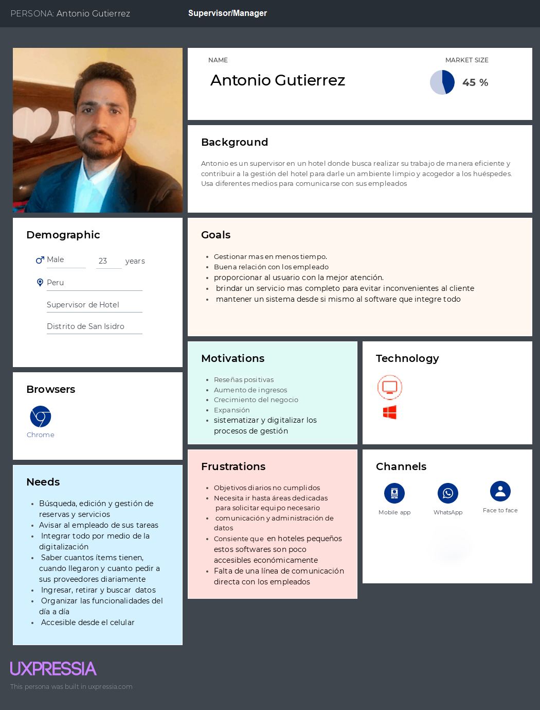
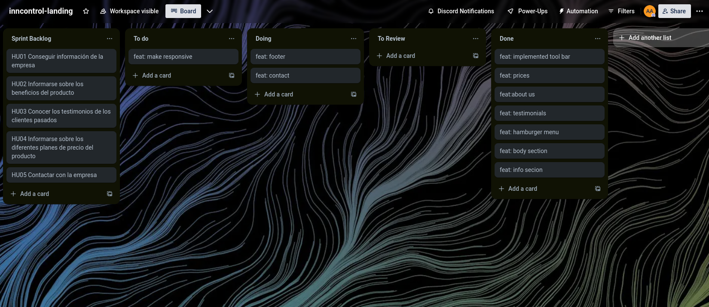
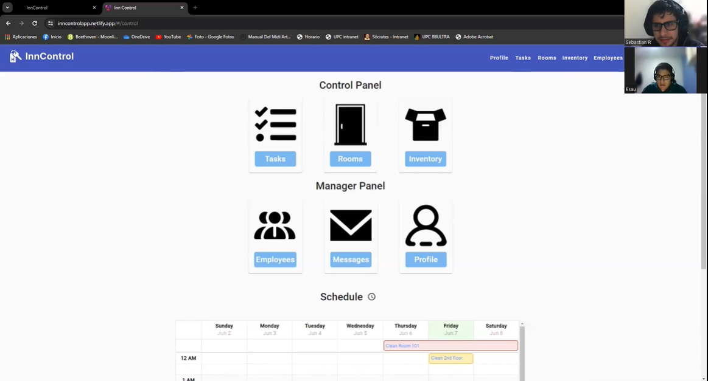

# <center>COURSE PROJECT</center>

<p align="center">
    <strong>Universidad Peruana de Ciencias Aplicadas</strong><br>
    <br>
    <strong>Ingeniería de Software</strong><br>
    <strong>OpenSource - WX55</strong><br>
    <strong>Profesor: Angel Augusto Velasquez Nuñez </strong><br>
    <br>INFORME
</p>


<center>

#### Startup: **EABMODEL**

#### Product: **INNCONTROL**

</center>

# Team  Members:

<div align="center">

|             Member             |    Code    |
|:------------------------------:|:----------:|
| Alex Ramon Alberto Avila Asto  | u20221a322 |
|   Sebastian Ramirez Hoffmann   |  u2011894  |
| Piero Fernando Periche Quiroga | u202210192 |
|  Manuel Sebastian Peña Rivera  | U202210138 |
|    Josue Hidalgo Bustamante    | U20219880  |
| Erick Armando Cueva Elera      | U201910151 |

</div>

# Registro de Versiones del Informe

<div align="center">


| Version | Fecha      | Autor         | Descripcion de Modificacion                                                                                             |
|---------|------------|---------------|-------------------------------------------------------------------------------------------------------------------------|
| 0.0     | 24/03/2024 | Alex          | Crea documento                                                                                                          |
| 0.4     | 10/04/2024 | Sebastian R   | Se aplican mejoras a las secciones del chapter 1 y 2 siendo especificamente Journey Mapping, Entrevistas y Competidores |
| 0.5     | 10/03/2024 | Sebastian P   | Se realiza un review a los mockups y wireframes                                                                         |
| 0.6     | 10/03/2024 | Josue         | Realiza cambios en diagramas de clases y user flow                                                                      |
| 0.7     | 11/03/2024 | Sebastian P    | Se realizan cambios a la investigacion y el lean UX                                                                     |
| 0.8     | 10/03/2024 | Piero         | Se realizan cambios a toda la seccion 5.1                                                                               |
| 1.1     | 24/04/2024 | Sebastian R    | Realiza correcciones observadas en clase                                                                                |
| 1.2     | 27/04/2024 | Sebastian R    | Finaliza proceso LeanUX corregido                                                                                       |
| 1.3     | 28/04/2024 | Sebastian P   | Se realizan cambios en la seccion de entrevistas 2.2.2                                                                  |
| 1.4     | 28/04/2024 | Sebastian R   | Realiza correcciones observadas en user personas                                                                        |
| 1.5     | 28/04/2024 | Sebastian  P  | Realiza cambios en la bibliografia, cambio de formato a APA                                                             |
| 1.6     | 28/04/2024 | Sebastian  P  | Realiza cambios en los user stories                                                                                     |
| 1.7     | 29/04/2024 | Sebastian R   | Realiza cambios en los user stories                                                                                     |
| 1.8     | 29/04/2024 | Piero Periche | Actualizacion de los diagrama c4 model                                                                                  |
| 1.9     | 29/04/2024 | Sebastian R   | Finaliza cambios en los user stories                                                                                    |
| 2.1 | 29/04/2024 | Piero P | Actualiza los impact map de los segmentos |
| 4.1 | 29/06/2024 | Sebastian R | Cambios al student Outcome |
| 4.1 | 29/06/2024 | Alex | Correcciones de Lean UX |
| 4.3 | 29/06/2024 | Josue | Correcciones de Entrevistas |
| 4.4 | 29/06/2024 | Sebastian R | Correciones generales al informe |


</div>

# Project Report Collaboration Insights

Repositorios:

Projecto: (https://github.com/upc-pre-20241-si729-wx55-eabmodel/report-project)

Landing Page: (https://github.com/upc-pre-20241-si729-wx55-eabmodel/inncontrol-landing-page)

Front End del Proyecto: (https://github.com/upc-pre-20241-si729-wx55-eabmodel/inncontrol-frontend)

Back End del Proyecto: (https://github.com/upc-pre-20241-si729-wx55-eabmodel/inncontrol-backend)

### TB1

Para la entrega del TB1 se han hecho las respectivas divisiones por cada capítulo con el objetivo de tener un workflow saludable y se pueda realizar una retroalimentación activa, para cada actividad asignada se ha entregado un conjunto de sub índices por cada capítulo a los integrantes del grupo dejando la posibilidad de realizar correcciones entre los mismos integrantes.

Se muestran evidencias de los commits realizados en la entrega de la TB1 en el informe

  

[Colaboraciones del repositorio]

  
[Registro de los commits donde se realizaron la mayor cantidad]

En ambos casos se puede observar el incremento de modificaciones y revisiones en la primera semana de abril.

---

### TP1

Para la entrega del TP1 se realizó el desarrollo del Front end junto con los cambios necesarios para demostrar una mejora continua. Asimismo, se asignó a cada integrante un bounded context para desarrollar en el front end.

Se muestran evidencias de los commits realizados en la entrega del TP

**Front end:**

  

[Colaboraciones del repositorio]

  

[Registro de donde se realizaron la mayor cantidad de commits]

Se observan los cambios respecto al front end y sus etapas de desarrollo.   

---

### TB2
Para la entrega del TB2 se realizo cambios de mejora continua para el Front end y el report-project stament. Se inicio el desarrollo del Back en y para ello se asigno a cada integrante un bounded context para desarollar y conectar con el Front end.

Se muestran evidencias de los commits realizados en la entrega del TB2

**Front end:**

 

[Colaboraciones del repositorio]

   

[Registro de donde se realizaron la mayor cantidad de commits]

**Back end:**

 

[Colaboraciones del repositorio]

   

[Registro de donde se realizaron la mayor cantidad de commits]

Se observan los cambios al front end y el desarollo del back end.

### TF 
Para la entrega del TF se realizo cambios de mejora continua para todo el proyecto y el report-project stament. Se realizan las correcciones del informe y se termina de conectar el back end con el front end.

**Informe:**


 

[Colaboraciones del repositorio]

   


**Front end:**

 

[Colaboraciones del repositorio]

   


**Back end:**

 

[Colaboraciones del repositorio]

   

[Registro de donde se realizaron la mayor cantidad de commits]

Se observan las correcciones al back end, front end y el informe.

# Contenido

[Registro de Versiones del Informe](#registro-de-versiones-del-informe)

[Project Report Collaboration Insights](#project-report-collaboration-insights)

[Student Outcome](#student-outcome)

[Capítulo I: Introducción](#capítulo-i-introducción)

[1.1 Startup Profile](#11-startup-profile)  
[1.1.1. Descripción de la Startup](#111-descripción-de-la-startup)  
[1.1.2. Perfiles de integrantes del equipo](#112-perfiles-de-integrantes-del-equipo)

[1.2. Solution Profile](#12-solution-profile)  
[1.2.1 Antecedentes y problemática](#121-antecedentes-y-problemática)  
[1.2.2 Lean UX Process.](#122-lean-ux-process)  
[1.2.2.1. Lean UX Problem Statements.](#1221-lean-ux-problem-statements)  
[1.2.2.2. Lean UX Assumptions.](#1222-lean-ux-assumptions)  
[1.2.2.3. Lean UX Hypothesis Statements.](#1223-lean-ux-hypothesis-statements)  
[1.2.2.4. Lean UX Canvas.](#1224-lean-ux-canvas)

[1.3. Segmentos objetivo.](#13-segmentos-objetivo)

[Capítulo II: Requirements Elicitation & Analysis](#capítulo-ii-requirements-elicitation--analysis)

[2.1. Competidores](#21-competidores)  
[2.1.1. Análisis competitivo]()  
[2.1.2. Estrategias y tácticas frente a competidores](#211-análisis-competitivo)

[2.2. Entrevistas](#22-entrevistas)  
[2.2.1. Diseño de entrevistas](#221-diseño-de-entrevistas)    
[2.2.3. Análisis de entrevistas](#223-análisis-de-entrevistas)

[2.3. Needfinding](#23-needfinding)  
[2.3.1. User Personas](#231-user-personas)  
[2.3.2. User Task Matrix](#232-user-task-matrix)  
[2.3.3. User Journey Mapping](#233-user-journey-mapping)  
[2.3.4. Empathy Mapping](#234-empathy-mapping)  
[2.3.5. As-is Scenario Mapping](#235-as-is-scenario-mapping)

[2.4. Ubiquitous Language](#24-ubiquitous-language)

[Capítulo III: Requirements Specificatio](#capítulo-iii-requirements-specification)

[3.1. To-Be Scenario Mapping](#31-to-be-scenario-mapping)

[3.2. User Stories](#32-user-stories)

[3.3. Impact Mapping](#33-impact-mapping)

[3.4. Product Backlog](#34-product-backlog)

[Capítulo IV: Product Desig](#capítulo-iv-product-design)

[4.1. Style Guidelines](#41-style-guidelines)  
[4.1.1. General Style Guidelines](#411-general-style-guidelines)  
[4.1.2. Web Style Guidelines](#412-web-style-guidelines)

[4.2. Information Architecture](#42-information-architecture)  
[4.2.1. Organization Systems](#421-organization-systems)  
[4.2.2. Labeling Systems](#422-labeling-systems)  
[4.2.3. SEO Tags and Meta Tag](#423-seo-tags-and-meta-tags)  
[4.2.4. Searching Systems](#424-searching-systems)   
[4.2.5. Navigation Systems](#425-navigation-systems)

[4.3. Landing Page UI Design](#43-landing-page-ui-design)   
[4.3.1. Landing Page Wireframe](#431-landing-page-wireframe)  
[4.3.2. Landing Page Mock-up](#432-landing-page-mock-up)

[4.4. Web Applications UX/UI Design](#44-web-applications-uxui-design)  
[4.4.1. Web Applications Wireframes](#441-web-applications-wireframes)  
[4.4.2. Web Applications Wireflow Diagrams](#442-web-applications-wireflow-diagrams)  
[4.4.3. Web Applications Mock-ups](#442-web-applications-mock-ups)   
[4.4.4. Web Applications User Flow Diagrams](#443-web-applications-user-flow-diagrams)

[4.5. Web Applications Prototyping](#45-web-applications-prototyping)

[4.6. Domain-Driven Software Architecture](#46-domain-driven-software-architecture)  
[4.6.1. Software Architecture Context Diagram](#461-software-architecture-context-diagram)  
[4.6.2. Software Architecture Container Diagrams](#462-software-architecture-container-diagrams)  
[4.6.3. Software Architecture Components Diagrams](#463-software-architecture-components-diagrams)

[4.7. Software Object-Oriented Design](#47-software-object-oriented-design)  
[4.7.1. Class Diagrams](#471-class-diagrams)  
[4.7.2. Class Dictionary](#472-class-dictionary)

[4.8. Database Design](#48-database-design)  
[4.8.1. Database Diagram](#481-database-diagram)

[Capítulo V: Product Implementation, Validation & Deploymen](#capítulo-v-product-implementation-validation--deployment)

[5.1. Software Configuration Management](#51-software-configuration-management)  
[5.1.1. Software Development Environment Configuration](#511-software-development-environment-configuration)  
[5.1.2. Source Code Management](#512-source-code-management)  
[5.1.3. Source Code Style Guide & Conventions](#513-source-code-style-guide--conventions)  
[5.1.4. Software Deployment Configuration](#514-software-deployment-configuration)

[5.2. Landing Page, Services & Applications Implementation](#52-landing-page-services--applications-implementation)  
[5.2.1. Sprint 1 ](#521-sprint-1)  
[5.2.1.1. Sprint Planning 1](#5211-sprint-planning-1)  
[5.2.1.2. Sprint Backlog 1](#5212-sprint-backlog-1)  
[5.2.1.3. Development Evidence for Sprint Review](#5213-development-evidence-for-sprint-review)  
[5.2.1.4. Testing Suite Evidence for Sprint Review](#5214-testing-suite-evidence-for-sprint-review)  
[5.2.1.5. Execution Evidence for Sprint Review](#5215-execution-evidence-for-sprint-review)  
[5.2.1.6. Services Documentation Evidence for Sprint Review](#5216-services-documentation-evidence-for-sprint-review)  
[5.2.1.7. Software Deployment Evidence for Sprint Review](#5217-software-deployment-evidence-for-sprint-review)  
[5.2.1.8. Team Collaboration Insights during Sprint](#5218-team-collaboration-insights-during-sprint)

[5.2.1. Sprint 2 ](#522-sprint-2)  
[5.2.2.1. Sprint Planning 2](#5221-sprint-planning-2)  
[5.2.2.2. Sprint Backlog 2](#5222-sprint-backlog-2)  
[5.2.2.3. Development Evidence for Sprint Review](#5223-development-evidence-for-sprint-review)  
[5.2.2.4. Testing Suite Evidence for Sprint Review](#5224-testing-suite-evidence-for-sprint-review)  
[5.2.2.5. Execution Evidence for Sprint Review](#5225-execution-evidence-for-sprint-review)  
[5.2.2.6. Services Documentation Evidence for Sprint Review](#5226-services-documentation-evidence-for-sprint-review)  
[5.2.2.7. Software Deployment Evidence for Sprint Review](#5227-software-deployment-evidence-for-sprint-review)  
[5.2.2.8. Team Collaboration Insights during Sprint](#5228-team-collaboration-insights-during-sprint)

[5.2.2. Sprint 3 ](#523-sprint-3)  
[5.2.3.1. Sprint Planning 3](#5231-sprint-planning-3)  
[5.2.3.2. Sprint Backlog 3](#5232-sprint-backlog-3)  
[5.2.3.3. Development Evidence for Sprint Review](#5229-development-evidence-for-sprint-review)  
[5.2.3.4. Testing Suite Evidence for Sprint Review](#5234-testing-suite-evidence-for-sprint-review)  
[5.2.3.5. Execution Evidence for Sprint Review](#5235-execution-evidence-for-sprint-review)  
[5.2.3.6. Services Documentation Evidence for Sprint Review](#5236-services-documentation-evidence-for-sprint-review)  
[5.2.3.7. Software Deployment Evidence for Sprint Review](#5237-software-deployment-evidence-for-sprint-review)  
[5.2.3.8. Team Collaboration Insights during Sprint](#5238-team-collaboration-insights-during-sprint)

[5.2.3. Sprint 4 ](#524-sprint-4)  
[5.2.4.1. Sprint Planning 4](#5241-sprint-planning-4)  
[5.2.4.2. Sprint Backlog 4](#5242-sprint-backlog-4)  
[5.2.4.3. Development Evidence for Sprint Review](#5243-development-evidence-for-sprint-review)  
[5.2.4.4. Testing Suite Evidence for Sprint Review](#5244-testing-suite-evidence-for-sprint-review)  
[5.2.4.5. Execution Evidence for Sprint Review](#5245-execution-evidence-for-sprint-review)  
[5.2.4.6. Services Documentation Evidence for Sprint Review](#5246-services-documentation-evidence-for-sprint-review)  
[5.2.4.7. Software Deployment Evidence for Sprint Review](#5247-software-deployment-evidence-for-sprint-review)  
[5.2.4.8. Team Collaboration Insights during Sprint](#5248-team-collaboration-insights-during-sprint)

[5.3. Validation Interviews](#53-validation-interviews)  
[5.3.1. Diseño de Entrevistas](#531-diseño-de-entrevistas)  
[5.3.2. Registro de Entrevistas](#532-registro-de-entrevistas)  
[5.3.3. Evaluaciones según heurísticas](#533-evaluaciones-según-heurísticas)

[5.4. Video About-the-Product](#54-video-about-the-product)

[Conclusiones](#conclusiones)

[Conclusiones y recomendaciones](#conclusiones-y-recomendaciones)

[Video About-the-Team](#video-about-the-team)

[Bibliografía](#bibliografía)

[Anexos](#anexos)

# Student Outcome


| Criterio Especifico| Acciones Realizadas| Conclusiones|
|-|-|-|
| **Comunica oralmente sus ideas y/o resultados con objetividad a público de diferentes especialidades y niveles jerarquicos, en el marco del desarrollo de un proyecto en ingeniería.** |                                          **Sebastian Ramirez Hoffmann**: [<br/>**TB1:**  Como team leader tuve la asignacion de proporcionarle sus partes a mis compañeros, haciendo uso de la comunicacion oral en clase y por medio de audios en el chat del grupo comunique de los avances y asignaciones de tareas a mis compañeros ayudandoles a entender todos los aspectos del proyecto. En un entorno oral se realizo una participacion por mi parte en el **"Capitulo 2"** donde como resultado de la identificacion de problemas en nuestro proceso UX en las reuniones que hicimos previamente, realicé un needfinding para las entrevistas donde tuve que hacerles preguntas a los entrevistados. Finalmente mi participacion en las reuniones sprintse basaron en guiar la reunion en torno a los principales puntos que debiamos realizar y el enfoque que necesitan para realizarse.<br/>**TP** Mi participación en el TP radica en el bounded context orientado al message system donde tuve que realizar los endpoints necesarios y asegurarme que se cumplian los objetivos del product backlog que se me fueron asignados. En un contexto de comunicacion oral, me comunique constantemente con el grupo para hacer un seguimiento de los avances y asimismo para notificar que mis secciones de codigo ya estaban subidas al repositorio para que se les haga una revision. El principal impacto respecto a la comunicacion oral en ese contexto seria el revisar en los sprints, en clase y por audios en el grupo que todos esten realizando sus partes asignadas del proyecto.<br/>**TB2** En la TB2 tuve asignada la tarea de cumplir con el desarrollo del bounded context orientado a Inventory en el back end del proyecto. Donde, similarmente a la entrega anterior tuve que comunicarme con el grupo para comunicar mis resultados y asimismo asegurarme de que todos esten realizando sus partes del informe. Adicionalmente realice entrevistas de validacion donde a se realizo una entrevista en base a las diferentes jerarquias de los publicos objetivo que teniamos. Finalmente participe en los videos de about the team y about the product.<br/>**TF:** En el TF me enfoque en seguir asegurandome de que todos trabajen en un contexto oral y les comunique las ideas para realizar las correciones al informe en base a distintos cambios de este. Cabe mencionar la necesidad de comunicarnos oralmente con el profesor de misma manera para poder recibir un feedback positivo de la entrega anterior y asi mejorar la calidad de nuestro proyecto de ingenieria.] <br>                                       **Manuel Sebastian Peña Rivera**:<br/>  **TB1:** <br/> Participe en las reuniones virtuales y presenciales, estuve aportando constantemente mis ideas y comunicándome con mis compañeros para decidir el caso del proyecto. En el **capítulo 2** entreviste a una Gestora de hoteles y le comunique sobre nuestro proyecto e ideas para el desarrollo de este. Además de realizar las preguntas correspondientes a su segmento de Gestor de hotel. Además, para la sección de web applications desktop and mobile wireframes y mockups, comenté a mis compañeros ideas de diseño e incluso desarrollé algunas secciones. Se realizo también una reunión para decidir sobre el diseño y desarrollo de la landing page, sugerí mis ideas de diseño y de secciones. <br/> **TP:**<br/> Se realizo una reunión para organizarnos para el Front-end, comuniqué que también debíamos enfocarnos en la mejora continua y le pude aclarar dudas de mis compañeros en la reunión. Además, se hicieron reuniones continuas para saber el estado del avance del Front-end y me comunique constantemente dando información de mi progreso, los commits que iba realizando y avisa cuando mi código ya estaba preparado para implementar. <br/> **TB2:** <br/> Nos reorganizamos en una reunión para coordinar las correciones del Front-end y empezar a desarrollar el Back-end, por lo cual estuvimos en constante comunicación, avisando sobre los arreglos del Front-end y el avance del Back-end. Se acordo realizar un bounded context cada uno en el Front-end y tendríamos que desarrollar para el back-end un bounded context distinto. Exprese oralmente mi experiencia en el transcurso del proyecto y de mis compañeros en el video de About The Team. <br/> **TF:** <br/> Realizamos reuniones para coordinar el desarrollo de la conexión de Front-end y Back-end, además de proponer soluciones a las observaciones realizadas en clase, acerca del informe. Ayude a mis compañeros aclarar sus dudas en las reuniones, con respecto a dificultades que se presentan al desarrollo de la conexión de Front-end y Back-end.  **Josue Omar Hidalgo Bustamante**:<br>**TB1:** <br/> Del **capitulo 2** contribuí y realice los analisis de contribuidores, tambien me encargue de realizar los user stories y empathy mapping del segmento 2.<br> Del **capitulo 3** realice el impact map de los dos segmentos<br> En el **capitulo 4**Para este capitulo hice el Class Diagram y Database Diagram . Para el **capitulo 5** aporte en la creación de la landing page <br/>**TP:** <br/> Realice parte de las correcciones observadas en clase. <br/> Para el **capitulo 5** desarrolle mi sección del frontend, la parte de Employee. <br/>**TB2:** <br/> Hice correcciones de los anteriores capítulos y y agregue las partes faltantes del frontend, además de las correcciones observadas de clase. <br/> En el **capitulo 5** realice la sección de Employee y IAM, como parte de la corrección para el frontend y desarrolle la sección de employee y profile como parte del backend.<br/>                             **Alex Ávila Asto**: <br>**TB1**: En el informe participe del capitulo 4 y 5 junto con mis aportes para el capitulo 1, 2 y 3. Donde apoye con el proceso Lean UX y entrevistas, enfocándome en plantear las ideas para los diagramas que implementamos. <br> **TP1**: Me encarge de realizar modificaciones al front end enfocado en la sección de Control View y Schedule, igual que en la entrega anterior me encargue de apoyar a mis compañeros me asegure de que se estén cumpliendo los componentes según las historias de usuario y el product backlog me asegure de que se hiciera siguiendo el approach de Domain Driven Design y el diseño propuesto. <br>**TB2**: En el TB2 me asegure de que mis compañeros se aseguren de realizar sus avances del back end. Finalmente participe en el sprint 3 que se realizo de manera grupal y avances del capitulo 5. <br>                                                 **Piero Periche Quiroga:** <br>**TB1:** <br> En el capitulo 1 investigue y realice la sección de 5W y 2H. En el capitulo 2 apoye y realice la sección de análisis competitivo, también la sección estrategias y Tácticas Frente a Competidores y hice entrevista con su respectivo análisis. En el capitulo 3 aporte con el empathy map. Añadi mi entrevista al segmento objetivo: gerente  y apoye en el Lean UX<br> **TP1:** <br> Mi participacion en el tp consistio realizar las modificaciones al front en el apartado de rooms, tanto como la parte visual como la de entidad y servicios. asi como corregir errores de mi anterior entrega en base a las retroalimentaciones dadas en clase. <br> **TB2:** <br> En la tb2 tuve la tarea de cumplir el desarrollo del bounded context de task en el backend del proyecto. Añadi entrevistas y realice cambios asignados para el capitulo 5.<br>                                            **Erick Armando Cueva Elera**: <br> **TB2:** <br> En esta entrega de la TB2, estuve asignado a realizar las últimas correcciones de la landing page. En la parte del frontend , terminé de implementar la sección orientada a Inventory, además, implementé el bounded context de iam en el backend.|                   **TB1**: En conclusión se lograron identificar problemáticas, compartirlos de manera oral entre los integrantes del grupo y realizar un proceso de diseño UX, Asimismo junto con el equipo se logró proponer un diseño para una landing page junto con prototipos cumpliendo con el product Backlog. Se realizaron entrevistas donde los miembros del equipo comunicaron la propuesta del proyecto de ingenieria de manera oral. <br>**TP1**: Para el TP1 desarollamos el front end de nuestra aplicacion utilizando Angular 17 y Angular Material subsecuentemente nos aseguramos que se cumplan los objetivos de nuestro product backlog y bajo las reuniones Sprint logramos organizar y asignar los objetivos propuestos para poder realizar nuestro proyecto se comunicaron oralmente los progresos del proyecto en clase. Finalmente cabe mencionar que realizamos correcciones de la entrega anterior y nos propusimos en mejorar nuestra eficiencia grupal por medio de una mejor comunición. <br>**TB2**: Respecto a esta entrega nos enfocamos en realizar la parte del back end de nuestra solucion donde por medio del uso del aproach de Domain Driven Design utilizando Spring Boot y el IDE de InteliJ IDEA donde hemos separado nuestros bounded context e implementando las operaciones necesarias para las necesidades de nuestra solucion. Cabe mencionar que adicionalmente a esta entrega realizamos cambios segun las correciones que se nos mencionaron en entregas anteriores. En conclusion hemos implementado las herramientas e implementamos las metodologias Sprint para realizar la entrega.<br/>**TF**: grupo hemos logrado mantener una comunicacion oral en el proceso de correciones y cambios en el informe y el proyecto web, logramos desplegar y ofrecer este producto por medio del video about the product y se logro el comunicar los testimonios del grupo en el video about the Team. Finalmente, cabe mencioncar como se realizaron entrevistas utilizando tecnologias open source. |
|**Comunica en forma escrita ideas y/o resultados con objetividad a público de diferentes especialidades y niveles jerarquicos, en el marco del desarrollo de un proyecto en ingeniería.**|                                             **Sebastian Ramirez Hoffmann**:[<br>**TB1:** En el TB1 como grupo organizamos un workflow repartido en branches orientado al desarollo del informe, yo como lider escribi y comunique las ideas para distintos aspectos del informe en nuestro chat grupal y respectivamente comunique los resultados como decir un progreso que iba consiguiendo en ese mismo grupo. Implemente herramientas como lucid chart, y los materiales como el libro de Jeff Gothelf de Lean UX el cual en mis partes respecto al capitulo 1 y en todo el informe. Por medio de comunicacion escrita me contacte con los entrevistados de nuestros segmentos y finalmente escribi los analisis de entrevista y resumen de entrevista.<br> **TP1:** En esta entrega implemente componentes relacionados al bounded context que en su momento se llamo room management utilizando angular y angular material principalmente para darle estilización a mi vista asignada aplique la documentacion escrita en el codigo para funciones importantes y notifique de mis resultados por el chat grupal para hacerles saber del estado de mi progreso, como tuvimos que reunirnos nuevamente para coordinar cambios y mejoras tanto en el informe como en la sección front end del proyecto, de manera escrita registre los cambios que deberiamos hacer a futuro en el proyecto. Finalmente utilizamos como grupo y personalmente el plug-in de conventional commits para intentar mejorar la estructura de avances de manera escrita. <br>**TB2:** En el TB2 se me asigno mejorar la vista de mensajes segun el mockup corregido a nivel de front y en el back end tuve que realizar el bounded context relacionado al inventario donde se implemento spring boot en ambos casos tuve que realizar la documentacion adecuada y escoger las palabras correctas para comunicar bien el funcionamiento de mis funciones a nivel de back end. Asimismo realice algunas entrevistas para poder ver si cumplimos con las necesidades de nuestros usuarios objetivos y saber que nos faltaría para mejorar la solución proporcionada, para comunicarme con los entrevistados tuve que contactarlos de manera escrita y tener las preguntas escritas a la mano para realizar una entrevista exitosa.<br>**TF:** Para el trabajo final me enfoque en compartir mis ideas para corregir el informe del trabajo final actualizando asi los campos requeridos. Asimismo como en entregas anteriores exprese los resultados a lo largo de las correciones con mis compañeros de manera escrita comunicandoles de manera efectiva las actividades que debian hacer y haciendoles saber del progreso.]<br>                                                                       **Manuel Sebastian Peña Rivera**: <br>**TB1:**</br> Escribi en el grupo para coordinar las reuniones y resolviendo dudas de mis compañeros, acerca de diversos temas. <br/> Redacte el resumen de mi entrevista y colabore en la redacción del cuadro de User Task Matrix. También realice en uxpressia la redacción de las respuestas a las preguntas del Empathy Map de los dos segmentos. Redacte los business goals, impacts, deliverables y user stories del impact map para los dos segmentos realizados en uxpressi y exprese mis ideas de forma escrita para la sección del product backlog. Redacte la sección de general style guidelines sobre el color y la tipografía en base a las ideas que conformamos en grupo y aporte con diagramas en el user flow. Aporte en la creación de la landing page, programando y comentando la seccion de testimonios. Redacte los commits correspondientes en mi rama de Git Hub, utilizando los Conventional Commits. <br/> **TP:** <br/> Enfocado a la redacción de corrección de secciones observadas en clase, como el User Task Matrix o la redacción en Empathy map. Programe mi sección del Front-end, la sección Inventory y comente lo necesario, además de redactar los commits correspondientes. <br/> **TB2:** <br/> Se realizo mejora continua al redactar secciones observadas en clase como el Product Backlog y mi Student Outcome. Programe las correcciones de la sección de Tasks, como parte de las observaciones del Front-end y programe la sección de Rooms como parte del Back-end. <br/> **TF:** <br/> Redacte las correcciones para el Student Outcome. <br> En el **capítulo 5** programe la conexión del Front-end y Back-end del bounded context Accomodation perteneciente a la sección Rooms. <br/>           **Josue Omar Hidalgo Bustamante**:<br>**TB1:**<br>Utilicé herramientas de documentación como GitHub, empleando GitFlow y los Conventional Commits adecuados para las ramas de mi report-project. Asistí y contribuí en las reuniones programadas, tanto virtuales como presenciales, y participé de manera activa en el chat grupal del proyecto. <br>**TP:**<br>  Realicé las modificaciones sugeridas en clase para las secciones de product backlog, impact mapping y user task matrix. En el frontend, continué usando GitHub y GitFlow, creando las características necesarias para mi rama Employee , IAM y realizando los commits conforme a la estructura de Conventional Commits. Además, implementé el enfoque de Domain Driven Design para el contexto delimitado de Employee y IAM. Seguí asistiendo y participando activamente en las reuniones.<br>**TB2:**<br>Hice ajustes en la sección del frontend correspondiente al bounded context Employee, continuando con el desarrollo del código en GitHub usando GitFlow y Conventional Commits. En el backend, implementé el bounded context Employee, que se relaciona con el API de Employee y Profiles, desarrollando los métodos CRUD y Gets necesarios para que la aplicación frontend funcione correctamente. En ambos ajustes, tanto de frontend como de backend, apliqué el enfoque de Domain Driven Design, organizando las carpetas según cada bounded context. Además, seguí asistiendo a las reuniones y contribuyendo con mis ideas en cada una de ellas. <br/>                                      **Alex Ávila Asto**: <br>**TB1**: En el informe utilice herramientas como Trello para realizar correctamente el seguimiento de los avances por sprint, adicionalmente implemente las herramientas de deployment requeridas para la landing page, asimismo participe de las reuniones grupales para los avances del informe y compartí mis puntos de vista junto con mi participación en el capitulo 5 <br> **TP1**: En esta entrega realice la sección orientada a Schedule y Control View junto con los cambios al informe relacionados al capitulo 5 para el Sprint1 asegurándome que se cumplieran los objetivos planteados en el product backlog<br>**TB2**:  Asimismo en el TB2 tome control del desarrollo de el bounded context de Communication y me encargue de hacer el deploy necesario para el back end. Finalmente me enfoque en la corrección de errores encontrados en el review del Trello. <br>          **Erick Armando:**<br>**TB2:** <br> En esta entrega de la TB2, me encargué de desarrollar los puntos de:  Development Evidence for Sprint Review, Registro de entrevistas y Evaluaciones según heurísticas en el informe del proyecto.                                                                <br>**Piero Fernando Periche Quiroga** <br>**TB1:** <br> Aprendí y use distintas herramientas de documentación colaborativas como lo son GitHub, GitKraken, empleando GitFlow y los Commits designados para cada rama de la Branch “report-project”. Ayude y colabore con mi equipo en las reuniones programadas, participando de manera activa y estando pendientes a fallas y errores para corregir. <br>**TP:** <br> Hice modificaciones en base a las retroalimentaciones dadas en clase. En la sección Frontend participe, creando el login y cambiando a cards algunas secciones decididas por el grupo. Implemente el DDD (Domain Driven Design) en el desarrollo de la aplicación, continuando con la participación continua en mi equipo. <br>**TB2:** <br> Hice ajutes designados por el equipo en el informe, participe en el desarrollo del backend en el bounded context “Task”, cumpliendo a tiempo con mis commits designados, siguiendo con el enfoque del DDD para poder facilitar a mi equipo la lectura y entendimiento del código y no generar dudas dentro del ambiente de trabajo.|**TB1**:<br>El uso de las herramientas que se nos proporcionaron y mencionaron nos resultaron importantes para el desarrollo de nuestro proyecto, asimismo el poder comunicar de manera escrita las reuniones grupales en las coordinaciones de sprint junto con las validaciones realizadas resultaron esenciales para nuestro proyecto para organizarnos como grupo y proyectar las acciones a realizar en cada entrega asimismo como para poder mostrar nuestro trabajo a otras personas sabiendo que estas lograran recibir el mensaje. <br>**TP1**:<br>Las herramientas que se nos proporcionaron y mencionaron para el desarrollo de nuestro proyecto a nivel de front end fueron implementadas y documentadas de manera escrita. Igualmente, las reuniones grupales durante las coordinaciones de sprint y las validaciones realizadas fueron esenciales para nuestra organización como equipo y para planificar las acciones a tomar en cada entrega junto con los objetivos escritos en el chat grupal, el sprint backlog y el informe en general.<br/> Finalmente las herramientas y reuniones de Sprint nos ayudan a organizar nuestras ideas y plantear soluciones en cada entrega tomando en cuenta los objetivos del grupo para luego ser registrados a manera de texto y compartirlo con el grupo. Son estas actividades colectivas y acciones de documentacion de objetivos y en el proyecto las cuales nos sirven como una base para saber que tareas debemos realizar y mejorar la colaboración como grupo. <br>**TB2** Las herramientas para el desarrollo de nuestro produto fueron esenciales para lograr un buen resultado. Igualmente mencionar el compromiso y la buena dedicacion que le pusieron los miembros del equipo en esta seccion, cumpliendo a timpo con las tareas asignadas, consultando de manera escrita cuando tenian dudas y no presentar muchos inconvenientes respecto a la comunicación de ideas y resultados. Se fomentó buen ambiente de trabajo al mantener una comunicacion continua por medio del chat grupal y se expresaron correctamente las ideas en el informe.<br> **TF**: Como conclusion final el grupo se ha comunicado correctamente por medio escrito, utilizando diferentes herramientas para continuar esta comunicacion. Se ha logrado ejecutar una aplicacion web de manera exitosa donde se han tomado en consideracion la documentacion escrita tanto en el proyecto como en el informe se comunicaron a diferentes segmentos y a una audiencia en las entrevistas de validacion logrando asi una comunicacion efectiva de manera escrita. |


# Capítulo I: Introducción

## 1.1. Startup Profile

### 1.1.1. Descripción de la Startup

Nuestra startup "InnControl" es un servicio de gestion orientado a negocios en el rubro de hospedajes u hotelería el
cual provee un seguimiento de inventario, empleados, espacios, tiempos y servicios utilizados en el proceso del
servicio. Asimismo mantendrá igualmente un contacto tanto con los empleados como sus gerentes.
gerentes.

#### 1.1.2. Perfiles de integrantes del equipo

| Miembros del equipo                                                                                                   | Codigo Estudiante | Carrera                | Conocimientos / Habilidades                                                              |
|-----------------------------------------------------------------------------------------------------------------------|-------------------|------------------------|------------------------------------------------------------------------------------------|
| Avila Asto, Alex Ramon Alberto <br/>                    | U20221a322        | Ingeniería de software | C++, Python, Kotlin, Dart, SQL, MongoDB, Java. Responsabilidad y trabajo en equipo.      |
| Peña Rivera, Manuel Sebastian <br/>                     | U202210138        | Ingeniería de software | C++, Python, MongoDB, SQL, Assembler. Responsabilidad y Buena Comunicación               | 
| Ramírez Hoffmann, Sebastián <br/>  | U20221894         | Ingeniería de software | C++, Python, Js, Reactjs, NodeJs, expressjs, MongoDB, SQL.  Paciencia, Liderazgo, Logico |
| Periche Quiroga, Piero <br/>       | U202210192        | Ingeniería de software | C++, SQL, Js. Responsabilidad y buen ambiente de equipo                                  |
| Hidalgo Bustamante, Josue <br/>                               | U20219880         | Ingeniería de software | C++, SQL,  MongoDB, Js, Reactjs, NodeJs,. Paciencia y Responsabilidad.                   |
| Cueva Elera, Erick Armando <br/>     | U201910151        | Ingeniería de software | C++, SQL, Vue, Flutter. Responsabilidad, buena comunicación grupal, paciencia y predispuesto a la mejora contínua. |

## 1.2. Solution Profile

### 1.2.1 Antecedentes y problemática

En el Peru se ha detectado una falta de inversion turistica menciona María Alejandra Gonzales(2023) donde podemos
observar asimismo a Blanca Chavez Vocera de la asociacion de hoteles, restaurantes y afines la visible preocupacion de
una falta de incentivos economicos debido a las crisis que hemos sufrido ultimamente. Al existir esta problematica la
mejor opcion es demostrar las capacidades de adaptacion y efectividad de gestion por parte de los mismos hoteles y
hostales en mejorar sus servicios reduciendo costos y aumentando la calidad.

La industria hotelera esta actualizandose implementando la digitalizacion y reduciendo el tiempo en las operaciones de
gestion. Segun Eva Lacalle (2023), "La tecnología ayuda a ofrecer un servicio fluido, proporciona mayor independencia a
los huéspedes, automatiza tareas tediosas y brinda una mejor experiencia para todas las partes involucradas."
adicionalmente menciona como los beneficios del uso tecnologico aumenta la competitividad en el mercado generando de
esta manera un flujo constante de mejora.

En 2024 el equpo de BIMnD comparte como la digitalizacion ayuda a la sostenibilidad de los establecimientos hoteleros y
como por medio de distintas tecnologias se llega a aplicar funcionalidades futuristas como vienen siendo tours
digitales, o gestionamiento en 3D. Estas funcionalidades se llegan a implementar en algunos lugares de europa y aumentan
considerablemente la eficiencia de sus establecimientos.

| ¿What? - ¿Cuál es el problema?           | El proyecto EABMODEL con su plataforma InnControl busca mejorar la problematica la cual trata de una mala gestion dentro del sector hotelero, el cual genera una mala coordinacion y por lo tanto afecta a la experiencia del usuario.                                                                                                                           |
|------------------------------------------|------------------------------------------------------------------------------------------------------------------------------------------------------------------------------------------------------------------------------------------------------------------------------------------------------------------------------------------------------------------|
| ¿Who? - ¿Quienes son los beneficiarios?  | InnControl es un servicio de gestión orientado a negocios en el rubro de hospedaje u hotelería el cual provee un seguimiento de inventario, empleados, espacios, tiempos y servicios utilizados en los procesos. Asimismo mantendrá igualmente un contacto tanto con los proveedores del negocio como sus mismo empleados y gerentes.                            |
| ¿Where? - ¿Donde se origina el problema? | La problemática se extiende a nivel global en entornos hoteleros, donde la falta de coordinacion o de gestion dentro de una empresa afecta a la eficiencia y a la experiencia del usuario. InnControl ofrece una solucion aplicable en cualquier ubicacion que cuente con servicios de hospedaje y hoteleria, mejorando la coordinacion y los procesos empleados |
| ¿When? - ¿Cuando se origina el problema? | La necesidad de esta solucion surge en el contexto actual de la atencion en los hospedajes u hoteles, donde la urgencia de modernizar y organizar procesos es evidente. La ayuda y herramientas de InnControl es relevante, ya que ofrece mejoras inmediatas en la coordinacion y eficiencia de la atencion dentro del sector.                                   |
| ¿Why? - ¿Por qué se origina el problema? | La falta de coordinacion, la desconexión en la atencion hotelera y los procesos manuales motivan la busqueda de una solucion. InnControl aborda estas problemáticas para mejorar la calidad de atención, proporcionar una operativa mas eficiente y preparar el sector para una atencion mas conectada.                                                          |
| ¿How? - ¿Como se origina el problema?    | InnControl implementa tecnologia para digitalizar la gestion de inventario, espacios, tiempos y servicios usados en los procesos. La plataforma facilita la colaboracion entre proovedores del negocio, asi como sus empleados y gerentes.                                                                                                                       |
| ¿How much?                               | El proyecto busca maximizar el valor proporcionado en terminos de eficiencia operativa y mejora en la atencion hotelera. En el ambito economico es crucial reducir costos asociados a procesos ineficientes y errores en la gestion.                                                                                                                             |

5 w's 2 h

Concientiza de la importancia de las ONG.

Why (¿Porque se está haciendo?): Se hace esta aplicacion web con el objetivo de que los establecimientos de hoteleria o
de hospedaje tengan una plataforma de gestion accesible, facil de utilizar y eficiente para realizar un conjunto de
actividades tales como la gestion de inventario, tiempos de habitacion, horarios de limpieza y servicio y entre otros
distintos procedimientos que normalmente se hacen de manera estatica, con nosotros esto pasa a ser mas dinamico y
modificable segun las necesidades del usuario.

When (¿Cuándo se usa?): Se usa cuando el usuario tenga la necesidad de gestionar distintos procesos de administracion de
su negocio de hospedaje u hoteleria, en los tiempos donde hay un incremento en la clientela o cuando el negocio requiere
hacer distintas cantidades de procesos de manera rapida.

Where (¿Dónde se usa?): El uso esta diseñado para Perú inicialmente ya que ademas de poder realizar un seguimiento local
del funcionamiento de la aplicacion web tambien se podra mejorar el estado actual de nuevos emprendimientos de hospedaje
y hoteleria.

Who (¿Quién lo usa?): Lo usan como administradores los gerentes o supervisores de los establecimientos ya que este
servicio es una herramienta para ellos, si bien se pueden automatizar funciones como la notificacion para empleados, lo
principal seria que los mismos supervisores hagan seguimiento de los procesos que se estan llevando al cabo en caso de
que se tenga que hacer alguna operacion manual.

How Much (¿Cuánto costaría?): La aplicacion web tendra sus funcionalidades core a forma de un pago inicial y luego
mensual proporcional a la cantidad de habitaciones que tenga que gestionar el negocio, es decir entre mas cuartos se
encuentren presentes el servicio tendra que almacenar mas procesos para cada habitacion, por esta razon se implementara
un paquete para asi poder fomentar la accesibilidad a los nuevos emprendimientos. Los paquetes de suscripcion variaran
de entre hostal, hotel, y sus respectivas tarifas por cantidad de habitaciones.

How (¿Cómo se lleva al cabo?) La aplicacion web tendra su espacio workspace donde el gestor podra revisar los distintos
procesos que se estan llevando al cabo, es decir diferentes recuadros mostrando estos procesos como por ejemplo, el
siguiente envio programado de inventario, horarios de limpieza o checkout inminentes, habitaciones libres, en proceso de
limpieza o ocupadas, habitaciones que esten solicitando algun servicio adicional (esto en caso el establecimiento lo
ofrezca) entre otros. Las habitaciones tendran que ser registradas de manera semi automatica donde se tendran que
especificar cuantos cuartos hay por piso y que servicio proporcionan, una vez se haga esto se generaran todos los
cuartos con sus distintos numeros de habitacion, servicios y estado. Tambien existiran los demas cuadros en la
aplicacion web donde se tendra que especificar los horarios donde se deban de hacer los registros de inventario y el
suministro de estos junto con otros procesos adicionales como lavanderia, manutencion de plantas u alguna otra
funcionalidad que desee agregar el gestor.

### 1.2.2 Lean UX Process.

#### 1.2.2.1. Lean UX Problem Statement.


En el estado actual de la industria de hoteleria y hospedaje muchos establecimientos enfrentan desafíos significativos en la gestión interna
de sus operaciones. La falta de coordinación y eficiencia en la gestión del inventario, el personal, los espacios y los
servicios afecta negativamente tanto la experiencia del usuario como la eficiencia operativa. Esta falta de coordinación
puede llevar a errores en la asignación de recursos, retrasos en la atención al cliente y una experiencia general
insatisfactoria para los huéspedes.

Lo que otros productos han fallado en realizar son los rapidos cambios en la digitalizacion dejando sus softwares obsoletos o con cambios que resultan ser pobres en experiencia de usuario. Además, los gerentes de hoteles se enfrentan a la presión de mantener altos estándares de calidad y eficiencia, mientras
lidian con procesos manuales y sistemas obsoletos que consumen tiempo y recursos. Esta falta de herramientas adecuadas
para la gestión puede tener un impacto directo en la rentabilidad del negocio y en la satisfacción del cliente.

Nuestro producto se enfocara en proporcionar funcionalidades mas intuitivas al usuario, un mejor sistema de gestion para poder observar todos los aspectos necesarios, la capacidad de poder mantener una comunicacion entre gerentes y empleados y fomentando la accesibilidad para modelos de negocio pequeños que tienen la capacidad de digitalizarse.

Nuestro enfoque principal sera el ofrecer este servicio a los gerentes de hotel para que evaluen con sus empleados los beneficios que proveemos. 

Como resultado, nos enfrentamos al siguiente problema: ¿Cómo podemos proporcionar a los gerentes de hoteles una
plataforma de gestión accesible y eficiente que les permita coordinar de manera efectiva el inventario, los empleados,
los espacios y los servicios, para mejorar la experiencia del usuario y optimizar los procesos operativos en un 45%?

Nuestro producto se encargara de esto al proporcionar un servicio de gestion que pueda digitalizar, optimizar y solucionar los procesos de gestion en procesos de hoteleria y hostales. 

Sabremos que tuvimos exito cuando se pueda observar un minimo de 45% de satisfaccion en encuestas de control donde los gerentes y empleados que utilizaron la aplicacion hayan logrado una mejorada calidad de trabajo y asimismo un crecimiento de 5% en la industria turistica.


#### 1.2.2.2. Lean UX Assumptions.

**Business Outcome**  
En esta seccion vamos a usar las metricas de Montaña que ha conceptualizada por Jeff Gothelf e implementaremos algunas de las pirate metrics para poder definir los niveles de la montaña para llegar poder analizar los comportamientos de nuestros usuarios y analizar que parte del User Journey es relevante para nosotros y hacer un assumption de como actuaran nuestros usuarios en base al producto.

Acquisition: (Base): [1000 visitantes]
El usuario se percatara de nuestra solucion por medio de las redes sociales como medio de comunicacion asimismo promocionando nuestra landing page, de misma manera intentaremos ofrecer el servicio a los mismos usuarios con metodos de comunicacion directa como por ejemplo ofrecerle el servicio a la institucion donde trabaja (hotel/hostal).

Activacion: (Plateau):[450 users : 100% users]
En esta seccion el usuario gerente crea su cuenta registrando su correo ya sea personal o de la institucion, metodos de pago, las dimensiones del negocio es decir la cantidad de habitaciones por piso y finalmente un codigo de autenticacion para los empleados que deban de generar una cuenta.
De los usuarios que se percatan del producto esperamos que el 45% se anime a utilizarlo.

Retention: (Plateau + 1 level):[60% users]
De los usuarios que se animaran a utilizarlo esperamos que el 60% de estos continue utilizando nuestro producto diariamente para gestionar a sus empleados y habitaciones. En esta seccion el usuario utiliza las herramientas que le proporciona nuestro producto para la gestion de cuartos, ya tiene a sus empleados asignados y les asigna sus tareas mientras que estos mantienen una comunicacion continua.

Revenue: (Plateau + 2 levels):[10% users]
Los usuarios que utilizan nuestro producto son usuarios estrictamente de paga, no obstante si es que llegara la situacion donde su negocio se expande entonces van a tener mas empleados, mas cuartos y excederan el limite que le proporcionamos en su plan inicial. De esta manera se espera que un 10% de los usuarios retenidos que consigan este crecimiento estaran dispuestos a mejorar su plan generandonos un mayor ingreso.

Referral:(top) [5% users]
Finalmente de los usuarios que retenimos esperamos que un 5% de estos nos referencien a sus colegas o a nuevos emprendedores indirectamente promocionandonos y aumentando el flujo de usuarios potenciales que podemos obtener.

**Users**  
En esta seccion creamos un Proto-Persona como un assumption de como son nuestros usuarios enfocandonos mas en el aspecto de actitud.

|Demografica|Comportmamiento|Necesidades / Obstaculos|
|-|-|-|
|Alex:<br>35 años <br> Gestor de hotel/hostal| - Trabaja en un hotel/hostal <br> -Gana lo suficiente <br> - Enfocado en la gestion de tareas <br> - Busca que todo este en orden | - Necesita aumentar el area de gestion <br> -Necesita mejorar la asignacion de tareas <br> - Requiere de una mejor comunicacion con los demas empleados a quienes asigna las tareas <br> - Obstaculo: El hotel utiliza herramientas obsoletas o no tiene alguna para asignar tareas <br> - Obstaculo: Utilizan medios no formales como whatsapp para comunicarse lo que complica la comunicacion eficiente. <br> - Busca mejorar la organizacion del hotel/hostal |
|Carla:<br> 27 años <br> Empleada de limpieza | -Gana lo minimo <br> -Enfocada en el cumplimiento de tareas <br> -busca terminar su trabajo de manera rapida|- Necesita un medio de comunicacion directo con su gestor <br> -Necesita una manera de notificar la falta de algun objeto que necesite <br> -Necesita notificar que cuartos ya estan listos y saber cuales debe de preparar <br> -Obstaculo: Todos hablan en el mismo grupo de whatsapp y se pierden tareas <br> - Obstaculo: No hay un registro seguro de las tareas que se les fueron asignadas <br> - Busca comunicar de inmediato a su supervisor el estado de una habitacion <br> -Busca avisar si falta algun objeto necesario para la preparacion de la habitacion |

Esta tabla refleja los dos principales usuarios que tenemos como assumption junto con sus necesidades y comportamientos en el area laboral.

**User Outcomes & Benefits**

En esta seccion se busca el lado mas emocional y empatizar con el usuario para darles los outcomes correctos.


Que busca lograr el usuario?
Quiero notificar a mi supervisor que necesito ciertos materiales para realizar mis tareas.<br>
Como se quiere sentir el usuario en este proceso?
Quiero sentirme como si tuviera una linea directa con el supervisor.<br>
Como nuestro producto acerca al usuario a un logro personal?
Quiero sentirme escuchado y tomado en consideracion.<br>
Porque nuestro usuario buscaria nuestro producto?
Quiero que mis tareas se puedan realizar sin problemas.<br>
Que cambio de comportamiento podemos observar que nos cuenta que lograron su objetivo?
Sabremos que tuvimos exito cuando el usuario presente una comunicacion efectiva con su supervisor utilizando nuestro producto en el area laboral.<br><br>
Que busca lograr el usuario?
Quiero revisar los estados de cuarto.<br>
Como se quiere sentir el usuario en este proceso?
Quiero sentirme como que con solo ver ya puedo saber en que estado se encuentra un cuarto.<br>
Como nuestro producto acerca al usuario a un logro personal?
Quiero sentir que puedo manejarme y organizarme.<br>
Porque nuestro usuario buscaria nuestro producto?
Quiero realizar mis tareas de manera que sea tan facil como mirar por la ventana.<br>
Que cambio de comportamiento podemos observar que nos cuenta que lograron su objetivo?
Sabremos que tuvimos exito cuando el usuario presente un monitoreo rapido de habitaciones utilizando nuestro producto en el area laboral.<br><br>
Que busca lograr el usuario?
Quiero mantenerme comunicado con mi (gerente/empleado) para poder (entregar/recibir) tareas.<br>
Como se quiere sentir el usuario en este proceso?
Quiero sentirme como que puedo ver todos los aspectos logisticos del hotel en un solo lugar.<br>
Como nuestro producto acerca al usuario a un logro personal?
Quiero sentir que tengo el control de mis acciones.<br>
Porque nuestro usuario buscaria nuestro producto?
Quiero hacer mas trabajo en menor tiempo y que no me cueste mucho hacerlo.<br><br>
Que cambio de comportamiento podemos observar que nos cuenta que lograron su objetivo?
Sabremos que tuvimos exito cuando el usuario tenga una facilidad en comunicarse y realizar sus tareas en el area laboral utilizando nuestro producto.


Este analisis de user Outcomes sirve para ambos segmentos en ciertos casos ya que tienen un objetivo similar y se puede comprender el contexto desde ambas perspectivas.

**Solutions**

Si bien Gothelf menciona en su libro LeanUX 3rd Edition que debemos utilizar elementos fisicos como post its y demas para esta entrega realizamos una llamada para definir nuestras soluciones supuestas.

Tomando en cuenta las restricciones anteriormente seleccionadas realizamos las siguiente solucione:

Desarollar un gestor de hoteleria y hostales orientado a realizar la mayoria de prorcesos de gestion principales siendo:

- **El monitoreo de estados de cuartos** - notifica sin la necesidad de usar algun sistema de comunicacion como whatsapp el estado actual de un cuarto. Tomar en consideracion las validaciones necesarias.
- **La entrega de tareas** - entrega las tareas remotamente a los empleados sin necesidad de que se tenga que decir una palabra entre usuarios asimismo permite el monitoreo de esta. Tomar en consideracion que solo el usuario con la tarea asignada puede terminar esta tarea.
- **La revision de inventario** - permite que se pueda hacer un seguimiento de los items que se tienen en la bodega del negocio los cuales se deben registrar cuando son agregados o quitados. Tomar en consideracion que podemos agregar los proovedores de dichos productos.
- **La comunicacion empleado/gerente** - sistema de comunicacion para emergencias o dudas donde se mantiene una linea de comunicacion directa y sin distractores entre el gerente y el empleado, de misma manera puede servir para monitorear que mensajes se han mandado.
  

#### 1.2.2.3. Lean UX Hipotesis Statements.

**Hipotesis**

Siguiendo el formato de las Hipotesis usaremos la tabla de hipotesis.
Tomar en cuenta que cada hipotesis empieza con "Creemos que.." Estas hipotesis se basan en los 450 usuarios que proyectamos tener.

|Business Outcome|Persona|User Outcome|Feature/Solution|
|-|-|-|-|
|Conseguiremos una retencion del 20% de 450 usuarios | Si los gerentes de hoteles/hostales | entregan tareas a sus empleados | con el sistema de comunicacion para emergencias o dudas |
|Conseguiremos una retencion del 20% de 450 usuarios optima | Si los gerentes de hoteles/hostales | logran monitorear los estados de cuarto | con el sistema de monitoreo de cuartos |
|Conseguiremos una retencion del 60% de 450 usuarios optima | Si los gerentes de hoteles/hostales | se sienten en control de sus actividades | con las herramientas de gestion que estamos ofreciendo, estas siendo monitoreo de estados de cuartos, entrega de tareas, revision de inventario y sistema de comunicaciones |
|Conseguiremos una retencion del 20% 450 usuarios optima | Si los gerentes de hoteles/hostales | Notifican de los items necesitados al gerente | con el sistema de comunicacion entre empleado y gerente |
|Conseguiremos que 10% de nuestros 450 usuarios nos genere una ganancia | Si los gerentes de hoteles/hostales | mejoran el plan de su cuenta | proveyendo al usuario de la posibilidad de mejorar su cuenta |
|Conseguiremos que 5% de nuestros 450 usuarios nos referencien | Si los gerentes de hoteles/hostales y empleados | logran una comunicacion entre gerente y empleado efectiva | con el sistema de comunicacion entre empleado y gerente |
|Conseguiremos que 45% de nuestra adquisicion de 1000 usuarios vengan de nuestra pagina | Si los gerentes de hoteles/hostales y empleados | encuentran nuestra solucion como una posibilidad de mejora | con la landing page implementada |

**Que es lo mas importante que debemos aprender**

Debemos de analizar que es lo que debemos aprender de nuestras Hipotesis, entonces llegamos a nuestra siguiente conclusion respecto a lo mas importante que debemos aprender:

Los usuarios estaran interesados en nuestra "innovadora" propuesta dado que existen otros productos similares y asimismo, realmente la necesitan?

**Minimum viable product**

Los MVP nos sirven para aprender cosas a corto plazo. para realizar esto se hace la pregunta: 
What’s the most important thing we need to learn first?
Lo primero que debemos de confirmar para nuestro proyecto es **si realmente se esta requiriendo en el mercado**, es por esta misma razon que tendremos que realizar una serie de entrevistas a gerentes de hotel/hostal y sus empleados para poder probar que si existe una necesidad que estamos satisfaciendo. Adicionalmente crear una landing page realizando un MVP para los usuarios que esten interesados en este producto.


#### 1.2.2.4. Lean UX Canvas.

Finalmente juntamos todo lo que hemos hecho en este proceso y lo agregamos en un Lean UX Canvas (V2) guiandonos del ejemplo que nos proporciona Jeff Gothelf [Anexo 1.1]

<image src ="./assets/lean-ux/lean-ux-canvas/Lean UX Canvas (V2) - Inn Control.jpg" alt ="LeanUX Canvas (V2) [implementando lean UX 3]">


## 1.3. Segmentos objetivo.

|                           | Segmento 1                                                                                                                                   | Segmento 2                                                                                                                                                                                                  |
|---------------------------|----------------------------------------------------------------------------------------------------------------------------------------------|-------------------------------------------------------------------------------------------------------------------------------------------------------------------------------------------------------------|
| Variables                 | Empleado negocio                                                                                                                             | Gestor del negocio                                                                                                                                                                                          |
| Geográfica                | Ubicación cercana al establecimiento hotelero o de hospedaje                                                                                 | Preferiblemente ubicado en la misma región donde se encuentra el negocio                                                                                                                                    |
| Demográfica               | Diversidad en edad y género                                                                                                                  | Edad adulta, posiblemente con formación universitaria en áreas relacionadas con administración o gestión                                                                                                    |
| Psicológica               | Actitud hacia la adopción de nuevas tecnologías, motivación para mejorar la eficiencia en el trabajo                                         | Orientado hacia la eficiencia y mejora continua, interés en adoptar soluciones tecnológicas para optimizar la operación del negocio                                                                         |
| Función de comportamiento | Necesidad de herramientas que faciliten la realización de tareas diarias, interés en optimizar procesos para mejorar la calidad del servicio | Necesidad de herramientas que le permitan supervisar y gestionar eficientemente todas las áreas del negocio, prioriza la mejora de la experiencia del cliente y la optimización de los recursos disponibles |

---

# Capítulo II: Requirements Elicitation & Analysis

## 2.1. Competidores.

## 2.1.1. Análisis Competitivo

**Competitive Analysis Landscape**

                            

| ¿Por qué llevar a cabo este análisis? | Nosotros | Cloudbeds | SiteMinder |
|---------------------------------------|----------|-----------|------------|
| **Overview**                          | Nuestra startup está enfocada en desarrollar una plataforma integral para la gestión eficiente de negocios relacionados con la administración de habitaciones, con un enfoque en la industria hotelera. | Cloudbeds ofrece una solución de gestión hotelera basada en la nube que incluye herramientas para la administración de propiedades, reservas y distribución. | SiteMinder proporciona una plataforma de distribución hotelera y una suite de herramientas de gestión que incluyen gestión de tarifas, disponibilidad de habitaciones y canal de reservas en línea. |
| **Ventaja Competitiva**               | Nuestra plataforma ofrece una solución integral que abarca desde la gestión de habitaciones hasta la comunicación interna y la generación de informes de desempeño del personal. | Cloudbeds se destaca por su interfaz fácil de usar y su capacidad para integrarse con una amplia gama de sistemas y servicios de terceros. | SiteMinder se enfoca en maximizar la visibilidad en línea y la distribución de habitaciones a través de una amplia red de canales de reserva. |
| **Mercado Objetivo**                  | Nos dirigimos a hoteles independientes y pequeñas cadenas hoteleras que buscan mejorar su eficiencia operativa y experiencia del cliente. | Cloudbeds se enfoca en hoteles boutique y propiedades independientes que buscan una solución completa de gestión hotelera en la nube. | SiteMinder atiende a hoteles de todos los tamaños, desde pequeños establecimientos independientes hasta grandes cadenas hoteleras. |
| **Perfil de Marketing**               | Nuestra estrategia de marketing se centra en la promoción de nuestra plataforma a través de redes sociales y asociaciones con organizaciones de la industria hotelera. | Cloudbeds utiliza estrategias de marketing digital y participa en eventos de la industria para promover su marca y sus soluciones. | SiteMinder utiliza una combinación de marketing en línea y fuera de línea, incluidas campañas en redes sociales y publicidad en eventos de la industria. |
| **Perfil del Producto**               | Ofrecemos una variedad de herramientas y servicios, desde la gestión de habitaciones hasta la generación de informes de desempeño del personal, todo dentro de una plataforma fácil de usar y personalizable. | Cloudbeds ofrece funcionalidades como gestión de reservas, administración de canales de distribución y herramientas de informes en una interfaz intuitiva. | SiteMinder proporciona herramientas para gestionar tarifas, disponibilidad de habitaciones y reservas en línea, junto con análisis y generación de informes. |
| **Precios**  | Nuestro plataforma es de pago y contiene diferentes tipos de planes Starter, Standar y Exclusive  para satisfacer el tamaño del hotel/hostal del usuario segun la cantidad de cuentas de empleado y cuartos. |Cloud beds ofrece una tarifa dinamica segun los datos que ingrese un usuario teniendo los tipos de plan Pro y 360 |SiteMinder ofrece 3 tipos de planes los dos primeros siendo para alojamientos idependientes ofreciendo una prueba gratuita contando con el plano normal y el Plus adicionalemnte cuenta con planes para grupos hoteleros. |


## 2.1.2. Estrategias y Tácticas Frente a Competidores

 **Análisis SWOT** | Nosotros                                                                                                                                                                                                                                                                                            | Cloudbeds                                                                                                                                                                                                                                          | SiteMinder                                                                                                                                                                                                                                                                                                                                           
-------------------|-----------------------------------------------------------------------------------------------------------------------------------------------------------------------------------------------------------------------------------------------------------------------------------------------------|----------------------------------------------------------------------------------------------------------------------------------------------------------------------------------------------------------------------------------------------------|------------------------------------------------------------------------------------------------------------------------------------------------------------------------------------------------------------------------------------------------------------------------------------------------------------------------------------------------------
 **Fortalezas**    | Nuestra plataforma ofrece una solución integral y fácil de usar para la gestión de habitaciones y la comunicación interna. Además, nos destacamos por nuestra flexibilidad de precios y personalización de características.                                                                         | Cloudbeds tiene una interfaz intuitiva y se integra fácilmente con otros sistemas y servicios de terceros, lo que la convierte en una solución atractiva para hoteles independientes.                                                              | SiteMinder cuenta con una amplia red de distribución y visibilidad en línea, lo que ayuda a aumentar las reservas y la ocupación de habitaciones para los hoteles.                                                                                                                                                                                   
 **Debilidades**   | Como una startup emergente, podemos enfrentar desafíos en términos de reconocimiento de marca y alcance de mercado en comparación con competidores establecidos como Cloudbeds y SiteMinder.                                                                                                        | Cloudbeds puede tener tarifas de suscripción más altas en comparación con otras soluciones, lo que puede limitar su atractivo para hoteles con presupuestos ajustados.                                                                             | SiteMinder puede enfrentar desafíos en la retención de clientes debido a la competencia en el mercado de distribución hotelera en línea.                                                                                                                                                                                                             
 **Oportunidades** | Existe un mercado creciente de hoteles independientes y pequeñas cadenas hoteleras que buscan soluciones integrales y asequibles para mejorar su eficiencia operativa.                                                                                                                              | Cloudbeds puede expandir su alcance a través de asociaciones estratégicas con proveedores de servicios turísticos y organizaciones de la industria.                                                                                                | SiteMinder puede explorar nuevas oportunidades de crecimiento mediante la expansión a mercados emergentes y el desarrollo de características innovadoras para sus clientes.                                                                                                                                                                          
 **Amenazas**      | La competencia en el mercado de gestión hotelera puede intensificarse, lo que podría dificultar la adquisición de clientes y la retención en el futuro. Además, los cambios en las preferencias del consumidor y las regulaciones gubernamentales pueden afectar la demanda de servicios hoteleros. | Cloudbeds puede enfrentar amenazas de nuevos competidores que ingresan al mercado con soluciones similares pero más económicas. Además, los cambios en la tecnología y la regulación pueden afectar la demanda y la rentabilidad de sus servicios. | SiteMinder puede enfrentar amenazas de la consolidación en la industria hotelera y la competencia de grandes OTAs (agencias de viajes en línea) que ofrecen servicios similares de distribución de habitaciones. Además, los cambios en los algoritmos de búsqueda en línea pueden afectar la visibilidad de los hoteles que utilizan su plataforma. 

## 2.2. Entrevistas.

### 2.2.1. Diseño de entrevistas.

**Preguntas generales:**

En esta seccion realizamos preguntas simples para tener una demografica e informacion de comportamientos que nos interesan como que browser utiliza o que dispositivos usa.

1. ¿Cuál es su nombre?
2. ¿Qué edad tiene?
3. ¿A qué se dedica?
4. ¿Que browser y dispositivos usa?

Las siguientes preguntas se realizaron para responder nuestra pregunta ya mencionada en el capitulo anterior: "Los usuarios estarán interesados en nuestra "innovadora" propuesta dado que existen otros productos similares y asimismo, realmente la necesitan?" previo a las entrevistas ya se habian preguntado el distrito de los usuarios para contactarlos.

**Entrevistas usuario segmento (Gestor de Hotel/Hostal)**

Esta seccion de preguntas se enfocan en el punto de vista de los usuarios de segmento 2 Gestor de hotel/hostal.

1. Que opiniones tiene respecto a la digitalizacion de los sitemas de gestion en hoteles o modelos de negocio parecidos?
2. ¿Como le hace saber a los empleados que tareas deben hacer?
3. ¿Como manejan el inventario de productos que utilizan tanto para limpieza como para los cuartos?
4. ¿En su opinion cree que se mantiene una comunicacion constante y efectiva entre los gerentes/supervisores y los
   empleados?
5. ¿Que frustraciones y objetivos/motivaciones tiene en su area laboral?

**Entrevistas usuario segmento (Empleado de Hotel/Hostal)**

Esta seccion de preguntas se enfocan en el punto de vista de los usuarios de segmento 1 Empleado de hotel/hostal.

1. ¿Que opiniones tiene del area laboral en el entorno de Hoteleria/Hostales?
2. ¿Como consigues la informacion de que tareas debes de realizar?
3. ¿Como notificas a tu supervisor de alguna falta de inventario?
4. ¿Mantienes una comunicacion efectiva con el gerente/supervisor en horas laborales?
5. ¿Que frustraciones y objetivos tienes en tu area laboral?

### 2.2.2. Registro de entrevistas.

Las entrevistas estan en un video en el siguiente URL: https://upcedupe-my.sharepoint.com/:v:/g/personal/u202211894_upc_edu_pe/ESxD6TAhfylMgJTLWMsn4F8BaCVSmqQuYn7hVIwYosnpvw?e=Wjhd8e&nav=eyJyZWZlcnJhbEluZm8iOnsicmVmZXJyYWxBcHAiOiJTdHJlYW1XZWJBcHAiLCJyZWZlcnJhbFZpZXciOiJTaGFyZURpYWxvZy1MaW5rIiwicmVmZXJyYWxBcHBQbGF0Zm9ybSI6IldlYiIsInJlZmVycmFsTW9kZSI6InZpZXcifX0%3D [Anexo 2.2.1.1]


**Segmento 1**  
Nombre: Arian Godinez Vargas
<br>
Edad: 20 años
<br>
Ocupación: Empleado de Hotel (limpieza)
<br>
Browser: Chrome
<br>
Device: Influencia en la marca Apple
<br>
Distrito: Cercado de Lima.
<br>
Timing: minuto[00:00]
<br>


Arian nos relata su día laboral cómo staff en un Hotel el cual prefiere que mantengamos anónimo. Nos comenta que en su trabajo tienen un sistema implementado que permite **saber el estado de las habitaciones asignadas**, sin embargo, presentan como **obstáculo** la comunicación entre los empleados y los supervisores, él nos comenta que es ineficiente el sistema de manejo de inventario y **necesita** un sistema especializado en administración, ya que tiene que estar contactándose con su supervisor constantemente. Es por ello por lo que nos comenta que es **necesaria** una plataforma que agilice el proceso de comunicación y de administración. Arian explica que **quiere** dejar de usar aplicaciones informales de comunicación como WhatsApp. También nos comenta que a él le **gustaría** hacer un acuerdo con su supervisor para mejorar el sistema que usan actualmente, debido a que se complica el trabajo y el manejo de inventario junto a la pésima comunicación, lo que le causa **frustración**. 

---

Nombre: Esau Carretero
<br>
Edad: 19 años
<br>
Ocupación: Trabaja en un hotel part-time
<br>
Browser: GoogleChrome y OperaGX
<br>
Device: Celular y computadora
<br>
Distrito: Jesus Maria
<br>
Timing: minuto[06:03]
<br>

 


Esau comenta respecto a como **siente** que su espacio laboral es bueno pero que al momento de comunicarse debe de moverse en el hotel para encontrar a sus supervisores y otros compañeros, asimismo de como **necesitan** whatsapp para que se les entreguen sus tareas. Ademas de como para avisarle a su gerente **necesita** de mandarle un mensaje de whatsapp o correo. El piensa que **whatsapp es un sistema que es propenso a *enredarse*** ya que todos hablan por un solo canal. Finalizando la entrevista nos comenta de como **siente** que entre sus compañeros se generan **frustraciones** de por donde empezar sus tareas y que de **objetivo** tiene el realizar un trabajo optimo.

---

Nombre: Nicola Estefan Romero
<br>
Edad: 22 años
<br>
Ocupación: Empleado de Hotel 
<br>
Browser: Brave
<br>
Device: Celular y laptop
<br>
Distrito: Lima Central
<br>
Timing: minuto[10:23]
<br>

 
<a> [Anexo 2.2.1.1]</a>  <br>  
Nicola comenta sobre su trabajo actual y el sistema que utilizan en el hotel. Su trabajo presenta como **obstáculo** la pobre optimización que tiene y la poca capacidad de usuarios, por lo que se cae constantemente, por lo que recurre a usar aplicaciones como WhatsApp para la comunicación. También, nos aclara sobre lo **necesario** que es el sistema en los días más concurridos. Además, nos comenta que le genera **frustración** la mala comunicación, debido a que a veces no entiende la tarea asignada, además de que a él **quisiera** poder administrar mejor el inventario y automatizarlo. Nicola explica que le **gustaría** mejorar el sistema para realizar un trabajo bien hecho y así poder dar una buena experiencia los clientes.


---

**Segmento 2**  
Nombre: Elisa Rivera Del Rio
<br>
Edad: 55 años
<br>
Ocupación: Gerencia de Hoteles
<br>
Browser Preferido: Google
<br>
Dispositivos: Computadoras (Windows), celulares android y telefonos domesticos.
<br>
Distritos: Magdalena
<br>
Timing: minuto[15:39] 
<br>

  

Elisa nos da su opinion respecto a la digitalizacion mencionando que es **necesaria**, mencionando que es importante mantener un sistema desde el huesped al software que integre todo, tambien dice como un **obstaculo** que en hoteles pequeños estos softwares son poco accesibles economicamente. Nos menciona que hay varias areas supervizadas por jefes donde se **quiere** digitalizar el proceso donde organizar las funcionalidades del dia a dia. Adicionalmente cuenta como no existe un inventario de productos digitalizado, manipulan todo lo relacionado de forma manual, menciona que le **gustaria** un software que se encarge de hacer eso. Asimismo relata de la falta de una linea de comunicacion directa con los empleados y como siente que se **necesita** que este deberia ser accesible desde el celular. Finalizando la entrevista menciona como **quisiera** sistematizar y digitalizar los procesos de gestion y que es una **frustracion** respecto a como los gastos de servicio realizan que se vuelva dificil el adquirir estos sistemas.

---

Nombre: Catalina Paredes
<br>
Edad: 25 años
<br>
Ocupación: Gerencia de Hoteles
<br>
Browser: OperaGX y Chrome
<br>
Dispositivos: Celular y Laptop
<br>
Distrito: Distrito de Trujillo, Trujillo
<br>
Timing: minuto[26:04]
<br>

  


Catalina nos comparte que considera que la digitalizacion de los sistemas de gestion serian **recibidos correctamente**, mencionando que se utilizaria para las **necesidades** de la busqueda, edicion y gestion de reservas y servicios. Menciona que se **asignan tareas dependiendo del tipo de empleado** en una reunion antes de una jornada laboral. Relata de como utilizan un excel para su gestion de items y menciona que le **gustaria** mejorarlo debido a que necesita que sus **datos se puedan ingresar, retirar y buscar** sin necesidad de saber mucho de excel. Finalmente nos menciona que **no siente** que existe una comunicacion fluida ya que **necesita ir hasta areas dedicadas como al area de mantenimiento para solicitar equipo necesario** o si existe un cambio de tareas **necesita** de avisar al empleado presencialmente mencionando como le **gustaria** implementar ese tiempo en otras tareas. Terminando la entrevista nos comenta sus **frustraciones con la comunicacion y administracion de datos** que tiene y de sus **objetivos** menciona como quiere superar y mejorar estos problemas y brindar un servicio mas completo para evitar inconvenientes al cliente ya que estos problemas segun nos cuenta son constantes.

---

Nombre: Ariana Valdivia
<br>
Edad: 29 años
<br>
Ocupación: Gerencia de hoteles (3 sedes)
<br>
Browser: N/A
<br>
Device: N/A
<br>
Distrito: Miraflores, Surquillo, Surco.
<br>
Timing: [26:07]
<br>


Ariana cuenta que ella y su equipo cuentan con sistemas de gestion de inventario, para dar horarios y sus tareas. Respecto a la digitalizacion, menciona que los procesos empresariales se vuelven menos tediosos gracias al poder **gestionar mas en menos tiempo**. menciona que, en el sistema que tienen se asignan las tareas a sus empleados, **cada empleado sabe que hacer al dia y al finalizar el dia se revisa si se cumplieron estas tareas**. Comparte que en su analisis de inventario se organizan sabiendo **cuantos items tienen, cuando llegaron y cuanto pedir a sus proveedores diariamente**. Intentan de mantener la comunicacion por charlas y conferencias para los trabajadores de la empresa. **Necesitan** que la relacion con el trabajador sea buena para que la eficiencia de estos aumente. Menciona que las **frustraciones** que tiene se originan por un **proceso no cumplido en el dia**, intenta que los procesos esten realizados. Comenta que sus **objetivos** son proporcionar al usuario con la mejor atencion.

---


### 2.2.3. Análisis de entrevistas.


**Segmento 1: (Empleados):**

Estadisticas y Aspectos comunes:
En las entrevistas realizadas encontramos que 67% del segmento utiliza el browser de google, asimismo se muestra que todos los entrevistados usan WhatsApp para su comunicacion, adicionalmente el 100% de los entrevistados mencionan almenos una discomformidad con la comunicacion que se mantiene con sus superiores. Observamos que piensan en sus demas colegas del area laboral.

Caracteristicas Objetivas:
Se requiere un sistema de comunicacion para este segmento, hay una necesidad en saber que hacer solicitando una entrega de tareas o avisos si es que estas cambian, discomformidad con sistemas lentos. Hacer más, con menos. todos utilizan dispositivos moviles.

Caracteristicas Subjetivas:
Todos los entrevistados tienen una fuerte opinion respecto a la comunicacion como un problema comun, seguido de la falta de servicios actualizados o la falta total de estos que afecta su eficiencia. Todos estan de acuerdo con un cambio parecido al que estaremos desarollando satisfaciendo nuestro supuesto mas importante por el lado del segmento 1.

**Segmento 2: (Gerentes)**
Estadisticas y Aspectos comunes:
En las entrevistas realizadas solo un 33% de los entrevistados cuenta con un software el cual no presenta problemas. Adicionalmente 100% de los entrevistados creen que es necesario que se puedan realizar las tareas de gestion en un entorno digital.

Caracteristicas Objetivas:
La implementacion de un sistema de datos el cual pueda agregar, eliminar y actualizar se mantiene como una necesidad entre los 3 el poder asignar tareas para el dia.
Caracteristicas Subjetivas:
Todos los entrevistados opinan que la digitalizacion efectua un impacto positivo en su modelo y algunos hasta lo implementan. Aun asi un entrevistado menciona como existe una falta de accesibilidad para este tipo de negocios en estados emergentes. 

Con esta informacion estamos sustentando los supuestos por el lado del segmento 2 y segmento 1


## 2.3. Needfinding.

### 2.3.1. User Personas.


**Segmento 1:**   
<br/> 


**Segmento 2:**
<br/> 

 

---

### 2.3.2. User Task Matrix.
|| Segmento 1 | Empleado | Segmento 2 | Gestor |
|-------------|-----------|-----------|-----------|--------|
| Titulo      | Importancia | Frecuencia | Importancia | Frecuencia |
| Dar a conocer que una habitación está libre | Alta | Media | Alta | Baja |
| Asignar tareas a los empleados | Alta | Baja | Alta | Alta |
| Avisar al gestor que se requiere algún ítem para una tarea | Alta | Media | Baja | Media |
| Avisar de cambios de tareas a otros empleados | Alta | Media | Alta | Alta |
| Registrar ítems en el inventario | Alta | Media | Alta | Alta |
| Solicitar pedidos de ítems específicos | Alta | Baja | Alta | Alta |
| Revisar que los empleados realizaron sus tareas | Alta | Media | Alta | Alta |
| Programar las tareas del día o semana | Baja | Baja | Alta | Alta |
| Reportarse con el gestor | Alta | Alta | Media | Media |


### 2.3.3. User Journey Mapping.

En esta seccion hacemos un journey mapping para comprender el camino que recorren nuestros segmentos en un escenario comun en su area laboral

**Segmento 1**


**Segmento 2**


### 2.3.4. Empathy Mapping.

**Segmento 1:**


**Segmento 2:**


### 2.3.5. As-is Scenario Mapping.

**Segmento 1**  


Escenario: Empleado realiza sus actividades y desea hacerle saber al supervisor que ya termino o si este le puede dar mas tareas.


As Is:

| Fases    |                                                                  |                                                                       |                                                                     |                                                                        |
|----------|------------------------------------------------------------------|-----------------------------------------------------------------------|---------------------------------------------------------------------|------------------------------------------------------------------------|
| Doing    | Realizando tareas de limpieza asignadas                          | Notificando al supervisor cuando terminan las tareas de limpieza      | Verificando el stock de elementos de limpieza y toallas             | Comunicándose con el supervisor sobre cualquier problema               |
| Thinking | Reflexionando sobre la eficacia de las tareas de limpieza        | Evaluando la necesidad de reabastecer elementos de limpieza y toallas | Considerando cómo mejorar la comunicación con el supervisor         | Pensando en soluciones para mejorar el proceso de limpieza             |
| Feeling  | Comprometido con la calidad de las tareas de limpieza realizadas | Satisfecho al completar las tareas de limpieza asignadas              | Preocupado por la disponibilidad de elementos de limpieza y toallas | Interesado en mejorar la comunicación y colaboración con el supervisor |


**Segmento 2**  
Escenario: supervisor quiere revisar el estado de los cuartos y darles sus tareas a los empleados mientras tambien debe de revisar el inventario.

As Is:

| Fases    |                                                                           |                                                                           |                                                           |                                                                      |
|----------|---------------------------------------------------------------------------|---------------------------------------------------------------------------|-----------------------------------------------------------|----------------------------------------------------------------------|
| Doing    | Verificando el estado actual de los cuartos                               | Revisando el inventario de elementos de limpieza y toallas                | Asignando tareas al personal de limpieza                  | Comunicándose con el personal para coordinar las tareas              |
| Thinking | Reflexionando sobre la disponibilidad de los cuartos para nuevos clientes | Evaluando la cantidad de elementos de limpieza y toallas disponibles      | Considerando la carga de trabajo del personal de limpieza | Pensando en cómo mejorar la comunicación con el personal             |
| Feeling  | Preocupado por la disponibilidad de cuartos para nuevos clientes          | Preocupado por la cantidad de elementos de limpieza y toallas disponibles | Ansioso por asignar tareas de manera efectiva al personal | Frustrado por la falta de una comunicación eficiente con el personal |

## 2.4. Ubiquitous Language.

```
Vacant: Se refiere al estado de la habitacion cuando esta se encuentra libre para utilizar.

InService: Se refiere al estado de servicio donde la habitacion puede estar en medio de una limpieza, restocking o mantenimiento.

Occupied: Cuando la habitacion se encuentra Ocupada por un cliente del local.
Manager(Gerente): Encargado de supervizar las tareas, empleados, providers y habitaciones.

Employees(Empleados): Estos empleados idependientemente de su labor que puede variar entre limpieza, servicio al cuarto o restockers reciben tareas por parte del gerente.

Tasks: Tareas orientadas para los empleados como puede ser el servicio de limpieza a una habitacion o el restocking de los productos.

Items: Los items se refieren a los productos consumibles que se utilizan en los cuartos ya pueden ser jabones, toallas, shampoo etc. todos estos se deben registrar con un stock para poder gestionar el inventario de estos.

Provider: Los providers se van a proporcionar como un atributo de los items para facilitar la filtracion de productos provenientes de un provider especificio.

```

---

# Capítulo III: Requirements Specification

## 3.1. To-Be Scenario Mapping.

Segmento 1:

| Fases    |                                                                                             |                                                                                             |                                                                                       |                                                                                                   |
|----------|---------------------------------------------------------------------------------------------|---------------------------------------------------------------------------------------------|---------------------------------------------------------------------------------------|---------------------------------------------------------------------------------------------------|
| Doing    | Utilizando la herramienta web para recibir y completar tareas asignadas                     | Notificando al supervisor a través de la plataforma cuando las tareas están completas       | Actualizando el estado del stock de elementos de limpieza y toallas en la herramienta | Comunicándose con el supervisor a través de la plataforma sobre cualquier problema o solicitud    |
| Thinking | Reflexionando sobre la eficacia de las tareas asignadas y la comunicación con el supervisor | Evaluando la necesidad de mejorar la gestión de tareas y la comunicación con la herramienta | Considerando cómo mejorar la eficiencia en la gestión de inventario y comunicación    | Pensando en soluciones para optimizar el proceso de trabajo y la colaboración con el supervisor   |
| Feeling  | Comprometido con la calidad y eficiencia en la ejecución de tareas asignadas                | Satisfecho al completar las tareas de manera efectiva y comunicarlas al supervisor          | Preocupado por la disponibilidad y gestión adecuada del inventario                    | Interesado en mejorar la comunicación y colaboración con el supervisor a través de la herramienta |


Segmento 2:

| Fases    |                                                                                                    |                                                                                  |                                                                                  |                                                                                    |
|----------|----------------------------------------------------------------------------------------------------|----------------------------------------------------------------------------------|----------------------------------------------------------------------------------|------------------------------------------------------------------------------------|
| Doing    | Utilizando la herramienta web para verificar el estado de los cuartos y el inventario              | Asignando tareas al personal de limpieza a través de la plataforma               | Monitoreando el progreso del personal y comunicándose directamente con ellos     | Revisando las sugerencias de mejora proporcionadas por la herramienta              |
| Thinking | Considerando cómo optimizar la asignación de tareas y la gestión del inventario con la herramienta | Evaluando la eficacia de la comunicación y supervisión a través de la plataforma | Reflexionando sobre las mejoras implementadas y la efectividad de la herramienta | Identificando nuevas oportunidades de mejora en la gestión de habitaciones y stock |
| Feeling  | Satisfecho con la eficiencia y precisión en la gestión de cuartos e inventario                     | Valorando la comunicación directa y efectiva con el personal                     | Motivado por las mejoras implementadas y el impacto positivo en la operación     | Esperanzado por las nuevas oportunidades de mejora identificadas                   |


## 3.2. User Stories.


| HUX/EPX | Historia de Usuario / Épica                                   | Descripción                                                                                                                                            | Criterios de Aceptación                                                                                                                                                                                                                                                                                                                          | Relacionado con (Epic ID) |
|---------|---------------------------------------------------------------|--------------------------------------------------------------------------------------------------------------------------------------------------------|--------------------------------------------------------------------------------------------------------------------------------------------------------------------------------------------------------------------------------------------------------------------------------------------------------------------------------------------------|---------------------------|
| EP01    | Información del producto                                      | Como visitante del sitio web, quiero obtener información relacionada al producto que se ofrece.                                                        | Given el usuario está interesado en el producto <br> When ingresa al sitio web <br> Then observa la información del producto que se está ofreciendo <br> And obtiene una mejor visión de qué ofrece la empresa <br> And obtiene información útil.                                                                                                            |                           | 
| HU01    | Conseguir información de la empresa                           | Como visitante del sitio web, quiero obtener más información sobre la empresa a cargo del producto.                                                    | Given el usuario está interesado en conocer información de la empresa <br> When navega en la sección principal del sitio web <br> Then observa la información relevante sobre la empresa <br> And se interesa en saber más del producto                                                                                                                    | EP01                      | 
| HU02    | Informarse sobre los beneficios del producto                  | Como visitante del sitio web, quiero informarme sobre los beneficios del producto ofrecido.                                                            | Given se han establecido umbrales de inventario y preferencias de notificación <br> When los niveles de inventario caen por debajo de los umbrales establecidos <br> Then se envían notificaciones automáticas <br> And las notificaciones incluyen detalles sobre los suministros con bajo inventario.                                      | EP01                      |
| HU03    | Conocer los testimonios de los clientes pasados               | Como visitante, quiero acceder a testimonios de clientes anteriores para evaluar la experiencia y el desempeño del personal.      | Given existe la opción de acceder a testimonios de clientes anteriores <br> When selecciona los testimonios que desea revisar <br> Then puede evaluar la experiencia y desempeño del personal basado en los comentarios de clientes previos.                                                                               | EP01                      |
| HU04    | Informarse sobre los diferentes planes de precio del producto | Como visitante, quiero conocer los diferentes planes de precio disponibles para el producto ofrecido. | Given hay una lista de planes de precios disponibles <br> When visualiza los diferentes planes <br> Then puede entender las opciones disponibles y tomar decisiones informadas sobre el producto.                                                                                                    | EP01                      |
| HU05    | Contactar con la empresa                                      | Como visitante, quiero poder contactarme fácilmente con la empresa desde la página de inicio.                 | Given el usuario accede a la página de inicio <br> When desea contactar a la empresa <br> Then encuentra opciones claras y accesibles para hacerlo.                                                                                       | EP01                      |
| EP02    | Crear cuenta                                                  | Como gerente del hotel/hostal quiero crear una cuenta para utilizar InnControl (aplicación).                                                           | Given el usuario debe loguearse o crear una cuenta <br> When ingresa sus datos como correo, nombre de hotel, habitaciones y número de empleados <br> Then se le presentará con el plan que se acomoda mejor a las necesidades del negocio <br> And realiza el pago.                                                                       | -                         |
| HU01    | Crear cuenta empleado                                         | Como empleado, quiero crear mi cuenta de empleado.                                                                  | Given el usuario selecciona que quiere crear una cuenta <br> When el usuario crea su cuenta de empleado <br> And ingresa el correo del hotel <br> And ingresa sus datos <br> Then se muestra un mensaje de bienvenida <br> And se muestra el dashboard de empleado.                                                                    | EP02                      |
| HU02    | Crear cuenta gerente                                          | Como gerente, quiero crear mi cuenta de gerente para poder gestionar a mis empleados.                                                | Given se paga el plan <br> When el usuario  ingrese sus datos de hotel y gerente <br> Then se muestra un mensaje de bienvenida <br> And se muestra el dashboard de gerente.                                                                                                   | EP02                      |
| EP03    | Gestionar Habitaciones del Hotel                              | Como gerente, quiero poder revisar el estado de las habitaciones.                                                                                      | Given existen habitaciones ya generadas <br> When el usuario revisa la sección de Habitaciones <br> And revisa las habitaciones en su página <br> Then puede ver los estados, reservaciones, el tipo de habitación, el número de habitación y el cliente <br> And se muestra también un botón para cambiar el estado y otro para crear habitaciones. | -                         |
| HU01    | Cambiar estado de habitación                                  | Como gerente, quiero realizar un cambio al estado de la habitación.                                                                                    | Given el usuario ingresa a la seccion de Habitaciones<br> When el usuario usa el botón para editar <br> And selecciona uno de los estados en el popup <br> Then el estado de la habitación se actualiza.                                                                                                                                          | EP03                      |
| HU02    | Cambiar estado de habitación (Empleado)                                  | Como empleado, quiero cambiar el estado de la habitación de mi tarea para notificar que ya terminé mi tarea.                                           | Given las tareas muestran las habitaciones asignadas <br> When el usuario termina con su tarea <br> And usa el botón para cambiar el estado de la habitación.<br> Then el estado de la habitación se actualiza.                                                                                                                    | EP03                      |
| HU03    | Crear habitaciones                                            | Como gerente, quiero crear nuevas habitaciones en el sistema.                                                                                          | Given el usuario tiene acceso para crear nuevas habitaciones <br> When ingresa los detalles de la habitación (tipo, número, etc.) <br> Then la habitación se añade al sistema y se refleja en la lista de habitaciones.                                                                                                                                 | EP03                      |
| EP04    | Gestionar Inventario                                          | Como gestor, quiero gestionar el inventario del hotel.                                                                                                 | Given el usuario tiene acceso al sistema de gestión de inventario <br> When revisa los niveles de inventario <br> Then puede agregar, actualizar o eliminar elementos del inventario <br> And se reflejan los cambios en tiempo real.                                                                                                                   | -                         |
| HU01    | Crear ítem                                                    | Como gestor, quiero agregar un nuevo ítem al inventario.                                                                                               | Given el usuario tiene acceso para agregar ítems al inventario <br> When ingresa los detalles del nuevo ítem (nombre, cantidad, etc.) <br> Then el ítem se añade al inventario.<br> And se muestra en la seccion Inventory                                                                                                                                                                          | EP04                      |
| HU02    | Actualizar ítem                                               | Como gestor, quiero actualizar la información de un ítem en el inventario.                                                                             | Given el usuario tiene acceso para actualizar la información de un ítem <br> When selecciona el ítem a actualizar <br> And modifica sus detalles (cantidad, descripción, etc.) <br> Then los cambios se reflejan en el inventario.                                                                                                               | EP04                      |
| HU03    | Eliminar ítem                                                 | Como gestor, quiero eliminar un ítem del inventario.                                                                                                   | Given el usuario tiene acceso para eliminar ítems del inventario <br> When selecciona el ítem a eliminar <br> And confirma que quiere eliminar el item <br> Then el ítem se elimina del inventario.                                                                                                                                                                                                   | EP04                      |
| HU04    | Actualizar ítem                                               | Como empleado, quiero actualizar la información de un ítem en el inventario asignado a mi tarea.                                                       | Given el usuario esta en Inventory <br> When el usuario selecciona la opcion de editar un ítem asignado <br> And modifica los detalles permitidos (cantidad) <br> Then los cambios se reflejan en el sistema de gestión de inventario.                                                                                                                       | EP04                      |
| EP05    | Gestionar Tareas                                              | Como gerente, quiero gestionar las tareas asignadas a los empleados.                                                                                   | Given el usuario tiene acceso para crear, editar, finalizar o eliminar tareas <br> When revisa la seccion de tareas <br> Then puede realizar las acciones necesarias para gestionarlas.                                                                                                                                                                   | -                         |
| HU01    | Crear tarea                                                   | Como gerente, quiero crear una nueva tarea para asignar a un empleado.                                                                                 | Given el usuario se encuentra en la seccion tareas <br> When presiona el boton para agregar una tarea <br> And define los detalles de la tarea (descripción, empleado asignado, fecha límite, etc.) <br> Then la tarea se añade a la seccion de tareas.                                                                                                                                                 | EP05                      |
| HU02    | Finalizar tarea                                               | Como empleado, quiero marcar una tarea como completada una vez que la haya finalizado.                                                                 | Given el usuario se encuentra en la seccion tareas <br> When selecciona una tarea <br> And cambia su estado a "DONE" <br> Then la se actualiza en la seccion tareas.                                                                                                                                                                                                                                   | EP05                      |
| HU03    | Eliminar tarea                                                | Como gerente, quiero eliminar una tarea que ya no sea necesaria.                                                                                       | Given el usuario se encuentra en tareas <br> When selecciona eliminar una tarea <br> And presiona en el boton para delete <br> Then la tarea se elimina.                                                                                                                                                                                                                                           | EP05                      |
| HU04    | Asignar/Editar tarea                                          | Como gerente, quiero asignar o editar tareas para distribuir las responsabilidades entre los empleados.                                                | Given el usuario tiene acceso para asignar o editar tareas, en la seccion tareas <br> When selecciona una tarea existente o crea una tarea <br> And Ingresa el usuario asignado en el dialogo <br> Then la tarea se asigna a un empleado específico y  los detalles se actualizan.                                                                                                                                                              | EP05                      |
| EP06    | Gestionar Mensajes                                            | Como gerente, quiero gestionar los mensajes enviados entre empleados.                                                                       | Given el usuario tiene acceso para crear, revisar o eliminar mensajes <br> When accede a la seccion de mensajes <br> Then puede realizar las acciones necesarias para gestionarlos.                                                                                                                                                                       | -                         |
| HU01    | Crear mensaje                                                 | Como gerente, quiero enviar un mensaje a un empleado.                                                                                        | Given el usuario tiene acceso para redactar mensajes en la seccion mensajes <br> When redacta <br> And envía el mensaje <br> Then el mensaje se envía con éxito. <br> And se muestra en la seccion de mensajes del remitente.                                                                                                                                                                                                                      | EP06                      |
| HU02    | Crear mensaje                                                 | Como empleado, quiero enviar un mensaje a un  gerente.                                                                                         |  Given el usuario tiene acceso para redactar mensajes en la seccion mensajes <br> When redacta <br> And envía el mensaje <br> Then el mensaje se envía con éxito. <br> And se muestra en la seccion de mensajes del remitente.                                                                                                                                                                                                                       | EP06                      |
| HU03    | Revisar mensaje                                               | Como gerente, quiero revisar los mensajes recibidos de  empleados.                                                                           | Given el usuario tiene acceso para la seccion mensajes <br> When presiona la campana <br> Then puede ver los mensajes recibidos y sus detalles filtrados.                                                                                                                                                                                                  | EP06                      |
| HU04    | Revisar mensaje                                               | Como empleado, quiero revisar los mensajes recibidos del gerente.                                                                                      | Given el usuario tiene acceso para la seccion mensajes <br> When presiona la campana <br> Then puede ver los mensajes recibidos y sus detalles filtrados.                                                                                                                                                                                                  | EP06                      |
| HU05    | Eliminar mensaje                                              | Como gerente, quiero eliminar un mensaje específico de la bandeja de entrada.                                                                          | Given el usuario tiene acceso a la seccion mensajes <br> When presiona en eliminar un mensaje <br> Then el mensaje se elimina correctamente.                                                                                                                                                                                                                | EP06                      |
| HU06    | Eliminar mensaje                                              | Como empleado, quiero eliminar un mensaje específico de la bandeja de entrada.                                                                          | Given el usuario tiene acceso a la seccion mensajes <br> When presiona en eliminar un mensaje <br> Then el mensaje se elimina correctamente.                                                                                                                                                                                                                 | EP06                      |
| EP07    | Uso de APIs/BD                                                | Como desarrollador de InnControl, quiero tener acceso a la información de la base de datos para poder realizar las operaciones CRUD.                       | Given el usuario necesita realizar operaciones CRUD <br> When realiza la conexion con la Base de datos en MySql <br> Then se aplican la conexion y se permite el acceso en la base de datos.                                                                                                                                                                                                              |                           |
| HU01    | API de Servicios de la aplicacion                                                     | Como desarrollador, quiero integrar la API para en InnControl para procesar transacciones necesarias para el funcionamiento del proyecto.                                                              | Given el usuario desea integrar una API <br> And tiene acceso a la base de datos <br> When ingresa los metodos necesarios para los bounded context <br> And realiza la conexion con el front end  <br> Then se muestra el status code exitoso al realizar operaciones crud en el front end.                                                                                                                               | EP07                      |
| HU02    | API de Autenticación                                          | Como desarrollador, quiero utilizar la API de autenticación en InnControl para gestionar el inicio de sesión de usuarios.                                  | Given el usuario desea utilizar la API de autenticación <br> And tiene acceso a su cuenta de empleado <br> When ingresa sus credenciales de inicio de sesión <br> And se comprueba de que es un usuario registrado <br> Then se devuelve un codigo con el status respectivo. <br> And Se logra iniciar sesion.                                                                                                                        | EP07                      |
| HU03    | API de Verificación Clave JWT Gerente                                          | Como desarrollador, quiero incorporar la API de verificación JWT en InnControl para asegurar la autenticidad de los usuarios para que ingresen la clave JWT.                                  | Given el usuario desea incorporar la API de verificación JWT <br> And tiene acceso a su cuenta de empleado <br> When ingresa sus credenciales de inicio de sesión <br> And se realizan las validaciones necesarias <br> Then se realiza el proceso de verificación del JWT.                                                                                                                       | EP07                      |
| EP08    | Seguridad de datos                                            | Como gerente, quiero que la información del hotel esté asegurada así como mi cuenta.                                                                   | Given el usuario tiene una cuenta <br> When decide ingresar a la aplicación <br> And se realiza la verificación exitosa JWT. <br> Then logra iniciar sesion de manera correcta.                                                                                                                                                                                                 | -                         |
| HU01    | Seguridad de usuario                                         | Como usuario, quiero ingresar a InnControl con mi cuenta.                                                                                  | Given el usuario se encuentra en Sign In <br> When ingresa sus datos de login <br> And se realiza la verificación exitosa de JWT. <br> Then logra iniciar sesion de manera correcta. <br> And se le redirecciona a su dashboard.| EP08                      |


## 3.3. Impact Mapping.


## 3.4. Product Backlog.
https://trello.com/invite/b/VKcGEXxg/ATTI53870853c3d20c6c6e0471d9086963148FEDED5D/product-backlog

| #Orden | User Story ID | Titulo                                                        | Descripción                                                                                                                                            | Story Points (1/2/3/5/8) |
|--------|---------------|---------------------------------------------------------------|--------------------------------------------------------------------------------------------------------------------------------------------------------|--------------------------|
| 1      | EP01          | Información del producto                                      | Como visitante del sitio web, quiero obtener información relacionada al producto que se ofrece.                                                        | 3                        |
| 2      | HU01          | Conseguir información de la empresa                           | Como visitante del sitio web, quiero obtener más información sobre la empresa a cargo del producto.                                                    | 3                        |
| 3      | HU02          | Informarse sobre los beneficios del producto                  | Como visitante del sitio web, quiero informarme sobre los beneficios del producto ofrecido.                                                            | 2                        |
| 4      | HU03          | Conocer los testimonios de los clientes pasados               | Como gerente, quiero generar informes de desempeño del personal para evaluar el rendimiento de los empleados y tomar decisiones basadas en datos.      | 5                        |
| 5      | HU04          | Informarse sobre los diferentes planes de precio del producto | Como gerente, quiero visualizar la ocupación de habitaciones en tiempo real para gestionar eficazmente la disponibilidad y asignación de habitaciones. | 3                        |
| 6      | HU05          | Contactar con la empresa                                      | Como gerente, quiero ver el estado de las habitaciones para poder revisar si están listas para su uso después del proceso de limpieza.                 | 2                        |
| 7      | EP02          | Crear cuenta                                                  | Como gerente del hotel/hostal quiero crear una cuenta para utilizar InnControl (aplicación).                                                           | 5                        |
| 8      | HU01          | Crear cuenta empleado                                         | Como empleado, quiero utilizar el código de gerente para crear mi cuenta de empleado.                                                                  | 3                        |
| 9      | HU02          | Crear cuenta gerente                                          | Como gerente, quiero crear mi cuenta de gerente para poder darles mi código de gerente a mis empleados.                                                | 3                        |
| 10     | EP03          | Gestionar Habitaciones del Hotel                              | Como gerente, quiero poder revisar el estado de las habitaciones.                                                                                      | 8                        |
| 11     | HU01          | Cambiar estado de habitación                                  | Como gerente, quiero realizar un cambio al estado de la habitación.                                                                                    | 2                        |
| 12     | HU02          | Cambiar estado de habitación                                  | Como empleado, quiero cambiar el estado de la habitación de mi tarea para notificar que ya terminé mi tarea.                                           | 3                        |
| 13     | HU03          | Crear habitaciones                                            | Como gerente, quiero crear nuevas habitaciones en el sistema.                                                                                          | 5                        |
| 14     | EP04          | Gestionar Inventario                                          | Como gestor, quiero gestionar el inventario del hotel.                                                                                                 | 8                        |
| 15     | HU01          | Crear Item                                                    | Como gestor, quiero agregar un nuevo ítem al inventario.                                                                                               | 3                        |
| 16     | HU02          | Actualizar Item                                               | Como gestor, quiero actualizar la información de un ítem en el inventario.                                                                             | 3                        |
| 17     | HU03          | Eliminar Item                                                 | Como gestor, quiero eliminar un ítem del inventario.                                                                                                   | 2                        |
| 18     | HU04          | Actualizar Item                                               | Como empleado, quiero actualizar la información de un ítem en el inventario asignado a mi tarea.                                                       | 3                        |
| 19     | EP05          | Gestionar Tareas                                              | Como Gerente, quiero gestionar las tareas asignadas a los empleados.                                                                                   | 8                        |
| 20     | HU01          | Crear Tarea                                                   | Como gerente, quiero crear una nueva tarea para asignar a un empleado.                                                                                 | 3                        |
| 21     | HU02          | Finalizar Tarea                                               | Como empleado, quiero marcar una tarea como completada una vez que la haya finalizado.                                                                 | 2                        |
| 22     | HU03          | Eliminar Tarea                                                | Como gerente, quiero eliminar una tarea que ya no sea necesaria.                                                                                       | 2                        |
| 23     | HU04          | Asignar/Editar Tarea                                          | Como gerente, quiero asignar o editar tareas para distribuir las responsabilidades entre los empleados.                                                | 5                        |
| 24     | EP06          | Gestionar Mensajes                                            | Como gerente, quiero gestionar los mensajes enviados entre empleados y clientes.                                                                       | 8                        |
| 25     | HU01          | Crear Mensaje                                                 | Como gerente, quiero enviar un mensaje a un cliente o empleado.                                                                                        | 3                        |
| 26     | HU02          | Crear Mensaje                                                 | Como empleado, quiero enviar un mensaje a un cliente o colega.                                                                                         | 3                        |
| 27     | HU03          | Revisar Mensaje                                               | Como gerente, quiero revisar los mensajes recibidos de clientes o empleados.                                                                           | 2                        |
| 28     | HU04          | Revisar Mensaje                                               | Como Empleado, quiero revisar los mensajes recibidos del gerente.                                                                                      | 2                        |
| 29     | HU05          | Eliminar Mensaje                                              | Como gerente, quiero eliminar un mensaje específico de la bandeja de entrada.                                                                          | 2                        |
| 30     | HU06          | Eliminar Mensaje                                              | Como Empleado, quiero eliminar un mensaje específico de la bandeja de entrada.                                                                         | 2                        |
| 31     | EP07          | Uso de API en Base de Datos                                                | Como desarrollador de InnControl, quiero tener acceso a la información de la base de datos para poder realizar las operaciones CRUD.                                 | 5                        |
| 32     | HU01          | API de Pago                                                   | Como desarrollador, quiero integrar la API para en InnControl para procesar transacciones necesarias para el funcionamiento del proyecto.                                                              | 3                        |
| 33     | HU02          | API de Autenticación                                          | Como developer, quiero utilizar la API de autenticación en InnControl para gestionar el inicio de sesión de usuarios.                                  | 3                        |
| 34     | HU03          | API de Verificación JWT                                           | Como desarrollador, quiero incorporar la API de verificación JWT en InnControl para asegurar la autenticidad de los usuarios para que ingresen la clave JWT                                  | 5                        |
| 35     | EP08          | Seguridad de datos                                            | Como Gerente, quiero que la información del hotel esté asegurada así como mi cuenta.                                                                   | 5                        |
| 36     | HU01          | Seguridad de usuario                                         | Como usuario, quiero ingresar a InnControl con mi cuenta.                                                                                 | 3                        |


# Capítulo IV: Product Design

## 4.1. Style Guidelines.

### 4.1.1. General Style Guidelines.

Los siguientes elementos se han cosiderado para mejorar la experiencia del usuario.

**Color:** Para los colores hemos elegido un esquema monocromatico del color #81c9fa


Se eligieron este esquema debido a como el color azul y blanco representan un entorno ordenado, relajado y poco complejo
que son caracteristicas las cuales ayudaran con los procesos de gestion que pueden llegar a ser estresantes o caoticos.

**Tipografia:** Para la tipografia se esta usando Roboto principalmente por su simplicidad y popularidad en las paginas
web, representa bien las letras y hace que nuestro texto se vea ordenado sin verse abrumador.
  
**Branding** Nuestro logotipo se muestra como unas llaves de hotel junto con el nombre del producto InnControl, pensamos
en un logo minimalista que con el hecho de verse el logo se pueda distinguir quienes somos.


### 4.1.2. Web Style Guidelines.

En nuestra web app y landing page estaremos usando los colores ya mencionados en diferentes maneras.

**Background:** Color Primario: 539BCA
Color Secundario: BAE0FC
Color Terniario: 6A9CDE y 003785


**Text Styles:** (H1, H2, p, a,)  Nuestros estilos de texto van a depender del color que tengan detras, para colores mas
osucros como 003785 se usa EEEEEE para dar contraste, mientras que si es un color claro se usa 00628D para que el color
del texto pueda resaltar.


**Button Styles:** (Button, dropdowns, Switches)
Nuestros Botones van a ser rectangulares con bordes curvados de 4px, los colores varian entre 6A9CDE, 003785 y DBEFFE
siendo el primero tipo de boton el que se usara más.

Los DropDowns y Switches se implementaran con una menor frequencia sin embargo se usara el color DBEFFE o EEEEEE.


**Icons:** (Fondo blanco con los iconos que vamos a usar)

Los iconos que estaremos usando seran de las redes sociales en el caso de la landing page junto a otros relacionados a
los beneficios. Seguidamente, se estaran utilizando menos iconos en la web aplication siendo los mas prominentes la
lupa, icono de empleados, tareas cuartos e inventario.


**Misc** (Cosas como nav var o slideshows que pensemos usar)

Estaremos usando nav vars, carruseles y cards para poner informacion de testimonios y beneficios.


## 4.2. Information Architecture.

### 4.2.1. Organization Systems.

De sistema de Organizacion usaremos un sistema Sequencial donde el usuario debera de seguir un camino para conseguir su
objetivo paso por paso esto principalmente por las diferentes tareas que puede realizar.

### 4.2.2. Labeling Systems.

Los lables se usan para representar muchos datos en pocas palabras para este proyecto decidimos que nuestros labels
principales son Inventory, Tasks, RoomStates, Messages y Employees

De esta manera sera facil de reconocer y entender

### 4.2.3. SEO Tags and Meta Tags

**Meta & SEO (Search Engine Optimization) Tags:**

* Titulo: ```<title> El Control Que Necesitas | Software de Gestion de Hoteles/Hostales </title> ```
*

Descripcion: ```<meta name = "description" content = "Controla tus cuartos, empleados e inventario en un solo lugar, La solucion que buscas para cualquier tamaño"/> ```

* Palabras
  Clave: ```<meta name = "keyword" content = "Gestion Hotel, Hotel Manager software, software hotelero, software hoteleros más utilizados, Controlar tu Hotel/Hostal, Gestion hostal"/> ```

### 4.2.4. Searching Systems.

**Que se busca?:** El Usuario quiere buscar un empleado en especifico  
**Que resultados se mostraran?:** Se debe de mostrar el empleado con su codigo y tarea activa
**Interface de busqueda:** En la seccion de inicio se observara un dashboard con todas las funcionalidades de manera
resumida en estilo card, asimismo en un nav bar se encontraran los nombres de las funcionalidades. Adicionalmente en la
seccion de empleados se observara una lupa que sera el indicador de la interface de busqueda. cada seccion debe de tener
su lupa para poder buscar cuartos, items, empleados o tareas especificas.

### 4.2.5. Navigation Systems.

La navegacion de la web app se estara basando en un Sistema de navegacion Global donde por medio de las cards en el
dashboard o los labels en el nav bar el usuario se redirija a la seccion selecionada.

## 4.3. Landing Page UI Design.

### 4.3.1. Landing Page Wireframe.


### 4.3.2. Landing Page Mock-up.

Mockup es todo lo relacionado al diseño de la pagina


## 4.4. Web Applications UX/UI Design.

### 4.4.1. Web Applications Wireframes.

#### 4.4.1.1 Desktop Wireframes

Menu Wireframe


Rooms Wireframe


Task Wireframe


Inventory Wireframe


Messages Wireframe


Employees Wireframe


#### 4.4.1.2 Mobile Wireframes

Menu Wireframe


Rooms Wireframe


Task Wireframe


Inventory Wireframe


Messages Wireframe


Employees Wireframe


### 4.4.2. Web Applications Wireflow Diagrams.

En esta sección, se presentan los wireflows de la aplicación guiándose de las historias de usuario en la herramienta
Figma.

Link de
Figma:https://www.figma.com/design/zjc0u4ks9Eu23b6k7DoKLU/Figma-basics?node-id=401-12&t=W3c7go1XQdSU8lRz-1

User Goal: Como gerente, quiero visualizar la ocupación de habitaciones en tiempo real para gestionar eficazmente la
disponibilidad y asignación de habitaciones.

  

User Goal: Como gerente, quiero recibir notificaciones de baja en el inventario para tomar medidas rápidas en caso de escasez de suministros.  


User goal: Como empleado, quiero poder registrar el estado de los suministros para mantener un control preciso del
inventario y garantizar que se cuente con los suministros necesarios en todo momento.


User goals : Como gerente, quiero poder asignar tareas a los empleados para distribuir eficientemente las
responsabilidades y asegurarme de que las tareas se completen de manera oportuna y efectiva.


### 4.4.3. Web Applications Mock-ups.

#### 4.4.3.1 Desktop Mock-ups.

Se presentan los mockups para desktop.

Menu Mockup


Rooms Mockup


Task Mockup


Inventory Mockup


Messages Mockup


Employees Mockup


#### 4.4.3.2 Mobile Mock-ups.

Aqui se muestran los mockups para estilo mobile.

Menu Mockup


Rooms Mockup


Task Mockup


Inventory Mockup


Messages Mockup


Employees Mockup


### 4.4.4. Web Applications User Flow Diagrams.

Se presenta una idea de como se ven los demas user flow diagrams en base a este user flow diagram.

User flows para inicio de sesion y crear task 


 
 
 
 


Proceso usando los mockups

 


## 4.5. Web Applications Prototyping.

[URL del Prototipo (Hecho en figma)]'(https://www.figma.com/file/dFBkafkPplF301rbQ3hh8t/Untitled?type=design&node-id=0%3A1&mode=design&t=rX9ozCzhstSDIBxh-1)'

## 4.6. Domain-Driven Software Architecture.

### 4.6.1. Software Architecture Context Diagram.


### 4.6.2. Software Architecture Container Diagrams.


### 4.6.3. Software Architecture Components Diagrams.


(https://i.imgur.com/XJOrW1h.png)


(https://i.imgur.com/tE8IIgY.png)


(https://i.imgur.com/mNps2dZ.png)


(https://i.imgur.com/QJfEs1U.png)


(https://i.imgur.com/E6QZXw3.png)


(https://i.imgur.com/5Y4OtJV.png)


## 4.7. Software Object-Oriented Design.

### 4.7.1. Class Diagrams.

En esta sección, se presentarán los diagramas de clases, en las cuales se representan las clases y sus relaciones en el
diseño orientado a objetos.

[Link Database Diagram]'(https://lucid.app/lucidchart/0a661614-a2e4-42cb-b8a2-73a9bc6b6569/edit?viewport_loc=-1210%2C-676%2C2563%2C2874%2C0_0&invitationId=inv_f0bef7c5-6e84-4e61-9298-6777d0880fb6)'

### 4.7.2. Class Dictionary.

Inherit (TaskManager(superclase) -> (subclase)task )
Polymorphism (funcion de editar() -> editarEstado() , editarTask())

Abstraction (La cuenta empleado y gerente muestra el usuario, pero esta su edad y correo la base de datos (fuera
de vista))

Encapsulation (state es privado porque solo se debe de modificar el estado mas no los valores de estado )

## 4.8. Database Design.

### 4.8.1. Database Diagram.

[link vertabelo]'(https://my.vertabelo.com/public-model-view/7nlLmEzWRwMOp0eaZolkVYXfwkPf61HMA215NLXEs0zbWJcZ03aSFWAfQmF9BJ6i?x=2904&y=3359&zoom=0.4906)'


# Capítulo V: Product Implementation, Validation & Deployment

En la esta sección, se detallara las herramientas, convenciones, referencias y configuraciones utlizadas a lo largo
del desarrollo del proyecto.

## 5.1. Software Configuration Management.

En los siguientes puntos, detallaremos las herramientas, convenciones, referencias y configuraciones empleadas a lo
largo del desarrollo del proyecto, los cuales contribuyeron a mantener la base en el trabajo realizado.

### 5.1.1. Software Development Environment Configuration.

Figma: https://www.figma.com/

Es una herramienta visual, donde diseñamos el prototipo de la pagina web. Se usó para crear los wireframes, mock-ups,
asi como los desktop and mobile application del proyecto.

LucidChart: https://lucid.app/

Es una plataforma, la cual tiene opciones que nos ayudaron en la creación de diagramas, mapas y flujos usando plantillas
y tableros. Fue usado en el deasarollo del Diagram class, también para los Wireflows and User Flow.
Landing Page

Software Development
Para el desarollo de la landing page, se usaron las tecnologías basicas del desarrollo web: HTML, CSS Y JS. Añadiendole
frameworks como lo es Tailwind css para facilitar el desarrollo de la misma.

Frontend Web Applications

Para el desarrollo del Frontend (aplicación web) se usó HTML5, CSS3 Y JS. Añadiendo tambien el uso de Angular Material.

Web Services

Para el desarrollo del servicio web, se utilizó Java junto con Spring Boot. Asi como un RESTful API style para la parte
de la arquitectura.

Software Deployment

Netlify: https://www.netlify.com/

Es una plataforma en la cual hospedamos la lading page del proyecto, se integra con repositorios en Git.

Software Documentation

Vertabelo: https://vertabelo.com/

Es una herramienta online la cual ayuda en el desarrollo y creacion de base de datos. Se usó para la base de datos del
proyecto.

Structurizr: https://www.structurizr.com/

Esta plataforma permite el modelado de diagramas de arquitectura de software. Así creamos el modelo C4 de todo el
proyecto.

### 5.1.2. Source Code Management.

Para la gestion y actualización del proyecto, se creó una organizacion vía GitHub, en la cual se iba registrando las
modificaciones y actualizaciones del proyecto a lo largo de su creación y ciclo de vida. Se organizó de la siguiente
manera:

Organization: https://github.com/upc-pre-20241-si729-wx55-eabmodel
Landing Page Repository: https://github.com/upc-pre-20241-si729-wx55-eabmodel/landing-page
Report Repository: https://github.com/upc-pre-20241-si729-wx55-eabmodel/report-project
Para controlar de manera eficiente los cambios en el codigo, usamos GitFlow para definir el flujo de trabajo, siendo
creada las dos ramas principales:

master: También llamada "main", es donde se encuentra la versión más estable y lista del proyecto que van a pasar a
producción.
branches: Contiene las features, va a la par con el "main"

Ramas auxiliares:

feature: Son las ramas donde se desarrollan las funcionalidades del proyecto. Luego de completarlas, se fusionan con la
rama branch.

La nomenclatura para los features fueron las siguientes: feature/name. Por ejemplo, feature/sign-in, para ingresar a la
aplicación web.

release: Son las ramas donde se prepara la próxima versión del programa. En esta, se realizan las pruebas finales y se
corrigen pequeños errores antes del lanzamiento definitivo. Finalizado este proceso, los cambios se fusionan con la rama
develop, y luego a la rama main.

Se utilizó el formato "feature/chapter n" para la nomenclatura de las versiones del proyecto, por ejemplo: "
release/x.y.z". En donde:

X, Y y Z son números enteros positivos, donde cada uno se incrementa de manera numérica.

Commit Conventions

Para el formato de los commits se siguió la estructura de Conventional Commits 1.0.0, la cual tiene la siguiente
estructura:

``` < type > [optional scope]: < description > ```
Donde:

type: Es el tipo de cambio. Tenemos valores como: fix, feat, build, chore, ci, docs, style, refactor, perf, test, etc.
scope: Indica donde se realizó el commit (opcional).
description: Menciona las actualizaciones del codigo.

### 5.1.3. Source Code Style Guide & Conventions.

Para el desarrollo del código en HTML y CSS se decidió seguir la convención de Google HTML/CSS Style Guide. Entre las
más importantes destacan:

El tipo de documento debe especificarse al principio del archivo mediante el uso de meta tags.
El elemento `<title>` debe estar dentro de las etiquetas `<head>`.
La sangría debe tener dos espacios.
Debe utilizar letras minúsculas para elementos HTML, atributos, propiedades, valores y selectores de CSS.
Los atributos de los elementos HTML deben estar entre comillas. Cada elemento HTML debe tener su correspondiente
etiqueta de cierre.
Se recomienda evitar largas líneas de código. Es importante indicar el ancho y alto de las imágenes, así como el texto
alternativo (alt).
Para el código JavaScript, seguimos la convención de la Guía de estilo Java de Google de terminar cada línea con un
punto y coma, usar Camelcase para variables y funciones y encerrar valores de cadena entre comillas simples.
Al desarrollar pruebas de aceptación con el lenguaje Gherkin, se utilizan las "Convenciones de Gherkin para
especificaciones legibles", que incluyen palabras clave como "Dar", "Cuándo", "Entonces" y "Y", sangría específica y
comentarios separadores.
Java sigue el estándar Google Java Style Guid, que determina el formato de los nombres de paquetes, clases y métodos, la
sangría de la tabla, la división de líneas largas y los nombres de archivos Java que coinciden con el nombre de la
clase. contenida en el mismo.
Se recomienda insertar un salto de línea después de cada declaración.

### 5.1.4. Software Deployment Configuration.

En esta sección, nos enfocaremos en desplegar nuestra Landing Page utilizando el servicio automatizado de Netlify. Para
alcanzar este objetivo, detallaremos los pasos necesarios para lograrlo.

1. Debemos tener el repositorio de la Landing Page en GitHub.
   
2. Debemos iniciar session en https://www.netlify.com/ o crear una cuenta si no la tenemos.
   
3. Una vez dentro de la plataforma, seleccionamos la opción 'Sites" y en 'Add new site' seleccionamos 'Import an
   existing project'.
   
4. Seleccionamos Deploy with Github y autorizamos a Netlify a acceder a nuestros repositorios.
   
5. Seleccionamos la cuenta u organización y buscamos el repositorio de la Landing Page.
   
6. Por ultimo asinamos el nombre del proyecto y seleccionamos el branch, en este caso 'develop' y damos click en 'Deploy
   site'.
   

## 5.2. Landing Page, Services & Applications Implementation.

## 5.2.1 Spring 1

#### 5.2.1.1 Sprint Planning 1

A continuación, se presentará el sprint planning 1 donde se mostrarán las evidencias de planificación e implementación
del landing page.

**Sprint Backlog 1**
<table>
    <thead>
        <tr>
            <th> Sprint #</th>
            <th> Sprint 1</th>
        </tr>
    </thead>
    <tbody>
        <tr>
            <td style="font-weight: bold; text-align: center" colspan="2"> Sprint Planing Background</td>
        </tr>
        <tr>
            <td style="font-weight: bold;"> Date</td>
            <td> 8/04/2024 </td>
        </tr>
        <tr>
            <td style="font-weight: bold;"> Time</td>
            <td> 14:00 horas (GMT-5)</td>
        </tr>
        <tr>
            <td style="font-weight: bold;"> Location</td>
            <td> Modalidad remota por Discord.
            <td>
        </tr>
        <tr>
            <td style="font-weight: bold;"> Prepared By</td>
            <td> Eabmodel Team
            <td>
        </tr>
        <tr>
            <td style="font-weight: bold;"> Attendees (to planning meeting)</td>
            <td> Todos los miembros del equipo eabmodel.
            <td>
        </tr>
        <tr>
            <td style="font-weight: bold;"> Sprint n – 0 Review Summary</td>
            <td> Dado que es nuestro primer sprint de desarrollo no existe
                un summary del sprint anterior.
            <td>
        </tr>
        <tr>
            <td style="font-weight: bold;"> Sprint n – 1 Retrospective Summary</td>
            <td>
        Durante este sprint, el objetivo es crear el landing page empleando HTML, CSS, JavaScript y Bootstrap. También se abordaron las conversaciones sobre el contenido textual que se integrará en el landing page, así como el diseño previamente establecido en Figma. Al término de este sprint, el landing page debe estar activo en Netlify, permitiendo que cualquier usuario acceda y visualice la página a través del enlace proporcionado.
            <td>
        </tr>
        <tr>
            <td style="font-weight: bold; text-align: center" colspan="2"> Sprint Goal & User Stories</td>
        </tr>
        <tr>
            <td style="font-weight: bold;"> Sprint 1 Velocity</td>
            <td> 8
            <td>
        </tr>
        <tr>
            <td style="font-weight: bold;"> Sum of Story Points</td>
            <td> 8
            <td>
        </tr>
    </tbody>
</table>

#### 5.2.1.2 Sprint Backlog 1.

En esta secciones se muestra las tareas que se realizaron en el sprint 1, se adjunta la captura del tablero y el link.
Link del tablero: https://trello.com/invite/b/04LwhMg6/ATTI57ddb6a8fd60366401126bb6e4edfec367B8E3E8/inncontrol-landing



<table> 
   <tr>
      <th colspan="4"> Sprint # </th>
      <th colspan="7"> Sprint 1 </th>
   </tr>
   <tr >
     <th colspan="4"> User Story </th>
     <th colspan="7"> Work-Item /Task</th>
   </tr>
   <tr>
     <th > Id </th>
     <th colspan="3"> Title </th>
     <th> Id </th>
     <th > Title </th>
     <th> Description </th>
     <th> Estimation (Hours) </th>
     <th> Assigned To </th> 
     <th> Status (To-do / In-Process / To- Review / Done) </th>
   </tr>
    <tr>
      <th> EP1-US01 </th>
     <th colspan="3"> Barra de navegación en la Landing Page </th>
      <th> W01  </th>
     <th> Navbar Section  </th>
     <th> Implementar la navbar con menu de hamburgesa </th>
     <th> 0.3  </th>
     <th> Alex Avila </th> 
     <th> Done </th>
   </tr>
   <tr>
      <th> EP1-US02 </th>
     <th colspan="3"> Seccion About US </th>
      <th> W02  </th>
     <th> About Us Section  </th>
     <th> Implementar el contenido about us  </th>
     <th> 0.3  </th>
     <th> Alex Avila </th> 
     <th> Done </th>
   </tr>
   <tr>
      <th> EP1-US03 </th>
     <th colspan="3"> Product Info </th>
      <th> W03  </th>
     <th> Product Info </th>
     <th> Implementar información del producto </th>
     <th>  0.5 </th> 
     <th> Alex Avila </th>
     <th> Done </th>
   </tr>
   <tr>
      <th> EP1-US04 </th>
     <th colspan="3"> Informarse sobre los beneficios del producto </th>
      <th> W04  </th>
     <th> Product Benefits </th>
     <th> Apartado donde muestre los beneficios </th>
     <th> 0.3 </th> 
     <th> Alex Avila </th>
     <th> Done </th>
   </tr>
   <tr>
      <th> EP1-US05 </th>
     <th colspan="3"> Conocer los testimonios de los clientes pasados </th>
      <th> W05  </th>
     <th> Testimonials Section </th>
     <th> Vista con testimonios de clientes. </th>
     <th> 1 </th> 
     <th> Alex Avila </th>
     <th> Done </th>
   </tr>
   <tr>
      <th> EP1-US06 </th>
     <th colspan="3"> Informarse sobre los diferentes planes de precio del producto </th>
      <th> W06  </th>
     <th> Prices </th>
     <th> Informacion de precios </th>
     <th> 1 </th> 
     <th> Alex Avila </th>
     <th> Done </th>
   </tr>
   <tr>
<th> EP1-US07 </th>
     <th colspan="3"> Contactar con la empresa </th>
      <th> W07  </th>
     <th> Contact us </th>
     <th> Formulario de contacto </th>
     <th> 1 </th> 
     <th> Alex Avila </th>
     <th> Done </th>
   </tr>
</table>

#### 5.2.1.3. Development Evidence for Sprint Review.

<table>
  <thead>
    <tr>
      <th>Repository</th>
      <th>Branch</th>
      <th>Commit Id</th>
      <th>Commit Message</th>
      <th>Commit Message Body</th>
      <th>Committer</th>
      <th>Committed on (Date)</th>
    </tr>
  </thead>
  <tbody>
  <tr>
      <td rowspan="1000000">inncontrol-landing-page</td>
  </tr>
            <tr>
                <td rowspan="19">feature/about-us</td>
            </tr>
                <tr>
                    <td>c9e478ed9c61de9c22947c5ca5e6ffe753a43736</td>
                    <td>feat(about-us): finish about us.</td>
                    <td></td>
                    <td>Ryzeon</td>
                    <td>2024-04-24T07:08:46Z</td>
                </tr>
                <tr>
                    <td>26bfbecc2619335758a12a763e405b85d96a220a</td>
                    <td>feat(benefits): finish benefits section.</td>
                    <td></td>
                    <td>Ryzeon</td>
                    <td>2024-04-24T06:55:24Z</td>
                </tr>
                <tr>
                    <td>e733b13637d2665bce90cd4cc6ba6d74e64ab324</td>
                    <td>feat(body): fix img size.</td>
                    <td></td>
                    <td>Ryzeon</td>
                    <td>2024-04-24T06:33:31Z</td>
                </tr>
                <tr>
                    <td>eeb80582d720fa6a73afd4da031d7eeeb57b6367</td>
                    <td>feat(body): implemented body, and buttons.</td>
                    <td></td>
                    <td>Ryzeon</td>
                    <td>2024-04-24T06:22:24Z</td>
                </tr>
                <tr>
                    <td>bb9f5bc9158d608a6055222f717f36d99d7c6bc7</td>
                    <td>feat(navbar): reformat navbar now using vanilla css with bootstrap.</td>
                    <td></td>
                    <td>Ryzeon</td>
                    <td>2024-04-24T05:20:16Z</td>
                </tr>
                <tr>
                    <td>6d54ebb4fdb66947d88017c4ba2d0dd49ed554cb</td>
                    <td>chore: removed unused files.</td>
                    <td></td>
                    <td>GitHub</td>
                    <td>2024-04-11T08:28:27Z</td>
                </tr>
                <tr>
                    <td>810da7f789ef8df9ea58f8e20fd047d0ad97e726</td>
                    <td>feat(navbar): added sign in blue box in navbar for devices.</td>
                    <td></td>
                    <td>Ryzeon</td>
                    <td>2024-04-10T10:02:31Z</td>
                </tr>
                <tr>
                    <td>09d4db0c499e8aa2f8095ed89bc05f9349117bc7</td>
                    <td>chore: removed unused files.</td>
                    <td></td>
                    <td>GitHub</td>
                    <td>2024-04-10T09:46:39Z</td>
                </tr>
                <tr>
                    <td>767bed94bed1cc3b951331f81655e619434d0347</td>
                    <td>feat(navbar): added navbar.</td>
                    <td></td>
                    <td>Ryzeon</td>
                    <td>2024-04-10T09:44:30Z</td>
                </tr>
                <tr>
                    <td>d3c68956fe1c2e6d191a7437128e6437552c3af3</td>
                    <td>feat(navbar): import flowbite libary.</td>
                    <td></td>
                    <td>Ryzeon</td>
                    <td>2024-04-10T09:44:12Z</td>
                </tr>
                <tr>
                    <td>55b656f9a65cfce29e418b16571a0fe1fb4f4974</td>
                    <td>feat(navbar): tailwind build.</td>
                    <td></td>
                    <td>Ryzeon</td>
                    <td>2024-04-10T09:43:41Z</td>
                </tr>
                <tr>
                    <td>e7ee47fdc7ff227b36809e3a8d500548af9c6681</td>
                    <td>docs(navbar): added colors info to README.md</td>
                    <td></td>
                    <td>Ryzeon</td>
                    <td>2024-04-10T09:43:08Z</td>
                </tr>
                <tr>
                    <td>52aace60ce0d33412a33f869cb04b8764027309d</td>
                    <td>feat(navbar): import colors to tailwind config.</td>
                    <td></td>
                    <td>Ryzeon</td>
                    <td>2024-04-10T09:42:44Z</td>
                </tr>
                <tr>
                    <td>46cd4aa7f6270c2ae2cd6f7ec16fb836f64a57ab</td>
                    <td>feat(navbar): init logo.</td>
                    <td></td>
                    <td>Ryzeon</td>
                    <td>2024-04-10T09:01:35Z</td>
                </tr>
                <tr>
                    <td>faba38772a3156daa586c9e51ced9f7b1a439aa4</td>
                    <td>feat(navbar): added logo and banner to assets/img.</td>
                    <td></td>
                    <td>Ryzeon</td>
                    <td>2024-04-10T09:01:20Z</td>
                </tr>
                <tr>
                    <td>09c36cffa1f500e66a4a76e3c9e9bd127ab95e8e</td>
                    <td>feat: added color to readme.md</td>
                    <td></td>
                    <td>Ryzeon</td>
                    <td>2024-04-10T09:00:54Z</td>
                </tr>
                <tr>
                    <td>f4b14dd5e8cb4c7431f8377d1a79e22012afe9d9</td>
                    <td>feat: init tailwind framework.</td>
                    <td></td>
                    <td>Ryzeon</td>
                    <td>2024-04-10T08:34:04Z</td>
                </tr>
                <tr>
                    <td>7afbf0cf4a5aeaea47261be421cce705a46963da</td>
                    <td>Initial commit</td>
                    <td></td>
                    <td>Ryzeon</td>
                    <td>2024-04-10T08:13:29Z</td>
                </tr>
            <tr>
                <td rowspan="5">feature/contact-us</td>
            </tr>
                <tr>
                    <td>dfe242e68343a8d938bb0426b4d40815cbffac3a</td>
                    <td>feat(contact-us): contact us form.</td>
                    <td></td>
                    <td>Ryzeon</td>
                    <td>2024-04-24T07:59:17Z</td>
                </tr>
                <tr>
                    <td>89ee5ee09a6f2c581634d59fbfc689ace6573382</td>
                    <td>feat(pricing): finish pricing section.</td>
                    <td></td>
                    <td>Ryzeon</td>
                    <td>2024-04-24T07:27:40Z</td>
                </tr>
                <tr>
                    <td>6d928bd41deaf1d59e83a35b730353e41ddbef16</td>
                    <td>feat(pricing): created section.</td>
                    <td></td>
                    <td>Ryzeon</td>
                    <td>2024-04-24T07:20:41Z</td>
                </tr>
                <tr>
                    <td>a1bd4a51c7d9c5e44b9dbd794a71fb98e1d68a9a</td>
                    <td>feat(testimonials): done</td>
                    <td></td>
                    <td>Ryzeon</td>
                    <td>2024-04-24T07:19:12Z</td>
                </tr>
    </tbody>
</table>

#### 5.2.1.4. Testing Suite Evidence for Sprint Review.

Al ser un landing page, no se requiere de una suite de pruebas para su desarrollo.

#### 5.2.1.5. Execution Evidence for Sprint Review.

En esta entrega el equipo de eabmodel logro implementar el landing page, el cual se encuentra en la siguiente URL:
https://inncontrol.netlify.app/


#### 5.2.1.6. Services Documentation Evidence for Sprint Review.

En este sprint, se completó el desarrollo del landing page, al ser landing page no se requiere de documentación de
servicios.

#### 5.2.1.7. Software Deployment Evidence for Sprint Review.

En el este sprint, se completó el desarrollo del landing page y se utilizó un conjunto de herramientas para su
despliegue:

* Git: Utilizado como sistema de control de versiones para facilitar el trabajo en equipo durante el desarrollo del
* landing page.
* GitFlow: Implementado como flujo de trabajo para gestionar el progreso individual de cada miembro del equipo en el
* desarrollo del landing page.
* GitHub: Empleado como plataforma colaborativa para almacenar las versiones del proyecto y facilitar el desarrollo
* conjunto del equipo.
* Netlify: Utilizado como plataforma para automatizar la hospedaje y despliegue del landing page, especialmente diseñada
* para sitios web estáticos.

#### 5.2.1.8. Team Collaboration Insights during Sprint.

El equipo desarrollo la landing page usando ramas para cada 'feature' el uso de ramas permitió que cada miembro del
equipo trabajara en una parte del proyecto sin interferir en el trabajo de los demás. Al terminar cada 'feature' se
comprueba que no tenga conflictos con la rama principal y se procede a hacer un 'pull request' para que se integre con
la rama principal.
A continuación, se muestra una imagen de la colaboración del equipo en GitHub.


## 5.2.2 Spring 2

#### 5.2.2.1 Sprint Planning 2

A continuación, se presentará el sprint planning 1 donde se mostrarán las evidencias de planificación e implementación
de la appliacion web

**Sprint Backlog 2**
<table>
    <thead>
        <tr>
            <th> Sprint #</th>
            <th> Sprint 2</th>
        </tr>
    </thead>
    <tbody>
        <tr>
            <td style="font-weight: bold; text-align: center" colspan="2"> Sprint Planing Background</td>
        </tr>
        <tr>
            <td style="font-weight: bold;"> Date</td>
            <td> 22/04/2024 </td>
        </tr>
        <tr>
            <td style="font-weight: bold;"> Time</td>
            <td> 14:00 horas (GMT-5)</td>
        </tr>
        <tr>
            <td style="font-weight: bold;"> Location</td>
            <td> Modalidad remota por Discord.
            <td>
        </tr>
        <tr>
            <td style="font-weight: bold;"> Prepared By</td>
            <td> Eabmodel Team
            <td>
        </tr>
        <tr>
            <td style="font-weight: bold;"> Attendees (to planning meeting)</td>
            <td> Todos los miembros del equipo eabmodel.
            <td>
        </tr>
        <tr>
            <td style="font-weight: bold;"> Sprint n – 1 Review Summary</td>
            <td> Se implemento el landing page siguiento las historias de usuario y se hizo deploy con Netflify.
            <td>
        </tr>
        <tr>
            <td style="font-weight: bold;"> Sprint n – 2 Retrospective Summary</td>
            <td>
               En este spring trabajaremos en lo que seria es desarrollo de la aplicacion web donde se incluiran las
               siguiendo las historias de usuario, Asimismo en este spring se trabajara la correction de TB1.
               Al finalizar este spring tendremos la base de la applicacion web version standalone.
            <td>
        </tr>
        <tr>
            <td style="font-weight: bold; text-align: center" colspan="2"> Sprint Goal & User Stories</td>
        </tr>
        <tr>
            <td style="font-weight: bold;"> Sprint 1 Velocity</td>
            <td> 96
            <td>
        </tr>
        <tr>
            <td style="font-weight: bold;"> Sum of Story Points</td>
            <td>  89
            <td>
        </tr>
    </tbody>
</table>

#### 5.2.2.2 Sprint Backlog 1.

En esta secciones se muestra las tareas que se realizaron en el sprint 2, se adjunta la captura del tablero y el link.
Link del tablero: https://trello.com/invite/b/mL07vgLd/ATTIe5e9e9a61c843367b426dcb3b5f6291907BFE60C/inncontrol-frontend


<table> 
   <tr>
      <th colspan="4"> Sprint # </th>
      <th colspan="7"> Sprint 2 </th>
   </tr>
   <tr >
     <th colspan="4"> User Story </th>
     <th colspan="7"> Work-Item /Task</th>
   </tr>
   <tr>
     <th > Id </th>
     <th colspan="3"> Title </th>
     <th> Id </th>
     <th > Title </th>
     <th> Description </th>
     <th> Estimation (Hours) </th>
     <th> Assigned To </th> 
     <th> Status (To-do / In-Process / To- Review / Done) </th>
   </tr>
    <tr>
      <th> EP3-US01 </th>
     <th colspan="3"> Actualizar Habitaciones </th>
      <th> W01  </th>
     <th> Habitacion Component  </th>
     <th> Implementar actualizar habitaciones.</th>
     <th> 1  </th>
     <th> Sebastian Hoffmann </th> 
     <th> Done </th>
   </tr>
   <tr>
      <th> EP3-US02 </th>
     <th colspan="3"> Crear tasks</th>
      <th> W02  </th>
     <th> Task Component  </th>
     <th> Implementar creacion de task</th>
     <th> 1  </th>
     <th> Sebastian Hoffmann </th> 
     <th> Done </th>
   </tr>

   <tr>
      <th> EP3-US03 </th>
     <th colspan="3"> Notificaciones Inventario</th>
      <th> W03  </th>
     <th> Notificaciones Component  </th>
     <th> Implementar notificaciones</th>
     <th> 2  </th>
     <th> Sebastian Hoffmann </th> 
     <th> Done </th>
   </tr>

   <tr>
      <th> EP3-US04 </th>
     <th colspan="3"> Informacion de desempeño</th>
      <th> W04  </th>
     <th> Component  </th>
     <th> Implementar informacion desempeño</th>
     <th> 1  </th>
     <th> Josue Hidalgo </th> 
     <th> Done </th>
   </tr>

<tr>
      <th> EP3-US05 </th>
     <th colspan="3"> Listar habitaciones</th>
      <th> W05  </th>
     <th> Rooms View  </th>
     <th> Implementar vista de las habitaciones</th>
     <th> 0.5  </th>
     <th> Josue Hidalgo </th> 
     <th> Done </th>
   </tr>

<tr>
      <th> EP3-US06 </th>
     <th colspan="3"> Alertas mantenimiento</th>
      <th> W06 </th>
     <th> Maintenance Alerts  </th>
     <th> Alertas de mantenimiento </th>
     <th> 1  </th>
     <th> Josue Hidalgo </th> 
     <th> Done </th>
   </tr>

<tr>
      <th> EP3-US07 </th>
     <th colspan="3"> </th>
      <th> W07  </th>
     <th> Room State </th>
     <th> - </th>
     <th> 1  </th>
     <th> Josue Hidalgo / Piero Periche </th> 
     <th> Done </th>
   </tr>

<tr>
      <th> EP3-US014 </th>
     <th colspan="3"> </th>
      <th> W08 </th>
     <th> Registro proveedores </th>
     <th> - </th>
     <th> 2  </th>
     <th> Manuel Peña </th> 
     <th> Done </th>
   </tr>

<tr>
      <th> EP3-US014 </th>
     <th colspan="3"> </th>
      <th> W08 </th>
     <th> Programar turnos de trabajo </th>
     <th> Vista de programacion de turnos </th>
     <th> 3  </th>
     <th> Alex Avila </th> 
     <th> Done </th>
   </tr>

<tr>
      <th> EP3-US016 </th>
     <th colspan="3"> </th>
      <th> W08 </th>
     <th> Notificaciones </th>
     <th> Vista de noticaciones </th>
     <th> 2  </th>
     <th> Alex Avila </th> 
     <th> Done </th>
   </tr>

<tr>
      <th> EP3-US018 </th>
     <th colspan="3"> </th>
      <th> W08 </th>
     <th> Informacion de procedimientos </th>
     <th> - </th>
     <th> 2  </th>
     <th> Alex Avila </th> 
     <th> Done </th>
   </tr>

<tr>
      <th> EP3-US020 </th>
     <th colspan="3"> </th>
      <th> W08 </th>
     <th> Reporte de problemas </th>
     <th> - </th>
     <th> 1  </th>
     <th> Alex Avila </th> 
     <th> Done </th>
   </tr>
</table>

#### 5.2.2.3. Development Evidence for Sprint Review.
A continuación, se presentan los commits realizados en el repositorio de la aplicación web en Github.
Repositorio en github: https://github.com/upc-pre-20241-si729-wx55-eabmodel/inncontrol-frontend

<table>
    <thead>
    <tr>
        <th>Repository</th>
        <th>Branch</th>
        <th>Commit Id</th>
        <th>Commit Message</th>
        <th>Commit Message Body</th>
        <th>Committed on (Date)</th>
    </tr>
    </thead>
    <tbody>
    <tr>
        <td rowspan="1000000">inncontrol-frontend</td>
    </tr>
    <tr>
        <td rowspan="5">feature/check-room-real-time</td>
    </tr>
    <tr>
        <td>a059e2aa1999ce292f632db58577a47c87fc955c</td>
        <td>docs(readme): test.</td>
        <td></td>
        <td>2024-04-24T03:04:45Z</td>
    </tr>
    <tr>
        <td>3f28bd74cacd157a7f01a02d89c0bd7b7ed4a55b</td>
        <td>feat(home): added toolbar content in home components</td>
        <td></td>
        <td>2024-04-23T17:32:25Z</td>
    </tr>
    <tr>
        <td>e059f22f0ae4cf6cd83a7533dd0f3f3837c9cafe</td>
        <td>docs(readme): fixed typo in title.</td>
        <td></td>
        <td>2024-04-23T01:42:59Z</td>
    </tr>
    <tr>
        <td>7ad50bfbf0d6d7cddd55fce537f033cdaa6e0b73</td>
        <td>initial commit</td>
        <td></td>
        <td>2024-04-23T01:28:17Z</td>
    </tr>
    <tr>
        <td rowspan="5">feature/expense-tracking</td>
    </tr>
    <tr>
        <td>075ad3d399fa806ee265ef8b8405ad3d19536bad</td>
        <td>refactor(expenses): relocated.</td>
        <td></td>
        <td>2024-04-29T10:44:54Z</td>
    </tr>
    <tr>
        <td>4722492ab0fe34a683cc1d97d63b95798b3a1097</td>
        <td>refactor(performance-report): relocated.</td>
        <td></td>
        <td>2024-04-29T08:25:46Z</td>
    </tr>
    <tr>
        <td>afbf7fc24b9655e8718383b60208ebdbbff041a2</td>
        <td>style(notifications-view): update styles.</td>
        <td></td>
        <td>2024-04-29T04:07:12Z</td>
    </tr>
    <tr>
        <td>c00eeed68316a1ee65d3ba2490907485bc30a576</td>
        <td>refactor(app): organize imports.</td>
        <td></td>
        <td>2024-04-29T03:01:11Z</td>
    </tr>
    <tr>
        <td rowspan="10">feature/fake-api</td>
    </tr>
    <tr>
        <td>11d639e7fa2ed703a47d2acaf15085cc773d785c</td>
        <td>feat(gitignore): untrack fuse_hidden</td>
        <td></td>
        <td>2024-04-26T03:35:16Z</td>
    </tr>
    <tr>
        <td>f0e80e2f08c0521d88a9f4f98831808ad13dbe11</td>
        <td>feat(gitignore): untrack fuse_hidden</td>
        <td></td>
        <td>2024-04-26T03:35:10Z</td>
    </tr>
    <tr>
        <td>aba2f29da72d50d7fb5cfc7a1896d2d65e5397b9</td>
        <td>refactor(routes): refactor routes.</td>
        <td></td>
        <td>2024-04-26T03:07:39Z</td>
    </tr>
    <tr>
        <td>8d527e1d856bc561dd4b0635ddbe1ba69ec99df4</td>
        <td>feat(toolbar): added search content component.</td>
        <td></td>
        <td>2024-04-26T03:07:07Z</td>
    </tr>
    <tr>
        <td>d7b46d747f5af0bb937555f2cb6abd17824187cd</td>
        <td>feat(pages): added room state page.</td>
        <td></td>
        <td>2024-04-26T03:06:50Z</td>
    </tr>
    <tr>
        <td>3c10fa226a1c0316e85a74f785697acfdf06044c</td>
        <td>feat(pages): added messages page.</td>
        <td></td>
        <td>2024-04-26T03:06:40Z</td>
    </tr>
    <tr>
        <td>6c979b50ca218eac5496158cb409d8c14f5c8813</td>
        <td>feat(pages): added employees page.</td>
        <td></td>
        <td>2024-04-26T03:06:33Z</td>
    </tr>
    <tr>
        <td>7d114501cc76afc08c67718d20cb177093a6f27e</td>
        <td>feat(pages): added task page.</td>
        <td></td>
        <td>2024-04-26T03:06:24Z</td>
    </tr>
    <tr>
        <td>7bea1b14dc691fee0f9ce25329dbc44e2f21249e</td>
        <td>refactor(index): change page title.</td>
        <td></td>
        <td>2024-04-26T02:15:37Z</td>
    </tr>
    <tr>
        <td rowspan="5">feature/inventory-page-add-item</td>
    </tr>
    <tr>
        <td>b9556c932e3fbe14ed4bab3f5992ec26f4f3d02b</td>
        <td>refactor(inventory-add-item): relocated to supply bounded context.</td>
        <td></td>
        <td>2024-04-29T02:56:13Z</td>
    </tr>
    <tr>
        <td>64630eb5880c2dd4d29808a483fbad3e372a145a</td>
        <td>refactor(inventory-content): relocated to supply bounded context.</td>
        <td></td>
        <td>2024-04-29T02:53:47Z</td>
    </tr>
    <tr>
        <td>4f8f37e9a112c49bc5f75c52811e774c021cd9ec</td>
        <td>refactor(app): organize imports.</td>
        <td></td>
        <td>2024-04-29T02:48:23Z</td>
    </tr>
    <tr>
        <td>c2f0c6de5909209102e7059ceb2df23b005c1e6d</td>
        <td>fix(inventory-table): added filter styles</td>
        <td></td>
        <td>2024-04-28T17:32:04Z</td>
    </tr>
    <tr>
        <td rowspan="8">feature/inventory-page-content</td>
    </tr>
    <tr>
        <td>64630eb5880c2dd4d29808a483fbad3e372a145a</td>
        <td>refactor(inventory-content): relocated to supply bounded context.</td>
        <td></td>
        <td>2024-04-29T02:53:47Z</td>
    </tr>
    <tr>
        <td>9b54e96ae5f283540748ee20189ced032632f13c</td>
        <td>feat(inventory): added inventory-content page component</td>
        <td></td>
        <td>2024-04-24T23:28:12Z</td>
    </tr>
    <tr>
        <td>5a47c92710a8ab8d8994874d528b59fc21ef1959</td>
        <td>feat(inventory): added inventory-content page component</td>
        <td></td>
        <td>2024-04-24T23:15:42Z</td>
    </tr>
    <tr>
        <td>a059e2aa1999ce292f632db58577a47c87fc955c</td>
        <td>docs(readme): test.</td>
        <td></td>
        <td>2024-04-24T03:04:45Z</td>
    </tr>
    <tr>
        <td>3f28bd74cacd157a7f01a02d89c0bd7b7ed4a55b</td>
        <td>feat(home): added toolbar content in home components</td>
        <td></td>
        <td>2024-04-23T17:32:25Z</td>
    </tr>
    <tr>
        <td>e059f22f0ae4cf6cd83a7533dd0f3f3837c9cafe</td>
        <td>docs(readme): fixed typo in title.</td>
        <td></td>
        <td>2024-04-23T01:42:59Z</td>
    </tr>
    <tr>
        <td>7ad50bfbf0d6d7cddd55fce537f033cdaa6e0b73</td>
        <td>initial commit</td>
        <td></td>
        <td>2024-04-23T01:28:17Z</td>
    </tr>
    <tr>
        <td rowspan="11">feature/page-routing</td>
    </tr>
    <tr>
        <td>aba2f29da72d50d7fb5cfc7a1896d2d65e5397b9</td>
        <td>refactor(routes): refactor routes.</td>
        <td></td>
        <td>2024-04-26T03:07:39Z</td>
    </tr>
    <tr>
        <td>8d527e1d856bc561dd4b0635ddbe1ba69ec99df4</td>
        <td>feat(toolbar): added search content component.</td>
        <td></td>
        <td>2024-04-26T03:07:07Z</td>
    </tr>
    <tr>
        <td>d7b46d747f5af0bb937555f2cb6abd17824187cd</td>
        <td>feat(pages): added room state page.</td>
        <td></td>
        <td>2024-04-26T03:06:50Z</td>
    </tr>
    <tr>
        <td>3c10fa226a1c0316e85a74f785697acfdf06044c</td>
        <td>feat(pages): added messages page.</td>
        <td></td>
        <td>2024-04-26T03:06:40Z</td>
    </tr>
    <tr>
        <td>6c979b50ca218eac5496158cb409d8c14f5c8813</td>
        <td>feat(pages): added employees page.</td>
        <td></td>
        <td>2024-04-26T03:06:33Z</td>
    </tr>
    <tr>
        <td>7d114501cc76afc08c67718d20cb177093a6f27e</td>
        <td>feat(pages): added task page.</td>
        <td></td>
        <td>2024-04-26T03:06:24Z</td>
    </tr>
    <tr>
        <td>7bea1b14dc691fee0f9ce25329dbc44e2f21249e</td>
        <td>refactor(index): change page title.</td>
        <td></td>
        <td>2024-04-26T02:15:37Z</td>
    </tr>
    <tr>
        <td>8f4b403caef2b60c9f52bd10929ae6af394d3d6f</td>
        <td>feat(toolbar-logo): added logo and render in toolbar component.</td>
        <td></td>
        <td>2024-04-26T02:15:11Z</td>
    </tr>
    <tr>
        <td>6ce2f55661bc40dbde7b716fcb5509832c281296</td>
        <td>feat(routing): crated base routes.</td>
        <td></td>
        <td>2024-04-26T01:54:10Z</td>
    </tr>
    <tr>
        <td>e00dac440c2f445f482139ecf1ddab028df916bb</td>
        <td>feat(home-page): init home page.</td>
        <td></td>
        <td>2024-04-26T01:53:48Z</td>
    </tr>
    <tr>
        <td rowspan="9">feature/pages-implementation</td>
    </tr>
    <tr>
        <td>71aa8cb49a42f4c46766db4e44e6eaa9967a8bc3</td>
        <td>feat(404): page not found.</td>
        <td></td>
        <td>2024-04-29T07:40:46Z</td>
    </tr>
    <tr>
        <td>c84835e8fd4b3be80610782fcfd91823dad8a5e0</td>
        <td>feat(messages-page): implemented report form view.</td>
        <td></td>
        <td>2024-04-29T04:06:17Z</td>
    </tr>
    <tr>
        <td>683432c2ce98d297548500e16baa65982aa239b9</td>
        <td>feat(task-page): implemented task view.</td>
        <td></td>
        <td>2024-04-29T03:59:41Z</td>
    </tr>
    <tr>
        <td>930c312497164bb9ef63bfab11cf0763c6a93a46</td>
        <td>feat(inventory-page): implemented inventory view.</td>
        <td></td>
        <td>2024-04-29T03:55:37Z</td>
    </tr>
    <tr>
        <td>5bc2ffd828cf14fbabdc4b96b1811c3cd1627228</td>
        <td>feat(inventory-page): added inventory component into routing.</td>
        <td></td>
        <td>2024-04-29T03:55:20Z</td>
    </tr>
    <tr>
        <td>cb6da50de53c31423c5193612d6361391b23bcf8</td>
        <td>feat(inventory-page): added inventory page routing.</td>
        <td></td>
        <td>2024-04-29T03:54:55Z</td>
    </tr>
    <tr>
        <td>c00eeed68316a1ee65d3ba2490907485bc30a576</td>
        <td>refactor(app): organize imports.</td>
        <td></td>
        <td>2024-04-29T03:01:11Z</td>
    </tr>
    <tr>
        <td>b9556c932e3fbe14ed4bab3f5992ec26f4f3d02b</td>
        <td>refactor(inventory-add-item): relocated to supply bounded context.</td>
        <td></td>
        <td>2024-04-29T02:56:13Z</td>
    </tr>
    <tr>
        <td rowspan="5">feature/performance-report</td>
    </tr>
    <tr>
        <td>4722492ab0fe34a683cc1d97d63b95798b3a1097</td>
        <td>refactor(performance-report): relocated.</td>
        <td></td>
        <td>2024-04-29T08:25:46Z</td>
    </tr>
    <tr>
        <td>afbf7fc24b9655e8718383b60208ebdbbff041a2</td>
        <td>style(notifications-view): update styles.</td>
        <td></td>
        <td>2024-04-29T04:07:12Z</td>
    </tr>
    <tr>
        <td>c00eeed68316a1ee65d3ba2490907485bc30a576</td>
        <td>refactor(app): organize imports.</td>
        <td></td>
        <td>2024-04-29T03:01:11Z</td>
    </tr>
    <tr>
        <td>b9556c932e3fbe14ed4bab3f5992ec26f4f3d02b</td>
        <td>refactor(inventory-add-item): relocated to supply bounded context.</td>
        <td></td>
        <td>2024-04-29T02:56:13Z</td>
    </tr>
    <tr>
        <td rowspan="9">feature/procedures-information</td>
    </tr>
    <tr>
        <td>a21d0861c265dce97aaa84e3e490745584b0df1a</td>
        <td>fix(start.sh):corrected server startup errors</td>
        <td></td>
        <td>2024-04-25T05:43:41Z</td>
    </tr>
    <tr>
        <td>806a356803c0b2bcf971d4c2db7e4045b54a5055</td>
        <td>feat(base.service):added data base service</td>
        <td></td>
        <td>2024-04-25T05:43:41Z</td>
    </tr>
    <tr>
        <td>c52e71aeb7e1c77ff76f75c830ba892a5366ffad</td>
        <td>chore: unused.</td>
        <td></td>
        <td>2024-04-25T05:43:41Z</td>
    </tr>
    <tr>
        <td>2e1ec9e19852647214b67a175f4fe206b1967903</td>
        <td>chore: unused.</td>
        <td></td>
        <td>2024-04-25T05:43:41Z</td>
    </tr>
    <tr>
        <td>5054bd6805866b26a472961c6650e48bbbc24a6a</td>
        <td>chore: unused files.</td>
        <td></td>
        <td>2024-04-25T05:43:41Z</td>
    </tr>
    <tr>
        <td>9b54e96ae5f283540748ee20189ced032632f13c</td>
        <td>feat(inventory): added inventory-content page component</td>
        <td></td>
        <td>2024-04-24T23:28:12Z</td>
    </tr>
    <tr>
        <td>5a47c92710a8ab8d8994874d528b59fc21ef1959</td>
        <td>feat(inventory): added inventory-content page component</td>
        <td></td>
        <td>2024-04-24T23:15:42Z</td>
    </tr>
    <tr>
        <td>cf84cd42ce4b8b84fac738d1f2ba12dd56527f16</td>
        <td>fix(start.sh):corrected server startup errors</td>
        <td></td>
        <td>2024-04-24T22:35:21Z</td>
    </tr>
    <tr>
        <td rowspan="9">feature/report-problems</td>
    </tr>
    <tr>
        <td>7ff1acac8ee80bf0b8dff955182c0591c077b8d9</td>
        <td>feat(report-api): handle api service error in a snackbar.</td>
        <td></td>
        <td>2024-04-25T19:20:31Z</td>
    </tr>
    <tr>
        <td>220a70a4c5a1ef1db55758f63e83b0a68a5d741f</td>
        <td>fix: imports.</td>
        <td></td>
        <td>2024-04-25T09:55:08Z</td>
    </tr>
    <tr>
        <td>60f16053bce6e2afa9887e80ba8a05b9b980eff6</td>
        <td>feat(report-api): done implemented fake-api with reports.</td>
        <td></td>
        <td>2024-04-25T09:53:29Z</td>
    </tr>
    <tr>
        <td>97bce4940479bd567fde0f9b0b32dcab28e924db</td>
        <td>feat(report-api): implemented base service into report-api service.</td>
        <td></td>
        <td>2024-04-25T09:52:15Z</td>
    </tr>
    <tr>
        <td>a185b6b7882381e5d51757cbf951985e1dc65850</td>
        <td>feat(report-entity): created report entity.</td>
        <td></td>
        <td>2024-04-25T09:51:57Z</td>
    </tr>
    <tr>
        <td>d4e6367a68fa17bada678c518ef8632e9bc90b45</td>
        <td>feat(report): added reports fake end-point.</td>
        <td></td>
        <td>2024-04-25T09:35:16Z</td>
    </tr>
    <tr>
        <td>a940788b72eb73ba9e239fb8dd0cbfc43b276008</td>
        <td>chore: remove unused import.</td>
        <td></td>
        <td>2024-04-25T08:57:29Z</td>
    </tr>
    <tr>
        <td>ab52fa1b83a3906374b990d6758d43735eef7aaf</td>
        <td>feat(report-form): added snackbar.</td>
        <td></td>
        <td>2024-04-25T08:56:49Z</td>
    </tr>
    <tr>
        <td rowspan="11">feature/room-status</td>
    </tr>
    <tr>
        <td>bf55547afd3f6e679973416a3a59b76719c90039</td>
        <td>refactor(room-status): relocated.</td>
        <td></td>
        <td>2024-04-29T08:45:21Z</td>
    </tr>
    <tr>
        <td>6d4675e9c374aeeb38ef1793380bf295768f3e71</td>
        <td>stle(room-reports):change size-fount of title</td>
        <td></td>
        <td>2024-04-29T01:45:30Z</td>
    </tr>
    <tr>
        <td>3862509f44d82bdaf8096d33521ee66600164cd1</td>
        <td>fix(room-reports):fix error title</td>
        <td></td>
        <td>2024-04-29T01:29:29Z</td>
    </tr>
    <tr>
        <td>fbae3e5652995bffca7dcbc25db6e3385f1b3407</td>
        <td>feat(room.entity):add new entity</td>
        <td></td>
        <td>2024-04-29T01:25:19Z</td>
    </tr>
    <tr>
        <td>1e2c19a9ee1003f2ce65246ce2ae059b0fba9b0a</td>
        <td>feat(app.module):add new imports</td>
        <td></td>
        <td>2024-04-29T01:25:05Z</td>
    </tr>
    <tr>
        <td>57d9b54e48520dd8c1e65af082f8140d64a9f419</td>
        <td>feat(room-create-dialog):add new component</td>
        <td></td>
        <td>2024-04-29T01:24:39Z</td>
    </tr>
    <tr>
        <td>de316d4ec9c697b4b84975ceff039fcfcf22b623</td>
        <td>feat(room-reports-component):add new component.Shows all rooms in all their states.</td>
        <td></td>
        <td>2024-04-29T01:24:20Z</td>
    </tr>
    <tr>
        <td>ee9a2afeeac4bae908b6ce6af951c48b88d902d6</td>
        <td>feat(room-creation-component):add new component.It is in charge of the creation of rooms</td>
        <td></td>
        <td>2024-04-29T01:23:00Z</td>
    </tr>
    <tr>
        <td>3d43fe541e753482de1e2afb33b140b09bf33aa6</td>
        <td>feat(app.component):add new component</td>
        <td></td>
        <td>2024-04-28T18:19:13Z</td>
    </tr>
    <tr>
        <td>63589049ef53cc0abcfba67eec545881b3d0400f</td>
        <td>feat(performance-report): created new component which shows the performance of the users with respect to the
            tasks
        </td>
        <td></td>
        <td>2024-04-28T18:18:35Z</td>
    </tr>
    <tr>
        <td rowspan="11">feature/schedule-notifications</td>
    </tr>
    <tr>
        <td>afbf7fc24b9655e8718383b60208ebdbbff041a2</td>
        <td>style(notifications-view): update styles.</td>
        <td></td>
        <td>2024-04-29T04:07:12Z</td>
    </tr>
    <tr>
        <td>e5b6e4f664770bf3e4fd65cd15733ed097126d8f</td>
        <td>refactor(notifications-card): done notifications card.</td>
        <td></td>
        <td>2024-04-28T09:55:10Z</td>
    </tr>
    <tr>
        <td>b3a212d83f0178cf65673bce03a3161bda8ac45a</td>
        <td>refactor(notifications-view): show notifications as card.</td>
        <td></td>
        <td>2024-04-28T09:54:48Z</td>
    </tr>
    <tr>
        <td>e9467fdff4d189daa5be3b812e81e68d28fdff67</td>
        <td>refactor(notifications-badge): refactor notifications service usage.</td>
        <td></td>
        <td>2024-04-27T00:53:51Z</td>
    </tr>
    <tr>
        <td>4b058c528ac7c610b25b262568d0576bd88527af</td>
        <td>chore(renamed): renamed notifications view component.</td>
        <td></td>
        <td>2024-04-27T00:53:21Z</td>
    </tr>
    <tr>
        <td>c18cc0916670ef53cfde4523b9b7a8dc8ee4355f</td>
        <td>feat(notifications-view): added close button, and text about notifications.</td>
        <td></td>
        <td>2024-04-27T00:52:20Z</td>
    </tr>
    <tr>
        <td>bc724529e2e400815d6703d10899f49bfafa4d15</td>
        <td>feat(notifications-service): added notification service.</td>
        <td></td>
        <td>2024-04-27T00:51:59Z</td>
    </tr>
    <tr>
        <td>1eae5a0607c93df3a0d58939e9695cc8fb03d6b3</td>
        <td>feat(notifications-badge): open notifications dialog, and parse notifications.</td>
        <td></td>
        <td>2024-04-26T22:39:46Z</td>
    </tr>
    <tr>
        <td>5d0dba016277cbbdc3ffd203d19ed7fa3282b6e7</td>
        <td>feat(toolbar): render notifications badge.</td>
        <td></td>
        <td>2024-04-26T22:34:00Z</td>
    </tr>
    <tr>
        <td>487d5b2cbc50da2a5485ea3df9ea22bc0d528bc0</td>
        <td>feat(notifications-badge): created notification badge using mat badge and mat icons.</td>
        <td></td>
        <td>2024-04-26T22:33:45Z</td>
    </tr>
    <tr>
        <td rowspan="10">feature/schedule-work-shifts</td>
    </tr>
    <tr>
        <td>0ed7b575f5905aa7ef327fc8a23da88e5d73a16c</td>
        <td>feat(schedule-view): added schedule component</td>
        <td></td>
        <td>2024-04-26T05:51:36Z</td>
    </tr>
    <tr>
        <td>fdc3ab20bf76b2833c354632ea6b156e2566c044</td>
        <td>feat(schedule-view): init scheduled view component.</td>
        <td></td>
        <td>2024-04-26T02:40:44Z</td>
    </tr>
    <tr>
        <td>53a3b2605b760826fed33fc499de0282d8598893</td>
        <td>feat(schedule-entity): added schedule entity model.</td>
        <td></td>
        <td>2024-04-26T02:40:05Z</td>
    </tr>
    <tr>
        <td>0b13ba78a2757c6930aec26beb2d33e14b66633b</td>
        <td>feat(schedule-service): added schedule service.</td>
        <td></td>
        <td>2024-04-26T02:39:25Z</td>
    </tr>
    <tr>
        <td>a21d0861c265dce97aaa84e3e490745584b0df1a</td>
        <td>fix(start.sh):corrected server startup errors</td>
        <td></td>
        <td>2024-04-25T05:43:41Z</td>
    </tr>
    <tr>
        <td>806a356803c0b2bcf971d4c2db7e4045b54a5055</td>
        <td>feat(base.service):added data base service</td>
        <td></td>
        <td>2024-04-25T05:43:41Z</td>
    </tr>
    <tr>
        <td>c52e71aeb7e1c77ff76f75c830ba892a5366ffad</td>
        <td>chore: unused.</td>
        <td></td>
        <td>2024-04-25T05:43:41Z</td>
    </tr>
    <tr>
        <td>2e1ec9e19852647214b67a175f4fe206b1967903</td>
        <td>chore: unused.</td>
        <td></td>
        <td>2024-04-25T05:43:41Z</td>
    </tr>
    <tr>
        <td>5054bd6805866b26a472961c6650e48bbbc24a6a</td>
        <td>chore: unused files.</td>
        <td></td>
        <td>2024-04-25T05:43:41Z</td>
    </tr>
    <tr>
        <td rowspan="10">feature/state-room</td>
    </tr>
    <tr>
        <td>6fadda4c36581f535581e569ef3cd360a8ca488c</td>
        <td>fix(room-component):correction import service</td>
        <td></td>
        <td>2024-04-26T02:45:52Z</td>
    </tr>
    <tr>
        <td>51575bd54b432a7407c0c58ccecab1ca54ca84c5</td>
        <td>feat(app.module):add new modules</td>
        <td></td>
        <td>2024-04-26T02:45:01Z</td>
    </tr>
    <tr>
        <td>f88609486195feb7e47aaf3e66c79be041e2232b</td>
        <td>feat(state-entity):creation of the room-entity</td>
        <td></td>
        <td>2024-04-26T02:43:07Z</td>
    </tr>
    <tr>
        <td>95058ea027ed75d7e4362e5003b35c23cae0bd43</td>
        <td>feat(state-room):creation of the room-state component</td>
        <td></td>
        <td>2024-04-26T02:42:19Z</td>
    </tr>
    <tr>
        <td>1f44b048b1a5afc1b855d458362e4fe5f6ee0378</td>
        <td>feat(room-service):creation of the room-api-service</td>
        <td></td>
        <td>2024-04-26T02:41:30Z</td>
    </tr>
    <tr>
        <td>cf9ef6fa5f3d954cd7b075af742c431fd99ad7d3</td>
        <td>feat(room-entity):creation of the room entity</td>
        <td></td>
        <td>2024-04-26T02:40:54Z</td>
    </tr>
    <tr>
        <td>cf84cd42ce4b8b84fac738d1f2ba12dd56527f16</td>
        <td>fix(start.sh):corrected server startup errors</td>
        <td></td>
        <td>2024-04-24T22:35:21Z</td>
    </tr>
    <tr>
        <td>0aa6314d17c2ab85c32bde6ff25291a38edb6636</td>
        <td>feat(base.service):added data base service</td>
        <td></td>
        <td>2024-04-24T22:34:48Z</td>
    </tr>
    <tr>
        <td>1af645c799df80c951cee0051af4587936fd44bc</td>
        <td>chore: unused.</td>
        <td></td>
        <td>2024-04-24T03:15:13Z</td>
    </tr>
    <tr>
        <td rowspan="11">feature/state-room-live</td>
    </tr>
    <tr>
        <td>e7e0a4d63d431452d24f0df0deecb671f16e80ee</td>
        <td>fix(room-state-live):adds a component that shows the rooms that are currently occupied</td>
        <td></td>
        <td>2024-04-26T16:47:03Z</td>
    </tr>
    <tr>
        <td>6fadda4c36581f535581e569ef3cd360a8ca488c</td>
        <td>fix(room-component):correction import service</td>
        <td></td>
        <td>2024-04-26T02:45:52Z</td>
    </tr>
    <tr>
        <td>51575bd54b432a7407c0c58ccecab1ca54ca84c5</td>
        <td>feat(app.module):add new modules</td>
        <td></td>
        <td>2024-04-26T02:45:01Z</td>
    </tr>
    <tr>
        <td>f88609486195feb7e47aaf3e66c79be041e2232b</td>
        <td>feat(state-entity):creation of the room-entity</td>
        <td></td>
        <td>2024-04-26T02:43:07Z</td>
    </tr>
    <tr>
        <td>95058ea027ed75d7e4362e5003b35c23cae0bd43</td>
        <td>feat(state-room):creation of the room-state component</td>
        <td></td>
        <td>2024-04-26T02:42:19Z</td>
    </tr>
    <tr>
        <td>1f44b048b1a5afc1b855d458362e4fe5f6ee0378</td>
        <td>feat(room-service):creation of the room-api-service</td>
        <td></td>
        <td>2024-04-26T02:41:30Z</td>
    </tr>
    <tr>
        <td>cf9ef6fa5f3d954cd7b075af742c431fd99ad7d3</td>
        <td>feat(room-entity):creation of the room entity</td>
        <td></td>
        <td>2024-04-26T02:40:54Z</td>
    </tr>
    <tr>
        <td>cf84cd42ce4b8b84fac738d1f2ba12dd56527f16</td>
        <td>fix(start.sh):corrected server startup errors</td>
        <td></td>
        <td>2024-04-24T22:35:21Z</td>
    </tr>
    <tr>
        <td>0aa6314d17c2ab85c32bde6ff25291a38edb6636</td>
        <td>feat(base.service):added data base service</td>
        <td></td>
        <td>2024-04-24T22:34:48Z</td>
    </tr>
    <tr>
        <td>1af645c799df80c951cee0051af4587936fd44bc</td>
        <td>chore: unused.</td>
        <td></td>
        <td>2024-04-24T03:15:13Z</td>
    </tr>
    <tr>
        <td rowspan="11">feature/supply-status</td>
    </tr>
    <tr>
        <td>d42c101b696a27a002079e7135c5d0259c8c13bd</td>
        <td>chore(supply-status): remove unused component.</td>
        <td></td>
        <td>2024-04-29T02:27:13Z</td>
    </tr>
    <tr>
        <td>0163f446d95047d1dd8aaacb53be5ffb22c9c5dd</td>
        <td>feat(supply-status-live): added supply status live component</td>
        <td></td>
        <td>2024-04-28T22:18:27Z</td>
    </tr>
    <tr>
        <td>4025d70597834a0d24f6359305d8abbcc91a262a</td>
        <td>feat(supply-status): added supply status component</td>
        <td></td>
        <td>2024-04-28T22:18:15Z</td>
    </tr>
    <tr>
        <td>13bdcdb25028a28bce5f9525966acdc2fe4d834c</td>
        <td>feat(service): added supply service</td>
        <td></td>
        <td>2024-04-28T22:17:51Z</td>
    </tr>
    <tr>
        <td>b28766fd34bf659a9bc6c320e5d105b2f874068c</td>
        <td>feat(module): added imports and declarations</td>
        <td></td>
        <td>2024-04-28T22:17:05Z</td>
    </tr>
    <tr>
        <td>8b4b227ecbcd5c4b8d3bee4328b6a17b8b955c28</td>
        <td>feat(supply-entity): added supply entity</td>
        <td></td>
        <td>2024-04-28T22:16:07Z</td>
    </tr>
    <tr>
        <td>11d639e7fa2ed703a47d2acaf15085cc773d785c</td>
        <td>feat(gitignore): untrack fuse_hidden</td>
        <td></td>
        <td>2024-04-26T03:35:16Z</td>
    </tr>
    <tr>
        <td>aba2f29da72d50d7fb5cfc7a1896d2d65e5397b9</td>
        <td>refactor(routes): refactor routes.</td>
        <td></td>
        <td>2024-04-26T03:07:39Z</td>
    </tr>
    <tr>
        <td>8d527e1d856bc561dd4b0635ddbe1ba69ec99df4</td>
        <td>feat(toolbar): added search content component.</td>
        <td></td>
        <td>2024-04-26T03:07:07Z</td>
    </tr>
    <tr>
        <td>d7b46d747f5af0bb937555f2cb6abd17824187cd</td>
        <td>feat(pages): added room state page.</td>
        <td></td>
        <td>2024-04-26T03:06:50Z</td>
    </tr>
    <tr>
        <td rowspan="7">feature/task-creation</td>
    </tr>
    <tr>
        <td>51abdd6b1bee2a913816b9d0d9b37eb9c5083a9f</td>
        <td>chore(display): deleted unused files</td>
        <td></td>
        <td>2024-04-28T16:44:38Z</td>
    </tr>
    <tr>
        <td>2ad5df61f4ef1e3e41086924fc735069e1c136b3</td>
        <td>fix(display): made the corrections to the table and methods including the process</td>
        <td></td>
        <td>2024-04-28T16:36:06Z</td>
    </tr>
    <tr>
        <td>e5b6e4f664770bf3e4fd65cd15733ed097126d8f</td>
        <td>refactor(notifications-card): done notifications card.</td>
        <td></td>
        <td>2024-04-28T09:55:10Z</td>
    </tr>
    <tr>
        <td>b3a212d83f0178cf65673bce03a3161bda8ac45a</td>
        <td>refactor(notifications-view): show notifications as card.</td>
        <td></td>
        <td>2024-04-28T09:54:48Z</td>
    </tr>
    <tr>
        <td>9584b7d3412b3e194cea636d6ae1e32ed8dfdb32</td>
        <td>fix(display): task table</td>
        <td></td>
        <td>2024-04-28T06:18:02Z</td>
    </tr>
    <tr>
        <td>cbe09a15bbb112038d08faa4f685c5dc2bb2f281</td>
        <td>fix(display): added task table component with task create</td>
        <td></td>
        <td>2024-04-28T04:56:37Z</td>
    </tr>
    <tr>
        <td rowspan="8">feature/task-table</td>
    </tr>
    <tr>
        <td>550e5cf0bd7519c72a9bda087363eb6cfbcab4b4</td>
        <td>fix(display): added task table component</td>
        <td></td>
        <td>2024-04-25T01:35:43Z</td>
    </tr>
    <tr>
        <td>9b54e96ae5f283540748ee20189ced032632f13c</td>
        <td>feat(inventory): added inventory-content page component</td>
        <td></td>
        <td>2024-04-24T23:28:12Z</td>
    </tr>
    <tr>
        <td>5a47c92710a8ab8d8994874d528b59fc21ef1959</td>
        <td>feat(inventory): added inventory-content page component</td>
        <td></td>
        <td>2024-04-24T23:15:42Z</td>
    </tr>
    <tr>
        <td>a059e2aa1999ce292f632db58577a47c87fc955c</td>
        <td>docs(readme): test.</td>
        <td></td>
        <td>2024-04-24T03:04:45Z</td>
    </tr>
    <tr>
        <td>3f28bd74cacd157a7f01a02d89c0bd7b7ed4a55b</td>
        <td>feat(home): added toolbar content in home components</td>
        <td></td>
        <td>2024-04-23T17:32:25Z</td>
    </tr>
    <tr>
        <td>e059f22f0ae4cf6cd83a7533dd0f3f3837c9cafe</td>
        <td>docs(readme): fixed typo in title.</td>
        <td></td>
        <td>2024-04-23T01:42:59Z</td>
    </tr>
    <tr>
        <td>7ad50bfbf0d6d7cddd55fce537f033cdaa6e0b73</td>
        <td>initial commit</td>
        <td></td>
        <td>2024-04-23T01:28:17Z</td>
    </tr>
    <tr>
        <td rowspan="6">feature/update-rooms</td>
    </tr>
    <tr>
        <td>afbf7fc24b9655e8718383b60208ebdbbff041a2</td>
        <td>style(notifications-view): update styles.</td>
        <td></td>
        <td>2024-04-29T04:07:12Z</td>
    </tr>
    <tr>
        <td>c00eeed68316a1ee65d3ba2490907485bc30a576</td>
        <td>refactor(app): organize imports.</td>
        <td></td>
        <td>2024-04-29T03:01:11Z</td>
    </tr>
    <tr>
        <td>b9556c932e3fbe14ed4bab3f5992ec26f4f3d02b</td>
        <td>refactor(inventory-add-item): relocated to supply bounded context.</td>
        <td></td>
        <td>2024-04-29T02:56:13Z</td>
    </tr>
    <tr>
        <td>64630eb5880c2dd4d29808a483fbad3e372a145a</td>
        <td>refactor(inventory-content): relocated to supply bounded context.</td>
        <td></td>
        <td>2024-04-29T02:53:47Z</td>
    </tr>
    <tr>
        <td>4f8f37e9a112c49bc5f75c52811e774c021cd9ec</td>
        <td>refactor(app): organize imports.</td>
        <td></td>
        <td>2024-04-29T02:48:23Z</td>
    </tr>
    </tbody>
</table>


#### 5.2.2.4. Testing Suite Evidence for Sprint Review.

En el alcance del sprint 2 se ha desarrollado el frontend de la aplicación web, por lo tanto no tenemos testing.

#### 5.2.2.5. Execution Evidence for Sprint Review.

A continuacion se mostraran capturas del avance de la aplicacion web avanzada en el sprint 2.

Para el deploy de esta se uso netlify.


Web app deploy: URL https://inncontrolapp.netlify.app/inventory

Notificaciones


Inventario


Tasks


Rooms


Reports


#### 5.2.2.6. Services Documentation Evidence for Sprint Review.

A continuación, se presenta la documentación de los servicios utilizados.
En este spring usamos json-server (https://www.npmjs.com/package/json-server) para simular una api


#### 5.2.2.7. Software Deployment Evidence for Sprint Review.

Siguiendo el spring 1, usamos netlify para el deploy de la aplicacion web.

#### 5.2.2.8. Team Collaboration Insights during Sprint.

El equipo desarrollo la apliacion web uso ramas para cada 'feature' el uso de ramas permitió que cada miembro del
equipo trabajara en una parte del proyecto sin interferir en el trabajo de los demás. Al terminar cada 'feature' se
comprueba que no tenga conflictos con la rama principal y se procede a hacer un 'pull request' para que se integre con
la rama principal.

A continuación, se muestra una imagen de la colaboración del equipo en GitHub.


## 5.2.3 Spring 3

#### 5.2.3.1 Sprint Planning 3

A continuación, se presentará el sprint planning 3 donde se mostrarán las evidencias de planificación e implementación
de la appliacion web

**Sprint Backlog 3**
<table>
    <thead>
        <tr>
            <th> Sprint #</th>
            <th> Sprint 3</th>
        </tr>
    </thead>
    <tbody>
        <tr>
            <td style="font-weight: bold; text-align: center" colspan="2"> Sprint Planing Background</td>
        </tr>
        <tr>
            <td style="font-weight: bold;"> Date</td>
            <td> 25/05/2024 </td>
        </tr>
        <tr>
            <td style="font-weight: bold;"> Time</td>
            <td> 14:00 horas (GMT-5)</td>
        </tr>
        <tr>
            <td style="font-weight: bold;"> Location</td>
            <td> Modalidad remota por Discord.
            <td>
        </tr>
        <tr>
            <td style="font-weight: bold;"> Prepared By</td>
            <td> Eabmodel Team
            <td>
        </tr>
        <tr>
            <td style="font-weight: bold;"> Attendees (to planning meeting)</td>
            <td> Todos los miembros del equipo eabmodel.
            <td>
        </tr>
        <tr>
            <td style="font-weight: bold;"> Sprint n – 1 Review Summary</td>
            <td> Se implemento el landing page siguiento las historias de usuario y se hizo deploy con Netflify.
            <td>
        </tr>
        <tr>
            <td style="font-weight: bold;"> Sprint n – 2 Retrospective Summary</td>
            <td>
               
En este sprint, nos enfocaremos en el desarrollo de la aplicación backend, basándonos en las historias de usuario. Además, este sprint incluirá la corrección del TP1. Al finalizar este sprint, tendremos la base para la aplicación backend.
            <td>
        </tr>
        <tr>
            <td style="font-weight: bold; text-align: center" colspan="2"> Sprint Goal & User Stories</td>
        </tr>
        <tr>
            <td style="font-weight: bold;"> Sprint 1 Velocity</td>
            <td> 96
            <td>
        </tr>
        <tr>
            <td style="font-weight: bold;"> Sum of Story Points</td>
            <td>  89
            <td>
        </tr>
    </tbody>
</table>

#### 5.2.3.2 Sprint Backlog 3.

En esta secciones se muestra las tareas que se realizaron en el sprint 3, se adjunta la captura del tablero y el link.
Link del tablero: https://trello.com/invite/b/mL07vgLd/ATTIe5e9e9a61c843367b426dcb3b5f6291907BFE60C/inncontrol-frontend


<table> 
   <tr>
      <th colspan="4"> Sprint # </th>
      <th colspan="7"> Sprint 3 </th>
   </tr>
   <tr >
     <th colspan="4"> User Story </th>
     <th colspan="7"> Work-Item /Task</th>
   </tr>
   <tr>
     <th > Id </th>
     <th colspan="3"> Title </th>
     <th> Id </th>
     <th > Title </th>
     <th> Description </th>
     <th> Estimation (Hours) </th>
     <th> Assigned To </th> 
     <th> Status (To-do / In-Process / To- Review / Done) </th>
   </tr>
    <tr>
      <th> EP02-US01 </th>
     <th colspan="3"> Crear cuenta empleado </th>
      <th> W01  </th>
     <th> Bounded Context Employees    </th>
     <th> Implementar Crear cuenta</th>
     <th> 1  </th>
     <th> Josue Hidalgo</th> 
     <th> Done </th>
   </tr>
   <tr>
      <th> EP3-US02 </th>
     <th colspan="3"> Crear tasks</th>
      <th> W02  </th>
     <th>  Bounded Context Task </th>
     <th> Implementar creacion de task</th>
     <th> 1  </th>
     <th> Piero Periche </th> 
     <th> Done </th>
   </tr>
      <tr>
      <th> EP05-US04 </th>
     <th colspan="3"> Asignar o editar tareas.</th>
      <th> W02  </th>
     <th>  Bounded Context Task   </th>
     <th> Implementar asignar o editar tareas.</th>
     <th> 1  </th>
     <th> Piero Periche </th> 
     <th> Done </th>
   </tr>

   <tr>
      <th> EP3-HU03 </th>
     <th colspan="3">  Crear nuevas habitaciones en el sistema</th>
      <th> W03  </th>
     <th>  Bounded Context Room  </th>
     <th> Implementar la creacion nuevas habitaciones en el sistema.</th>
     <th> 2  </th>
     <th> Manuel Peña</th> 
     <th> Done </th>
   </tr>

   <tr>
      <th> EP04-US01 </th>
     <th colspan="3"> Agregar un nuevo ítem al inventario.</th>
      <th> W04  </th>
     <th> Bounded Context Inventory  </th>
     <th> Implementar Agregar un nuevo ítem al inventario.</th>
     <th> 1  </th>
     <th> Sebastian Hoffmann </th> 
     <th> Done </th>
   </tr>

<tr>
      <th> EP2-HU02 </th>
     <th colspan="3"> Crear cuenta gerente</th>
      <th> W05  </th>
     <th> Bounded Context Employee   </th>
     <th> Implementar creacion cuenta gerente</th>
     <th> 0.5  </th>
     <th> Josue Hidalgo </th> 
     <th> Done </th>
   </tr>

<tr>
      <th> EP05-US06 </th>
     <th colspan="3"> Alertas mantenimiento</th>
      <th> W06 </th>
     <th> Maintenance Alerts  </th>
     <th> Bounded Context Room </th>
     <th> 1  </th>
     <th> Manuel Penia </th> 
     <th> Done </th>
   </tr>

<tr>
      <th> EP3-US07 </th>
     <th colspan="3">  Actualizar información de ítems en el inventario.</th>
      <th> W07  </th>
     <th> Bounded Context Inventory </th>
     <th>Implementar  Actualizacion de información de ítems en el inventario. </th>
     <th> 1  </th>
     <th> Sebastian Hoffman </th> 
     <th> Done </th>
   </tr>

<tr>
      <th> EP3-US014 </th>
     <th colspan="3"> </th>
      <th> W08 </th>
     <th> Employee Bounded Context </th>
     <th> - </th>
     <th> 2  </th>
     <th> Josue hidalgo </th> 
     <th> Done </th>
   </tr>

<tr>
      <th> EP3-US014 </th>
     <th colspan="3">Programar turnos de trabajo </th>
      <th> W08 </th>
     <th> Bounded Context Task </th>
     <th> Vista de programacion de turnos </th>
     <th> 3  </th>
     <th> Alex Avila </th> 
     <th> Done </th>
   </tr>

<tr>
      <th> EP3-US016 </th>
     <th colspan="3"> Notificaciones  </th>
      <th> W08 </th>
     <th> Bounded Context Room </th>
     <th> Vista de noticaciones </th>
     <th> 2  </th>
     <th> Alex Avila </th> 
     <th> Done </th>
   </tr>

<tr>
      <th> EP3-US018 </th>
     <th colspan="3"> Informacion de procedimientos </th>
      <th> W08 </th>
     <th> Bounded Context Room </th>
     <th> - </th>
     <th> 2  </th>
     <th> Alex Avila </th> 
     <th> Done </th>
   </tr>

<tr>
      <th> EP3-US020 </th>
     <th colspan="3">Reporte de problemas  </th>
      <th> W08 </th>
     <th> Bounded Context Inventory </th>
     <th> - </th>
     <th> 1  </th>
     <th> Alex Avila </th> 
     <th> Done </th>
   </tr>
</table>
5.2.3.3. Development Evidence for Sprint Review. <br>
A continuación, se presentan los commits realizados en el repositorio de la aplicación web en Github.
Repositorio en github: https://github.com/upc-pre-20241-si729-wx55-eabmodel/inncontrol-frontend

<table>
    <thead>
    <tr>
        <th>Repository</th>
        <th>Branch</th>
        <th>Commit Id</th>
        <th>Commit Message</th>
        <th>Commit Message Body</th>
        <th>Committed on (Date)</th>
    </tr>
    </thead>
    <tbody>
    <tr>
        <td rowspan="1000000">inncontrol-frontend</td>
    </tr>
        <td rowspan="16">feature/task-delete</td>
    </tr>
    <tr>
        <td>d51a4ebcf4e8f83b0e8e8616179ca2f9a0a1b6cb</td>
        <td>fix(task-create-dialog): added minor changes for display</td>
        <td></td>
        <td>2024-05-17</td>
    </tr>
    <tr>
        <td>6cdcfcf94f119bba2371ae473edf72ccf95a7f23</td>
        <td>feat(task-create): added tasks endpoint</td>
        <td></td>
        <td>2024-05-17</td>
    </tr>
    <tr>
        <td>a19048f70138558123a2c9a02dc48a0023afda47</td>
        <td>feat(task-create-api): added tasks api service methods get and post</td>
        <td></td>
        <td>2024-05-17Z</td>
    </tr>
    <tr>
        <td>5d120ccbebf06abf2c98d64c55070b0ac760ba64</td>
        <td>feat(task-content): added tasks from api displayed</td>
        <td></td>
        <td>2024-05-17</td>
    </tr>
    <tr>
        <td>642c629e04b2ec1608798a1980fde958a6fea2a8</td>
        <td>feat(task-api-service): changed task api service</td>
        <td></td>
        <td>2024-05-19</td>
    </tr>
    <tr>
        <td>bf67a1af59bdd3cbc2b32fd994adb77d8675fe47</td>
        <td>feat(task-content-create): changed task content</td>
        <td></td>
        <td>2024-05-19</td>
    </tr>
    <tr>
        <td>95cee17743606fca040ca84b4e2655f65f90a6a6</td>
        <td>feat(task-card): added task card component</td>
        <td></td>
        <td>2024-05-19</td>
    </tr>
    <tr>
        <td>ffe497f1b3c0f6701d8717204761dc406351f56f</td>
        <td>feat(task-content): changed task creation, using now base service</td>
        <td></td>
        <td>2024-05-19</td>
    </tr>
    <tr>
        <td>de0ffcd13c81aa621fc531626fbb5a977b023684</td>
        <td>feat(task-content): changed task creation, using now base service</td>
        <td></td>
        <td>2024-05-19</td>
    </tr>
    <tr>
        <td>830567ff3c00d665fa1779d182fabe6f751f2573</td>
        <td>feat(task-content): changed task creation, using now base service</td>
        <td></td>
        <td>2024-05-19</td>
    </tr>
    <tr>
        <td>022a9ff90a9de99478ba4fc7771a263e65c1a49f</td>
        <td>feat(task-edit-dialog): added task edit dialog component</td>
        <td></td>
        <td>2024-05-19</td>
    </tr>
    <tr>
        <td>8f6efda563cb727e472987fa43ccffe2dff703d6</td>
        <td>feat(task-edit-content): added task edit dialog to the task content</td>
        <td></td>
        <td>2024-05-19</td>
    </tr>
    <tr>
        <td>f88c170744b73aa86ec8677ab92cf1dc722c9408</td>
        <td>feat(task-edit-content): added task edit dialog to the task content</td>
        <td></td>
        <td>2024-05-19</td>
    </tr>
    <tr>
        <td>799476f8960fcb60aa5f2ae5f64c43db63405b86</td>
        <td>feat(task-entity): renamed variable</td>
        <td></td>
        <td>2024-05-19</td>
    </tr>
    <tr>
        <td>709c7e99688e4e3294f67545f065c5562031c611</td>
        <td>feat(task-delete): added delete method</td>
        <td></td>
        <td>2024-05-19</td>
    </tr>
    <tr>
        <td rowspan="15">feature/messages</td>
    </tr>
    <tr>
        <td>e6a1f7a3d8e95859f5d27e1782f187bb0017c4af</td>
        <td>feature(interactions): added the messages section</td>
        <td></td>
        <td>2024-05-17</td>
    </tr>
    <tr>
        <td>0363eba99b86eb1f206ccc6815e7ae9e2e7e7ac8</td>
        <td>fix(interactions): fixed the routing and implemented the shared searching component</td>
        <td></td>
        <td>2024-05-17</td>
    </tr>
    <tr>
        <td>b6bc9ad10af4514bbd2df8e0de1a39f02eecea16</td>
        <td>feature(interactions): added the cards to the messages section</td>
        <td></td>
        <td>2024-05-19</td>
    </tr>
    <tr>
        <td>c36d4b7ad3ebe2de9d5bfeda89a0a4e365c2a481</td>
        <td>feature(interactions): implemented the dialog and made an entity for concat</td>
        <td></td>
        <td>2024-05-19</td>
    </tr>
    <tr>
        <td>4ed281e2a305c2f371081ee2feddb5f6182b3367</td>
        <td>chore(fake-api): updated db.json</td>
        <td></td>
        <td>2024-05-19</td>
    </tr>
    <tr>
        <td>2ec484b8e80d23f973047f909b4cd24283c60960</td>
        <td>feat(shared-services): added the patch method.</td>
        <td></td>
        <td>2024-05-19</td>
    </tr>
    <tr>
        <td>c300fd3ae91c5e9a0c465cd2cb37a8fb2f4a1f69</td>
        <td>fix: renames variables.</td>
        <td></td>
        <td>2024-05-19</td>
    </tr>
    <tr>
        <td>8b3b38835f8561a9ebf711c9b9493da43b43e2ca</td>
        <td>feat(interactions): added the dialog and functionality for adding cards.</td>
        <td></td>
        <td>2024-05-19</td>
    </tr>
    <tr>
        <td>9c5b9110afbbd25663680c4daf9fe91a4ee0dc22</td>
        <td>feat(interactions): added the dialog and functionality for adding cards.</td>
        <td></td>
        <td>2024-05-19</td>
    </tr>
    <tr>
        <td>e046d5ba8e14eef5c5b2ddde50962f6bc84d8282</td>
        <td>Merge remote-tracking branch 'origin/feature/messages' into feature/messages</td>
        <td></td>
        <td>2024-05-19</td>
    </tr>
    <tr>
        <td>662b715aa0ddbf2bb0ad432f95d24da19f2f79f7</td>
        <td>fix(interactions): changeState typo.</td>
        <td></td>
        <td>2024-05-19</td>
    </tr>
    <tr>
        <td>97b3d2e17d3dbf489afd8cfbbee711a8bb16be25</td>
        <td>feat: change card hover styles.</td>
        <td></td>
        <td>2024-05-20</td>
    </tr>
    <tr>
        <td>2adb64d8ff13ad147463922359f6259abcc81818</td>
        <td>feat: move shared styles to global.</td>
        <td></td>
        <td>2024-05-20</td>
    </tr>
    <tr>
        <td>936ccde87591eb6a61ada2d45f00e501330732e5</td>
        <td>Merge branch 'develop' into feature/messages</td>
        <td></td>
        <td>2024-05-20</td>
    </tr>
    <tr>
        <td rowspan="15">feature/control-panel</td>
    </tr>
    <tr>
        <td>318b7173dce53e42dcb982ef556476c1d0c700e1</td>
        <td>feat: created panel card icon enum.</td>
        <td></td>
        <td>2024-05-19</td>
    </tr>
    <tr>
        <td>ce9cbe6c691f284087c94200b3d6f96f9a021f9e</td>
        <td>feat: created panel card model.</td>
        <td></td>
        <td>2024-05-19</td>
    </tr>
    <tr>
        <td>924c8e47c530f7271277f5cfcdd2e5aa2c52feee</td>
        <td>feat: init panel card icon component.</td>
        <td></td>
        <td>2024-05-19</td>
    </tr>
    <tr>
        <td>b03d12ce654aafc8424d4f20f2c871f6aabcbf72</td>
        <td>feat: init panel card view component.</td>
        <td></td>
        <td>2024-05-19</td>
    </tr>
    <tr>
        <td>fdc50ac406ef9e169f956feddcf53b2c5a0400df</td>
        <td>feat: init panel card content component.</td>
        <td></td>
        <td>2024-05-19</td>
    </tr>
    <tr>
        <td>8509857b1deea58d78a796365c420e1fc67fb3c6</td>
        <td>feat: init panel schedule content component.</td>
        <td></td>
        <td>2024-05-19</td>
    </tr>
    <tr>
        <td>7abd971c9a895c9f583ed33ae7ee740119812eae</td>
        <td>feat: added control to routing.</td>
        <td></td>
        <td>2024-05-21</td>
    </tr>
    <tr>
        <td>72b9c32caf9cbc9fda559a70fb8ee829c735668d</td>
        <td>feat: added control panel page.</td>
        <td></td>
        <td>2024-05-21</td>
    </tr>
    <tr>
        <td>be500c2661cc2541798cfd1389f93ed5fd1d2f3d</td>
        <td>feat: imports svg to PanelCardIcon</td>
        <td></td>
        <td>2024-05-21</td>
    </tr>
    <tr>
        <td>75217ff3f4c0bf3fe118ca548345bf6957c4f3c2</td>
        <td>feat: created panel icon view</td>
        <td></td>
        <td>2024-05-21</td>
    </tr>
    <tr>
        <td>282e624bab6d779852bd5fa89107ac63eb578af6</td>
        <td>feat: handling cards into panel cards container.</td>
        <td></td>
        <td>2024-05-21</td>
    </tr>
    <tr>
        <td>5edc16d4ef880266edc1b125a0472e40e0a03fea</td>
        <td>style: card panel title more big.</td>
        <td></td>
        <td>2024-05-21</td>
    </tr>
    <tr>
        <td>54d49e149b57833a3e562a84bae880162ee70ed9</td>
        <td>feat: init schedule view.</td>
        <td></td>
        <td>2024-05-21</td>
    </tr>
    <tr>
        <td>d4e31fb873d1ddda84eab99568965590d4a61fe5</td>
        <td>Merge branch 'develop' into feature/control-panel</td>
        <td></td>
        <td>2024-05-21</td>
    </tr>
    <tr>
        <td rowspan="13">feature/schedule</td>
    </tr>
    <tr>
        <td>ee16b8a9e6b8e06559523520ccd52b9fcc77f969</td>
        <td>feat: added calendar view dependency.</td>
        <td></td>
        <td>2024-05-21</td>
    </tr>
    <tr>
        <td>32c19ede86438ec487d1c1317c549451b65ba5a7</td>
        <td>docs: added new libraries.</td>
        <td></td>
        <td>2024-05-21</td>
    </tr>
    <tr>
        <td>422992df29431314c6f7ec4ba700d8c37aeea9f1</td>
        <td>feat: init schedule view component.</td>
        <td></td>
        <td>2024-05-21</td>
    </tr>
    <tr>
        <td>fc2c776bc157019f2eaf68afdf477d0dd4ee3b66</td>
        <td>feat: import schedule page into routing.</td>
        <td></td>
        <td>2024-05-21</td>
    </tr>
    <tr>
        <td>9658f91cb707e9c24befd69d9ff68eef4dafba6d</td>
        <td>feat: added schedule page content.</td>
        <td></td>
        <td>2024-05-21</td>
    </tr>
    <tr>
        <td>53de74ba5f6e33e7d574ddb14b919d1ba769797e</td>
        <td>feat: init task api service.</td>
        <td></td>
        <td>2024-05-21</td>
    </tr>
    <tr>
        <td>0c5619e159088369c51ebf3940bc3509393ca862</td>
        <td>feat: added calendar view.</td>
        <td></td>
        <td>2024-05-30</td>
    </tr>
    <tr>
        <td>ab91642c871747ebdc0c662613112aa6214d3aec</td>
        <td>feat: added input field for small view in control panel.</td>
        <td></td>
        <td>2024-05-30</td>
    </tr>
    <tr>
        <td>33654f5aab4475fba619b26f5f4d03564c5d4909</td>
        <td>feat: added schedule view to control panel page.</td>
        <td></td>
        <td>2024-05-30</td>
    </tr>
    <tr>
        <td>0bb578112d65623c602bc53f31886899ba8a43a5</td>
        <td>feat(schedule): added auto scroll for time.</td>
        <td></td>
        <td>2024-06-07</td>
    </tr>
    <tr>
        <td>861c44f8e28336dd14c0f7f748da826c2fd8e2f3</td>
        <td>style: added margin to schedule.</td>
        <td></td>
        <td>2024-06-07</td>
    </tr>
    <tr>
        <td>5114ddd6bd0757de83bda53a55f72358ebca22fd</td>
        <td>style: added margin.</td>
        <td></td>
        <td>2024-06-07</td>
    </tr>
    <tr>
        <td rowspan="7">feature/sidebar</td>
    </tr>
    <tr>
        <td>7107dee77a71631afc33088f7cc5ec433d407127</td>
        <td>feat: fix 404 page.</td>
        <td></td>
        <td>2024-05-30</td>
    </tr>
    <tr>
        <td>b5bca628b3ce4916ea429b985a510c789eb8e805</td>
        <td>feat: added sidebar navigation.</td>
        <td></td>
        <td>2024-05-30</td>
    </tr>
    <tr>
        <td>40df7e4502aae97aceaafc5123cc25fa3b1baa48</td>
        <td>feat: create sidebar item.</td>
        <td></td>
        <td>2024-05-30</td>
    </tr>
    <tr>
        <td>7dc6132659281437773fffb2e2092320dc19efa6</td>
        <td>refactor: move panel card icon to shared to make it reusable by other components.</td>
        <td></td>
        <td>2024-05-30</td>
    </tr>
    <tr>
        <td>52061fe7f8ebcc530d246f0c133d4a514de1402f</td>
        <td>feat: finish navbar.</td>
        <td></td>
        <td>2024-05-30</td>
    </tr>
    <tr>
        <td>ed37904772fbea063da7bddb632291e20ad06445</td>
        <td>feat: added notification bell.</td>
        <td></td>
        <td>2024-05-31</td>
    </tr>
    <tr>
        <td rowspan="19">feature/account-manager-content</td>
    </tr>
    <tr>
        <td>2ebd860975324dbe7fbdd705d2dc5365ed43ccfc</td>
        <td>feat:add new component about user manager.|is responsible for validating accounts at the password and user level.</td>
        <td></td>
        <td>2024-05-19</td>
    </tr>
    <tr>
        <td>0c1aa6efa6b574aba4c75439629de07d8f7e7fce</td>
        <td>feat:add user entity, this contains the attributes and functions of user</td>
        <td></td>
        <td>2024-05-19</td>
    </tr>
    <tr>
        <td>813774612a82cf5989cbc1758daf39b6237fde05</td>
        <td>feat:add user service.</td>
        <td></td>
        <td>2024-05-19</td>
    </tr>
    <tr>
        <td>48a5e46032116f8d3f753f6fff8d76ff2ecf24c2</td>
        <td>feat:add sign-up component</td>
        <td></td>
        <td>2024-05-19</td>
    </tr>
    <tr>
        <td>510029cbf6c33ed5207445d497377ab48620bc12</td>
        <td>feat:add new button for rol user</td>
        <td></td>
        <td>2024-05-20</td>
    </tr>
    <tr>
        <td>dc642a779b501eb2cbeb9ae668eba424b976d682</td>
        <td>feat:add new enum</td>
        <td></td>
        <td>2024-05-20</td>
    </tr>
    <tr>
        <td>31e96c88917128938e64788ceacdf9dd67031485</td>
        <td>feat:fix login-component y signup-component</td>
        <td></td>
        <td>2024-05-20</td>
    </tr>
    <tr>
        <td>fb67075bbd0e1f4a9d0b6195d849f2790421865b</td>
        <td>add: new component about manager-account</td>
        <td></td>
        <td>2024-05-20</td>
    </tr>
    <tr>
        <td>d91788e59ef12e9f03bdfc71c41426b1e8a1c8d2</td>
        <td>feat:add new component</td>
        <td></td>
        <td>2024-05-21</td>
    </tr>
    <tr>
        <td>2935274ea6c4e34813cc3fd7cd49e29e555ff533</td>
        <td>feat:add validation</td>
        <td></td>
        <td>2024-05-21</td>
    </tr>
    <tr>
        <td>04bf1375e9284dcd6f77f4766dbfd092c58b809e</td>
        <td>feat:add new parametter</td>
        <td></td>
        <td>2024-05-21</td>
    </tr>
    <tr>
        <td>000e60a1a7f04bde6899b22d355da787e1386039</td>
        <td>feat:add new method, updateUser for users with specific id</td>
        <td></td>
        <td>2024-05-22</td>
    </tr>
    <tr>
        <td>d8af08584b99246c27aae24ac8b5045952190310</td>
        <td>feat:add new method,full name.</td>
        <td></td>
        <td>2024-05-22</td>
    </tr>
    <tr>
        <td>60adfc5f24b11a53760068201dad6feb291245a8</td>
        <td>feat:add new data</td>
        <td></td>
        <td>2024-05-22</td>
    </tr>
    <tr>
        <td>56e64c9d24abc4f0c9c385e32b5c1c68d68376d4</td>
        <td>feat:add new route</td>
        <td></td>
        <td>2024-05-22</td>
    </tr>
    <tr>
        <td>f3277ba3ff5cb0c6a6ca7574930aeab1dda81c9d</td>
        <td>feat:add new functionalities</td>
        <td></td>
        <td>2024-05-22</td>
    </tr>
    <tr>
        <td>58510e6a6ead5367c4861ad241c06e2edf4fb027</td>
        <td>feat:add new functionalities</td>
        <td></td>
        <td>2024-05-22</td>
    </tr>
    <tr>
        <td>e72e5309e7eb3a7bca0e2c187096268481e407d5</td>
        <td>Merge branch 'develop' into feature/account-manager-content.</td>
        <td></td>
        <td>2024-05-31</td>
    </tr>
    <tr>
        <td rowspan="5">feature/tasks-search</td>
    </tr>
    <tr>
        <td>0efd3b11d4583b11215f21d561effa16130ec1a1</td>
        <td>feat(task-search): added search filter for tasks</td>
        <td></td>
        <td>2024-05-22</td>
    </tr>
    <tr>
        <td>f40a05de89b505fd32672fa5bca4c98f50901c43</td>
        <td>fix(tasks-date-update): fixed bug with the update option for the date</td>
        <td></td>
        <td>2024-05-22</td>
    </tr>
    <tr>
        <td>64f12181f6f1508c48287cca9ea577a96fb3e9ae</td>
        <td>fix(tasks-employee-update): fixed bug with the update option for the employee (minor fixes)</td>
        <td></td>
        <td>2024-05-22</td>
    </tr>
    <tr>
        <td>6053b3b7b021ea1863c60e3d021392c3df562959</td>
        <td>feat(tasks-reset-filter-button): added reset filter button</td>
        <td></td>
        <td>2024-05-22</td>
    </tr>
    <tr>
        <td rowspan="6">feature/room-management</td>
    </tr>
    <tr>
        <td>a0c99c077db0c5ec5496d779a5c538d40c196dc8</td>
        <td>feat: add api service and created entity rooms</td>
        <td></td>
        <td>2024-05-21</td>
    </tr>
    <tr>
        <td>b68b7ede9edb49d0444d2e7d32c2f8a3f56becbb</td>
        <td>feat: add entity rooms</td>
        <td></td>
        <td>2024-05-21</td>
    </tr>
    <tr>
        <td>599133b9589eff721e972a34d8bd1dc420afe0c2</td>
        <td>feat: created room card and added actions</td>
        <td></td>
        <td>2024-05-21</td>
    </tr>
    <tr>
        <td>2a29194ad282b0b604fbf8f8ecc776e47071c7d7</td>
        <td>fix: return to old room entity.</td>
        <td></td>
        <td>2024-06-05</td>
    </tr>
    <tr>
        <td>eefa261c0b2f894075d378d2f76f5562e4915bc1</td>
        <td>Merge branch 'develop' into feature/room-management</td>
        <td></td>
        <td>2024-06-05</td>
    </tr>
    <tr>
        <td rowspan="4">feature/toolbar-implementation</td>
    </tr>
    <tr>
        <td>5b0a27021879ddb794e0ab10dc64867b8b0a3ce9</td>
        <td>feat(sidebar-mobile): added function to only apear when its for mobile</td>
        <td></td>
        <td>2024-06-06</td>
    </tr>
    <tr>
        <td>91424f701b4e2995f9f8de3f3c1775490b3b1d39</td>
        <td>feat(sidebar-mobile): added function to only apear when its for mobile</td>
        <td></td>
        <td>2024-06-06</td>
    </tr>
    <tr>
        <td>f920a8b814bc57364172009a074c7a1fb2b873c8</td>
        <td>feat(sidebar-mobile): added function to only apear when its for mobile</td>
        <td></td>
        <td>2024-06-06</td>
    </tr>
    <tr>
        <td rowspan="15">feature/inventory</td>
    </tr>
    <tr>
        <td>a6b6c1a340a247cafdfc65cedaead72844aa3303</td>
        <td>feat(inventory): added inventory entity and inventory api service</td>
        <td></td>
        <td>2024-05-24</td>
    </tr>
    <tr>
        <td>0b8cf79f7ee4a14580b7a313897464d63ec0af3c</td>
        <td>chore(fake-api): updated db.json</td>
        <td></td>
        <td>2024-05-24</td>
    </tr>
    <tr>
        <td>803519d5c879c4de3dfb1d768e466d84a85ef8f8</td>
        <td>feat(inventory): added inventory card container</td>
        <td></td>
        <td>2024-05-24</td>
    </tr>
    <tr>
        <td>6834ac4109f6ccaec7b65e69108f53e3b42ffc51</td>
        <td>feat(inventory): added inventory card component</td>
        <td></td>
        <td>2024-05-24</td>
    </tr>
    <tr>
        <td>58fbed56dd7f7a42289c343b13246927373c90b2</td>
        <td>feat(inventory): added inventory card dialog component</td>
        <td></td>
        <td>2024-05-24</td>
    </tr>
    <tr>
        <td>22aab6cd758bb57eddf27c0b638dd4347ecded31</td>
        <td>feat(inventory-create): added inventory create dialog and inventory creation</td>
        <td></td>
        <td>2024-05-24</td>
    </tr>
    <tr>
        <td>5de7834bb7e885abb11a934ce4592b75777d1c30</td>
        <td>feat(inventory-update): added inventory update components</td>
        <td></td>
        <td>2024-05-24</td>
    </tr>
    <tr>
        <td>3eba989233c9cb003682e32c16afd3a22932d5b0</td>
        <td>feat(inventory-delete): added inventory delete components</td>
        <td></td>
        <td>2024-05-29</td>
    </tr>
    <tr>
        <td>b038e839b135bf4d0cb9350c0e0a352e4407b307</td>
        <td>fix(inventory-delete): fixed bug with delete dialog</td>
        <td></td>
        <td>2024-06-01</td>
    </tr>
    <tr>
        <td>3b3f306475049d0577d22774ce7f22a4cc8d52af</td>
        <td>fix(inventory-create): fixed bug with create dialog</td>
        <td></td>
        <td>2024-06-01</td>
    </tr>
    <tr>
        <td>c484f81242d3cd3fa5f2928442f6946a754859c3</td>
        <td>fix(inventory): fixed bug with cards information dialog</td>
        <td></td>
        <td>2024-06-01</td>
    </tr>
    <tr>
        <td>09c8148d4abbfbe811336c634f6c0149fb526d3d</td>
        <td>fix(inventory): fixed bug with cards menu button</td>
        <td></td>
        <td>2024-06-02</td>
    </tr>
    <tr>
        <td>5b4df06812635c0a2c696cad865b0001248e3aca</td>
        <td>chore: remove unused dependency.</td>
        <td></td>
        <td>2024-06-05</td>
    </tr>
    <tr>
        <td>e2200effe103f6c31237d0c3f76e5c12dc8faabc</td>
        <td>Merge branch 'develop' into feature/inventory-delete</td>
        <td></td>
        <td>2024-06-05</td>
    </tr>
    <tr>
        <td rowspan="5">feature/employees</td>
    </tr>
    <tr>
        <td>2aa616ac15994cb0a0037db4d13691abb847e18f</td>
        <td>feat(employees): implemented employee vista.</td>
        <td></td>
        <td>2024-06-06</td>
    </tr>
    <tr>
        <td>408af94ab05aca103fc07d4b06513055e0857fba</td>
        <td>feat(employees): implemented employee vista.</td>
        <td></td>
        <td>2024-06-06</td>
    </tr>
    <tr>
        <td>62049c5fa2caea7f64baddff398298dc7c192db3</td>
        <td>Merge pull request #33 from upc-pre-20241-si729-wx55-eabmodel/develop emplyess</td>
        <td></td>
        <td>2024-06-06</td>
    </tr>
    <tr>
        <td>910864035d58b2dab9f63f9627e8c9eeeadace0f</td>
        <td>feat(employees): implemented employee DIALOG.</td>
        <td></td>
        <td>2024-06-06</td>
    </tr>
    <tr>
        <td rowspan="4">feature/routing</td>
    </tr>
    <tr>
        <td>8c1cccdca2ace8c71630028dde5b0c4eb6cf23bf</td>
        <td>feat(routing): added routing for user view by id.</td>
        <td></td>
        <td>2024-06-07</td>
    </tr>
    <tr>
        <td>790f7d3d1d0b32bbc9320d28eeb9415f7e11c955</td>
        <td>feat(routing): implemented user routing :id</td>
        <td></td>
        <td>2024-06-07</td>
    </tr>
    <tr>
        <td>5d62f678619b687b673ad9476cb255dc6d860f97</td>
        <td>feat(routing): added hash routing.</td>
        <td></td>
        <td>2024-06-06</td>
    </tr>
    <tr>
        <td rowspan="5">feature/iam</td>
    </tr>
    <tr>
        <td>49ea5a629f95293939ff602daaabeead66d88a50</td>
        <td>feat(shared): create iam storage service.</td>
        <td></td>
        <td>2024-06-06</td>
    </tr>
    <tr>
        <td>a8e8680dd3cd94836c8a4b46ac4332bbd894201c</td>
        <td>fix(iam): fix http request.</td>
        <td></td>
        <td>2024-06-06</td>
    </tr>
    <tr>
        <td>33ede401ca371dac2dab3d71e9372ee6a877da90</td>
        <td>feat(iam): added guard for routing.</td>
        <td></td>
        <td>2024-06-06</td>
    </tr>
    <tr>
        <td>56ead9e9051820b8c5a0b4345417f1e8eebcdef7</td>
        <td>feat(iam): added login.</td>
        <td></td>
        <td>2024-06-06</td>
    </tr>
    </tbody>
</table> <br>
5.2.3.4. Testing Suite Evidence for Sprint Review. <br>
<table>
  <thead>
    <tr>
      <th>Repository</th>
      <th>Branch</th>
      <th>Commit Id</th>
      <th>Commit Message</th>
      <th>Commit Message Body</th>
      <th>Committed on (Date)</th>
    </tr>
  </thead>
  <tbody>
  <tr>
      <td rowspan="1000000">inncontrol-backend</td>
  </tr>
            <tr>
                <td rowspan="163">develop</td>
            </tr>
                <tr>
                    <td>87a17537a5dc5447756aa60d0d727b4da124df1f</td>
                    <td>fix(Employee):Rename repositories in infrastructure layer</td>
                    <td></td>
                    <td>2024-06-07T20:40:26Z</td>
                </tr>
                <tr>
                    <td>23483263f9543e19c72c3f601822e8c2682274c5</td>
                    <td>refactor: relocated packages.</td>
                    <td></td>
                    <td>2024-06-07T20:39:08Z</td>
                </tr>
                <tr>
                    <td>0661013419b91cda1c270f0180012e24ec0534a8</td>
                    <td>feat(jwt): added jwt secret.</td>
                    <td></td>
                    <td>2024-06-07T20:36:51Z</td>
                </tr>
                <tr>
                    <td>0a4bee393fd1c1cf1d68cce098fc4609ace0e8d9</td>
                    <td>fix(iam): pom.xml dependencies.</td>
                    <td></td>
                    <td>2024-06-07T20:36:14Z</td>
                </tr>
                <tr>
                    <td>1f245fa38863055c57369bd708905068b466af30</td>
                    <td>feat(IAM):Add implementation about IAM BOUNDED CONTEXT</td>
                    <td></td>
                    <td>2024-06-07T17:21:04Z</td>
                </tr>
                <tr>
                    <td>392aced8d37ffcc074480f034dd0eb95316b5f9e</td>
                    <td>feat(IAM):Add implementation about IAM BOUNDED CONTEXT</td>
                    <td></td>
                    <td>2024-06-07T17:21:02Z</td>
                </tr>
                <tr>
                    <td>5248ab50e9bbf7ae9467a2accf4a3b986eb2a28e</td>
                    <td>feat(IAM):Add implementation about IAM BOUNDED CONTEXT</td>
                    <td></td>
                    <td>2024-06-07T17:20:59Z</td>
                </tr>
                <tr>
                    <td>4edd9612cb6c466e83db448eabd1f13a780753b6</td>
                    <td>feat(IAM):Add implementation about IAM BOUNDED CONTEXT</td>
                    <td></td>
                    <td>2024-06-07T17:20:57Z</td>
                </tr>
                <tr>
                    <td>516799a7c0b3b07304df51f6dd15e0f9536f741a</td>
                    <td>feat(IAM):Add implementation about IAM BOUNDED CONTEXT</td>
                    <td></td>
                    <td>2024-06-07T17:20:54Z</td>
                </tr>
                <tr>
                    <td>5ee941a3d10a0e7fc6351f4864062a4f449d8000</td>
                    <td>feat(IAM):Add implementation about IAM BOUNDED CONTEXT</td>
                    <td></td>
                    <td>2024-06-07T17:20:52Z</td>
                </tr>
                <tr>
                    <td>75aa6aaa3aaf6851c0460d99d5ef7320367c2293</td>
                    <td>feat(IAM):Add implementation about IAM BOUNDED CONTEXT</td>
                    <td></td>
                    <td>2024-06-07T17:20:49Z</td>
                </tr>
                <tr>
                    <td>e6dfc2a87d84fe4410474f27817f5407f17fc1c8</td>
                    <td>feat(IAM):Add implementation about IAM BOUNDED CONTEXT</td>
                    <td></td>
                    <td>2024-06-07T17:20:45Z</td>
                </tr>
                <tr>
                    <td>ca958f7b7947c3984bbbaa7686c85cd46e2f9d1e</td>
                    <td>feat(IAM):Add implementation about IAM BOUNDED CONTEXT</td>
                    <td></td>
                    <td>2024-06-07T17:14:33Z</td>
                </tr>
                <tr>
                    <td>c74c17d9e3c9e3546d3d1d3042a5a9cc21fcd404</td>
                    <td>feat(IAM):Add implementation about IAM BOUNDED CONTEXT</td>
                    <td></td>
                    <td>2024-06-07T17:14:31Z</td>
                </tr>
                <tr>
                    <td>51bc99b594d259cfec3d7e769fc2b962a7a372ae</td>
                    <td>feat(IAM):Add implementation about IAM BOUNDED CONTEXT</td>
                    <td></td>
                    <td>2024-06-07T17:14:28Z</td>
                </tr>
                <tr>
                    <td>360ebeba91d8468b27da311b1a532a42b0a7551a</td>
                    <td>feat(IAM):Add implementation about IAM BOUNDED CONTEXT</td>
                    <td></td>
                    <td>2024-06-07T17:14:25Z</td>
                </tr>
                <tr>
                    <td>fba6f7ec348753f53ced3404e694e3e5552da8e9</td>
                    <td>feat(IAM):Add implementation about IAM BOUNDED CONTEXT</td>
                    <td></td>
                    <td>2024-06-07T17:14:15Z</td>
                </tr>
                <tr>
                    <td>fe2c9dd02bfd06fc8c2d9baf7c3fa4a147b6bfa9</td>
                    <td>feat(IAM):Add implementation about IAM BOUNDED CONTEXT</td>
                    <td></td>
                    <td>2024-06-07T17:14:12Z</td>
                </tr>
                <tr>
                    <td>ad6b86782fd559035213b7dfa7c09e49627c4cc4</td>
                    <td>feat(IAM):Add implementation about IAM BOUNDED CONTEXT</td>
                    <td></td>
                    <td>2024-06-07T17:07:26Z</td>
                </tr>
                <tr>
                    <td>513513c0613ee96bf3039aad87113fec92851919</td>
                    <td>feat(IAM):Add implementation about IAM BOUNDED CONTEXT</td>
                    <td></td>
                    <td>2024-06-07T17:07:21Z</td>
                </tr>
                <tr>
                    <td>ead59e6e7955f19f34e841265dd89e23e974a350</td>
                    <td>feat(IAM):Add implementation about IAM BOUNDED CONTEXT</td>
                    <td></td>
                    <td>2024-06-07T17:07:17Z</td>
                </tr>
                <tr>
                    <td>8e1def32d3d4b0b0ba9c14efa3dbdf11ea8bf80f</td>
                    <td>feat(IAM):Add implementation about IAM BOUNDED CONTEXT</td>
                    <td></td>
                    <td>2024-06-07T17:07:14Z</td>
                </tr>
                <tr>
                    <td>a9212bdf7d5eebfa978d573902abe41324082423</td>
                    <td>feat(IAM):Add implementation about IAM BOUNDED CONTEXT</td>
                    <td></td>
                    <td>2024-06-07T17:07:12Z</td>
                </tr>
                <tr>
                    <td>ac023577136da7f95182e01feeadd2ab2ecd5bba</td>
                    <td>feat(IAM):Add implementation about IAM BOUNDED CONTEXT</td>
                    <td></td>
                    <td>2024-06-07T17:07:09Z</td>
                </tr>
                <tr>
                    <td>544069a22bec8158191605f859f68df6c45ef272</td>
                    <td>feat(IAM):Add implementation about IAM BOUNDED CONTEXT</td>
                    <td></td>
                    <td>2024-06-07T17:07:06Z</td>
                </tr>
                <tr>
                    <td>8412ebf2a85c15dff4a61645c48e1eb955bb6bb1</td>
                    <td>feat(IAM):Add implementation about IAM BOUNDED CONTEXT</td>
                    <td></td>
                    <td>2024-06-07T17:07:04Z</td>
                </tr>
                <tr>
                    <td>b897a88cf9818c70fed1765a12d53fd8aef27a82</td>
                    <td>feat(IAM):Add implementation about IAM BOUNDED CONTEXT</td>
                    <td></td>
                    <td>2024-06-07T17:07:00Z</td>
                </tr>
                <tr>
                    <td>aa2cb79364684bd6967ff868e8fc4099f417321c</td>
                    <td>feat(IAM):Add implementation about IAM BOUNDED CONTEXT</td>
                    <td></td>
                    <td>2024-06-07T17:06:56Z</td>
                </tr>
                <tr>
                    <td>ee762c94b1c917cab84269eafe8250b6d3258fcc</td>
                    <td>feat(IAM):Add implementation about IAM BOUNDED CONTEXT</td>
                    <td></td>
                    <td>2024-06-07T17:06:39Z</td>
                </tr>
                <tr>
                    <td>186b5f85abd69b6c61f5ba92f0159443dbca09ef</td>
                    <td>feat(IAM):Add implementation about IAM BOUNDED CONTEXT</td>
                    <td></td>
                    <td>2024-06-07T17:06:33Z</td>
                </tr>
                <tr>
                    <td>4f0c9bfdc31a01fa1f3e2908b09692cc4e5a72cf</td>
                    <td>feat(IAM):Add implementation about IAM BOUNDED CONTEXT</td>
                    <td></td>
                    <td>2024-06-07T17:06:28Z</td>
                </tr>
                <tr>
                    <td>76685de4201783daf0ad994c0b478adb49fff3c4</td>
                    <td>feat(IAM):Add implementation about IAM BOUNDED CONTEXT</td>
                    <td></td>
                    <td>2024-06-07T17:06:23Z</td>
                </tr>
                <tr>
                    <td>167a79ae30fb14904d0e22913023b758e2d96a95</td>
                    <td>feat(IAM):Add implementation about IAM BOUNDED CONTEXT</td>
                    <td></td>
                    <td>2024-06-07T17:06:18Z</td>
                </tr>
                <tr>
                    <td>136acda46009f85e6f7bdbabcb07da4752c77936</td>
                    <td>feat(IAM):Add implementation about IAM BOUNDED CONTEXT</td>
                    <td></td>
                    <td>2024-06-07T17:05:04Z</td>
                </tr>
                <tr>
                    <td>27f14ebffa6be88cfdb776ccced97dab2981ae29</td>
                    <td>feat(IAM):Add implementation about IAM BOUNDED CONTEXT</td>
                    <td></td>
                    <td>2024-06-07T17:04:59Z</td>
                </tr>
                <tr>
                    <td>7a21c2238c3907aa5a4682cdeecf978f37f0500a</td>
                    <td>feat(IAM):Add implementation about IAM BOUNDED CONTEXT</td>
                    <td></td>
                    <td>2024-06-07T17:04:35Z</td>
                </tr>
                <tr>
                    <td>02e4f5436fd2afeab9f09c26a6dfa4a656c8b21e</td>
                    <td>feat(IAM):Add implementation about IAM BOUNDED CONTEXT</td>
                    <td></td>
                    <td>2024-06-07T16:40:00Z</td>
                </tr>
                <tr>
                    <td>9d1116e0925d07f0cb08cb49c59921826a7cca90</td>
                    <td>feat(IAM):Add implementation about IAM BOUNDED CONTEXT</td>
                    <td></td>
                    <td>2024-06-07T16:39:24Z</td>
                </tr>
                <tr>
                    <td>b47e5b544cc57767e563afe7480c2eed4365d7fd</td>
                    <td>feat(IAM):Add implementation about IAM BOUNDED CONTEXT</td>
                    <td></td>
                    <td>2024-06-07T16:39:14Z</td>
                </tr>
                <tr>
                    <td>d725177386c950404cc7c11b220e0d8751c595e4</td>
                    <td>feat(IAM):Add implementation about IAM BOUNDED CONTEXT</td>
                    <td></td>
                    <td>2024-06-07T16:38:44Z</td>
                </tr>
                <tr>
                    <td>2a3ef784cc6b3b10668dc275f78422044ce6ad4b</td>
                    <td>feat(IAM):Add implementation about IAM BOUNDED CONTEXT</td>
                    <td></td>
                    <td>2024-06-07T16:38:33Z</td>
                </tr>
                <tr>
                    <td>369fd6df7200d2125e213ec6f2a8eae8c0a6cd90</td>
                    <td>feat(IAM):Add implementation about IAM BOUNDED CONTEXT</td>
                    <td></td>
                    <td>2024-06-07T16:38:10Z</td>
                </tr>
                <tr>
                    <td>d54314a4d9a45eaf12a7e84f18315294613adc8d</td>
                    <td>feat(IAM):Add implementation about IAM BOUNDED CONTEXT</td>
                    <td></td>
                    <td>2024-06-07T16:37:11Z</td>
                </tr>
                <tr>
                    <td>aa5724cae5b542d142a32b1a00016725b196f9db</td>
                    <td>feat(IAM):Add implementation about IAM BOUNDED CONTEXT</td>
                    <td></td>
                    <td>2024-06-07T16:36:58Z</td>
                </tr>
                <tr>
                    <td>2e51b8dc18394eacc78e73b9025c0ee5967e072d</td>
                    <td>feat(IAM):Add implementation about IAM BOUNDED CONTEXT</td>
                    <td></td>
                    <td>2024-06-07T16:34:25Z</td>
                </tr>
                <tr>
                    <td>41f187f534e7f8c85a62c3600c30ee9a3d5dcbea</td>
                    <td>feat(IAM):Add implementation about IAM BOUNDED CONTEXT</td>
                    <td></td>
                    <td>2024-06-07T16:34:12Z</td>
                </tr>
                <tr>
                    <td>c0cc10db9e3461a5968618ab5a4b0abc96e2cb0f</td>
                    <td>feat(IAM):Add implementation about IAM BOUNDED CONTEXT</td>
                    <td></td>
                    <td>2024-06-07T16:34:04Z</td>
                </tr>
                <tr>
                    <td>d1077f429eef6b21f30bd43f2d11434b01df848e</td>
                    <td>feat(IAM):Add implementation about IAM BOUNDED CONTEXT</td>
                    <td></td>
                    <td>2024-06-07T16:33:49Z</td>
                </tr>
                <tr>
                    <td>e8efa93ca81e761ca433f18a54b00380a639f0b4</td>
                    <td>feat: added mysql compose connection.</td>
                    <td></td>
                    <td>2024-06-07T05:20:41Z</td>
                </tr>
                <tr>
                    <td>dd4582fe4bc4d1ccb8117dabcd3b5a6cfab02085</td>
                    <td>fix(employee): fix imports.</td>
                    <td></td>
                    <td>2024-06-07T05:20:25Z</td>
                </tr>
                <tr>
                    <td>cffb76327cb92d9db73b29d1dec60335aebfd625</td>
                    <td>fix(employee): fix id conflicts.</td>
                    <td></td>
                    <td>2024-06-07T05:20:15Z</td>
                </tr>
                <tr>
                    <td>3e7c05f6f2b7de3947eee4ed58d2ddb9f93cc483</td>
                    <td>fix(message): merge to acl.</td>
                    <td></td>
                    <td>2024-06-07T05:19:58Z</td>
                </tr>
                <tr>
                    <td>2b14bd3e5ef20317cbf184dc652414155190a451</td>
                    <td>fix(message): added override attribute.</td>
                    <td></td>
                    <td>2024-06-07T05:19:48Z</td>
                </tr>
                <tr>
                    <td>3a472d8a75d608e93ba5bae62594cbe3e8f4322f</td>
                    <td>fix(profile): moved external profile service to shared.</td>
                    <td></td>
                    <td>2024-06-07T05:19:24Z</td>
                </tr>
                <tr>
                    <td>7f5e1427068a835e4f1b583d506ab20cc9e258db</td>
                    <td>fix(task): fix task mapping controller.</td>
                    <td></td>
                    <td>2024-06-07T05:19:06Z</td>
                </tr>
                <tr>
                    <td>a63f89132cb1f32ed69967f3b7e3e7422cf693d6</td>
                    <td>feat(docker): added compose to pom.xml</td>
                    <td></td>
                    <td>2024-06-07T05:18:48Z</td>
                </tr>
                <tr>
                    <td>d423af041c85a52993867ace42a306ab3d58c129</td>
                    <td>feat(docker): added mysql docker compose.yaml.</td>
                    <td></td>
                    <td>2024-06-07T05:18:38Z</td>
                </tr>
                <tr>
                    <td>4dddf589a7ca056e08512118ca2caa93595db56a</td>
                    <td>feat(task): created assembler for commands.</td>
                    <td></td>
                    <td>2024-06-06T06:00:09Z</td>
                </tr>
                <tr>
                    <td>9fd8d5bfbb3cbe2023faf38e149f451d0ef49b77</td>
                    <td>feat(task): created resources.</td>
                    <td></td>
                    <td>2024-06-06T05:59:57Z</td>
                </tr>
                <tr>
                    <td>27dd8ddec57e94cd7cf3a7d75a68efbb69997302</td>
                    <td>feat(task): created resources assemblers.</td>
                    <td></td>
                    <td>2024-06-06T05:59:35Z</td>
                </tr>
                <tr>
                    <td>907a68f5ab2d3a4fa731a10eecd6aecfa81d21be</td>
                    <td>feat(task): created intbound controller.</td>
                    <td></td>
                    <td>2024-06-06T05:59:15Z</td>
                </tr>
                <tr>
                    <td>aa936c962d4eb58b7c2580dd9392e3063d2cc6ea</td>
                    <td>feat(task): implemented queries for task by application layer.</td>
                    <td></td>
                    <td>2024-06-06T05:37:46Z</td>
                </tr>
                <tr>
                    <td>c177e6f2b775278d6f5fec568e855e1e85720a82</td>
                    <td>feat(task): implemented custom query</td>
                    <td></td>
                    <td>2024-06-06T05:37:27Z</td>
                </tr>
                <tr>
                    <td>f4789e1021984da50efb713a7aeb1fba8fe5cf1b</td>
                    <td>feat(task): handle all commnads by service layer.</td>
                    <td></td>
                    <td>2024-06-06T05:26:54Z</td>
                </tr>
                <tr>
                    <td>64f554b02c5a5d41c5d2b0beded558640ebd4317</td>
                    <td>feat(task): implemented services</td>
                    <td></td>
                    <td>2024-06-06T05:17:31Z</td>
                </tr>
                <tr>
                    <td>f605e515c1e5c84b577e55fc6c01ec08fe6ea6f0</td>
                    <td>feat(task): created query service impl</td>
                    <td></td>
                    <td>2024-06-06T05:12:29Z</td>
                </tr>
                <tr>
                    <td>b377f5641ccdd91596b9d740428512105b4e7c0d</td>
                    <td>feat(task): created command service impl</td>
                    <td></td>
                    <td>2024-06-06T05:12:18Z</td>
                </tr>
                <tr>
                    <td>334bc4fde37a17ca80d8c1ccbd9167600ac59da1</td>
                    <td>feat(task): created base controller.</td>
                    <td></td>
                    <td>2024-06-06T05:08:56Z</td>
                </tr>
                <tr>
                    <td>a0118fddd7a3a3fabb6e47f40eeb38f83d2215b3</td>
                    <td>feat(task): created repository.</td>
                    <td></td>
                    <td>2024-06-06T05:08:40Z</td>
                </tr>
                <tr>
                    <td>dd73573ce73b331718f4fa7f941c77588e3d6d2f</td>
                    <td>feat(Accommodation-Room): minor fixes</td>
                    <td></td>
                    <td>2024-06-06T03:44:24Z</td>
                </tr>
                <tr>
                    <td>9a4ea37b2b4eb29c72ecdba94502d99846f322e5</td>
                    <td>Fix(Accomodation): minor changes</td>
                    <td></td>
                    <td>2024-06-06T01:43:21Z</td>
                </tr>
                <tr>
                    <td>e3ff6d7a5dcde13391da14dcd88144acede02094</td>
                    <td>feat:corrected for my beba</td>
                    <td></td>
                    <td>2024-06-05T20:14:51Z</td>
                </tr>
                <tr>
                    <td>9b1cc32afbbf0657e1627a010b65c00df30b3440</td>
                    <td>fix(Inventory): camelCase fixings</td>
                    <td></td>
                    <td>2024-06-05T13:15:08Z</td>
                </tr>
                <tr>
                    <td>dbc7564cd5bd1aa2e0402efe95bc26ba04722a00</td>
                    <td>feat(task): domain layer aggregates methods.</td>
                    <td></td>
                    <td>2024-06-05T08:03:16Z</td>
                </tr>
                <tr>
                    <td>014a7e7ee350c94ebb838000f160c2dcbc3cc2da</td>
                    <td>feat(task): domain layer aggregates methods.</td>
                    <td></td>
                    <td>2024-06-05T08:01:50Z</td>
                </tr>
                <tr>
                    <td>10b13ac829bd6952572eb901511cfb8283b23700</td>
                    <td>feat(task): created service layer command and queries for tasks.</td>
                    <td></td>
                    <td>2024-06-05T08:01:31Z</td>
                </tr>
                <tr>
                    <td>3346eeb0e86da74822e42328fd66186c697a36fc</td>
                    <td>feat(task): created domain layer command and queries for tasks.</td>
                    <td></td>
                    <td>2024-06-05T08:01:23Z</td>
                </tr>
                <tr>
                    <td>29ffb51fca2a07e98895916ed357733a329e6c4b</td>
                    <td>feat(task): created task aggregates and value objects.</td>
                    <td></td>
                    <td>2024-06-05T07:51:13Z</td>
                </tr>
                <tr>
                    <td>978a7acfb3f8dae3fd8e2a65aa041412bde25067</td>
                    <td>feat(task): created employee acl.</td>
                    <td></td>
                    <td>2024-06-05T07:44:59Z</td>
                </tr>
                <tr>
                    <td>a8daa0e461645c72709ba6bc6a85d0c419e40c3a</td>
                    <td>feat(task): created employee acl.</td>
                    <td></td>
                    <td>2024-06-05T07:44:54Z</td>
                </tr>
                <tr>
                    <td>25fc7633578d4d71b6c29c6f3edc4ed455232425</td>
                    <td>feat(messages): finish message rest controller.</td>
                    <td></td>
                    <td>2024-06-04T07:15:23Z</td>
                </tr>
                <tr>
                    <td>ebec21771466cceade3242a8652fafa6e38fbf89</td>
                    <td>feat(inventory): Fix Item Creation</td>
                    <td></td>
                    <td>2024-06-04T01:37:28Z</td>
                </tr>
                <tr>
                    <td>5c5435b9eccdcdaf09ce16acc28f208fc17e6ec3</td>
                    <td>feat(Accommodation-Room): minor fixes</td>
                    <td></td>
                    <td>2024-06-03T00:35:08Z</td>
                </tr>
                <tr>
                    <td>d61182e10de46e8ee0be88374dca279a556df77e</td>
                    <td>feat(Accommodation-Room-Controller) added PutMapping and DeleteMapping By Id</td>
                    <td></td>
                    <td>2024-06-03T00:34:23Z</td>
                </tr>
                <tr>
                    <td>62fde77bb4fc33ec45a2a8613334bb3d1a616f4d</td>
                    <td>feat(Accommodation-Room-Repository) added exist byRoomNumber & AndIdIsNot</td>
                    <td></td>
                    <td>2024-06-03T00:33:58Z</td>
                </tr>
                <tr>
                    <td>70367313e10f60ffd8bef0ad2291de80ef37f00f</td>
                    <td>feat(Accommodation-Room-Command-service-impl): added handle UpdateRoom command and handle deleteRoomCommand</td>
                    <td></td>
                    <td>2024-06-03T00:33:04Z</td>
                </tr>
                <tr>
                    <td>01816207c217823f1a1aa676a783f955bdc2df0c</td>
                    <td>feat(Accommodation-Room-Command): added handle UpdateRoom command and handle deleteRoomCommand</td>
                    <td></td>
                    <td>2024-06-03T00:32:51Z</td>
                </tr>
                <tr>
                    <td>d9ed4b9b7f6d2b24968b79cbf0bccb5cbb35e173</td>
                    <td>feat(Accommodation-Room-Command): added Delete Room Command</td>
                    <td></td>
                    <td>2024-06-03T00:32:25Z</td>
                </tr>
                <tr>
                    <td>4a0258803f7aa610c687d586a4cc946859d0635a</td>
                    <td>feat(Accommodation-Room-Resource): added update Room Resource</td>
                    <td></td>
                    <td>2024-06-03T00:32:11Z</td>
                </tr>
                <tr>
                    <td>2058a6d37591c9f98c79381a98b8142488c19cfe</td>
                    <td>feat(Accommodation-Room- command): added update Room command</td>
                    <td></td>
                    <td>2024-06-03T00:31:54Z</td>
                </tr>
                <tr>
                    <td>1f70cb17136d599051c44f9c6f3fb138b6fabdd9</td>
                    <td>feat(Accommodation-Room): added date initialDate and finalDate, roomNumber and update information</td>
                    <td></td>
                    <td>2024-06-03T00:31:29Z</td>
                </tr>
                <tr>
                    <td>95ad01a2e3c51397c0822c4cb100f748575c7dd4</td>
                    <td>feat(Accommodation-Room-Reservation): added room reservation date initialDate and finalDate</td>
                    <td></td>
                    <td>2024-06-03T00:30:40Z</td>
                </tr>
                <tr>
                    <td>034c12a51c6c13dca644b1fd3295b0e52986f521</td>
                    <td>feat(Accommodation-Room-Resources): added room Number, reservation</td>
                    <td></td>
                    <td>2024-06-03T00:30:21Z</td>
                </tr>
                <tr>
                    <td>a5476df0461d089b361f55f62f1dca1329fa9d34</td>
                    <td>feat(Accommodation-Room-Resources): added room Number, reservation</td>
                    <td></td>
                    <td>2024-06-03T00:30:08Z</td>
                </tr>
                <tr>
                    <td>e1df13002a55eb1c204ef1ebbd3c2211098823f3</td>
                    <td>feat(Accommodation-Create-Room-Command): added room Number, date initialDate and finalDate</td>
                    <td></td>
                    <td>2024-06-03T00:29:43Z</td>
                </tr>
                <tr>
                    <td>4ad180d84e6661861e94e2b00628bc12d232c90a</td>
                    <td>feat(Inventory): implemented delete method.</td>
                    <td></td>
                    <td>2024-06-02T21:49:30Z</td>
                </tr>
                <tr>
                    <td>fbd5385e96be52dfa87bb055e8475e8e7169deac</td>
                    <td>feat:add new implementation on model and aggregate root  of the bounded context employee</td>
                    <td></td>
                    <td>2024-06-02T04:24:09Z</td>
                </tr>
                <tr>
                    <td>a2e86c5c8ab2e85e347083d14820a6de1c9cc774</td>
                    <td>feat:add new implementation on model and aggregate root  of the bounded context employee</td>
                    <td></td>
                    <td>2024-06-02T04:24:02Z</td>
                </tr>
                <tr>
                    <td>742d6e1d88bf6811ff27856558f7a92fe91cfb45</td>
                    <td>feat:add new implementation on model and aggregate root  of the bounded context employee</td>
                    <td></td>
                    <td>2024-06-02T04:23:54Z</td>
                </tr>
                <tr>
                    <td>8eb90d21910ad9f08c51f5ea2346e447b8c49682</td>
                    <td>feat:add new implementation on transform and resource that manages the information entering and exiting the interface layer   of the bounded context employee</td>
                    <td></td>
                    <td>2024-06-02T04:22:56Z</td>
                </tr>
                <tr>
                    <td>25afa6357fc17dd4f390a8f9a051608708521171</td>
                    <td>feat:add new implementation on transform and resource that manages the information entering and exiting the interface layer   of the bounded context employee</td>
                    <td></td>
                    <td>2024-06-02T04:22:43Z</td>
                </tr>
                <tr>
                    <td>3e66db6543c04b2379b8fb14171770a5a964f5b9</td>
                    <td>feat:add new implementation on transform and resource that manages the information entering and exiting the interface layer   of the bounded context employee</td>
                    <td></td>
                    <td>2024-06-02T04:22:34Z</td>
                </tr>
                <tr>
                    <td>9104e4943b2d071719b78104244b294dc8447014</td>
                    <td>feat:add new implementation on transform and resource that manages the information entering and exiting the interface layer   of the bounded context employee</td>
                    <td></td>
                    <td>2024-06-02T04:22:14Z</td>
                </tr>
                <tr>
                    <td>df597e3563d5068d3aec027eb7ba0b9b2da988e1</td>
                    <td>feat:add new implementation on transform and resource that manages the information entering and exiting the interface layer   of the bounded context employee</td>
                    <td></td>
                    <td>2024-06-02T04:22:06Z</td>
                </tr>
                <tr>
                    <td>06fc43abb31cc8ec12a03c0989ec930764421e3c</td>
                    <td>feat:add new implementation on EmployeeCommandService that handles the writing of the bounded context employee</td>
                    <td></td>
                    <td>2024-06-02T04:20:37Z</td>
                </tr>
                <tr>
                    <td>9a937bf8afd672b9a0bdf6e524b0630e3ecb0a3a</td>
                    <td>feat:add new implementation on EmployeeCommandService that handles the writing of the bounded context employee</td>
                    <td></td>
                    <td>2024-06-02T04:20:27Z</td>
                </tr>
                <tr>
                    <td>de47d03c74e1259ffbd60bb747e15df9f05251a7</td>
                    <td>fix(rooms): JPA with enums.</td>
                    <td></td>
                    <td>2024-06-01T05:14:15Z</td>
                </tr>
                <tr>
                    <td>e0ec990739fd1ab825e28db06a263b9eac3091a3</td>
                    <td>feat:add new implementation about EmployeeCommandService</td>
                    <td></td>
                    <td>2024-06-01T00:05:28Z</td>
                </tr>
                <tr>
                    <td>74fb78afc8ff5174c38812e8688fdb06db371e12</td>
                    <td>feat(Accommodation-Controller): added Rooms Controller</td>
                    <td></td>
                    <td>2024-06-01T00:00:54Z</td>
                </tr>
                <tr>
                    <td>542d1f4ebf61c4ba4cf02a75887f37aab07144c0</td>
                    <td>feat(Accommodation-Room-Assemblers): added Room Assemblers</td>
                    <td></td>
                    <td>2024-06-01T00:00:36Z</td>
                </tr>
                <tr>
                    <td>310befeadee2dc89f9db050e91d6f2a50c206786</td>
                    <td>feat(Accommodation-Room-Resources): added Room Resources</td>
                    <td></td>
                    <td>2024-06-01T00:00:22Z</td>
                </tr>
                <tr>
                    <td>78b9903b1a1b9d6ceafe94b61a193a3a71198bfe</td>
                    <td>feat(Accommodation-Room): added Room entity</td>
                    <td></td>
                    <td>2024-06-01T00:00:04Z</td>
                </tr>
                <tr>
                    <td>106b3359dea5eda25ec9f95dcc46af6f0a1c4426</td>
                    <td>feat(Accommodation-query-Service-impl): added Room Query Service impl</td>
                    <td></td>
                    <td>2024-05-31T23:59:45Z</td>
                </tr>
                <tr>
                    <td>586a064e25f49c8d93b23b576294308cdb602eb6</td>
                    <td>feat(Accommodation-Command-Service-impl): added Room Repository</td>
                    <td></td>
                    <td>2024-05-31T23:59:26Z</td>
                </tr>
                <tr>
                    <td>8aaf78f09fa6d862bbbb50d31cc8ae9cd30ada92</td>
                    <td>feat(Accommodation-repository): added Room Repository</td>
                    <td></td>
                    <td>2024-05-31T23:59:11Z</td>
                </tr>
                <tr>
                    <td>e131b0840d6a89088b2038315fb99933368e38a8</td>
                    <td>feat(Accommodation-queries): added GetRoomByTypeQuery</td>
                    <td></td>
                    <td>2024-05-31T23:58:36Z</td>
                </tr>
                <tr>
                    <td>18716b6d07010eb6d4b4fb62b5b6192e60930c3b</td>
                    <td>feat(Accommodation-Room-value-object): added Room value object enums Status and Type</td>
                    <td></td>
                    <td>2024-05-31T23:57:56Z</td>
                </tr>
                <tr>
                    <td>10bea216691094e3c4c78aad378fa23be05ff36c</td>
                    <td>feat(messages): implemented message inbound controller.</td>
                    <td></td>
                    <td>2024-05-31T07:15:14Z</td>
                </tr>
                <tr>
                    <td>293aa0e75556902a41b9d53fac942b3db49fcf1d</td>
                    <td>feat(messages): implemented event handler for message created.</td>
                    <td></td>
                    <td>2024-05-31T07:14:57Z</td>
                </tr>
                <tr>
                    <td>6987364e4263e0e3f38d58f0d7a138c0486e6a50</td>
                    <td>feat(messages): implemented messages command service.</td>
                    <td></td>
                    <td>2024-05-31T07:11:18Z</td>
                </tr>
                <tr>
                    <td>e5b68fb5f118fc5b359679196d5d010f79b13eca</td>
                    <td>feat(messages): created messages inbound.</td>
                    <td></td>
                    <td>2024-05-31T07:04:16Z</td>
                </tr>
                <tr>
                    <td>eff6eddbac4f1310213be920df096ecf359deaf0</td>
                    <td>feat(messages): created query command and services handlers.</td>
                    <td></td>
                    <td>2024-05-31T07:04:06Z</td>
                </tr>
                <tr>
                    <td>8e33ce0ff78333cbfc33002547a0f6598b34bb3a</td>
                    <td>feat(messages): created query service.</td>
                    <td></td>
                    <td>2024-05-31T06:26:01Z</td>
                </tr>
                <tr>
                    <td>6d2ff1897dda719410e1138ae239d819543bd54b</td>
                    <td>feat(messages): created queries.</td>
                    <td></td>
                    <td>2024-05-31T06:25:51Z</td>
                </tr>
                <tr>
                    <td>9fdb2a7bb2f0a02a795ba4ef1095c4f2f8e6423e</td>
                    <td>feat(messages): added outbound service.</td>
                    <td></td>
                    <td>2024-05-31T06:25:38Z</td>
                </tr>
                <tr>
                    <td>c16d6ba2daf837e793d0320160b6854a22128290</td>
                    <td>feat:add new parameters</td>
                    <td></td>
                    <td>2024-05-31T05:39:42Z</td>
                </tr>
                <tr>
                    <td>a83626b633b9d15544566c37cd5a5ff0c8981a20</td>
                    <td>feat:add implementation of ACL  for bounded context(employee) about Employee business logic</td>
                    <td></td>
                    <td>2024-05-31T05:39:18Z</td>
                </tr>
                <tr>
                    <td>23fdbbe2ea363fe925c37be6d65124e4714baa63</td>
                    <td>feat:add implementation of application Layer of bounded context(employee)  about Employee business logic</td>
                    <td></td>
                    <td>2024-05-31T03:43:53Z</td>
                </tr>
                <tr>
                    <td>2eec283a45fbd9e5189561af592f3f7b9ee5c0af</td>
                    <td>feat:add implementation of Infrastructure Layer of bounded context(profile)  about Profile business logic</td>
                    <td></td>
                    <td>2024-05-31T03:43:07Z</td>
                </tr>
                <tr>
                    <td>7d6fc96566d40ab1a55a6e829e7b4297d7648b73</td>
                    <td>feat:add implementation of Domain Layer of bounded context(profile) in aggregate root about Profile business logic</td>
                    <td></td>
                    <td>2024-05-31T03:42:26Z</td>
                </tr>
                <tr>
                    <td>1bfeb9b948d40a08e3d7e1c6e7288a2b2d968434</td>
                    <td>feat:add implementation of Interface Layer of bounded countext(profile) about Profile business logic</td>
                    <td></td>
                    <td>2024-05-31T03:40:59Z</td>
                </tr>
                <tr>
                    <td>c7a4d4579776a0390626f8bb496008f99e9d2729</td>
                    <td>feat:add implementation of Application Layer of bounded countext(profile) about Profile business logic</td>
                    <td></td>
                    <td>2024-05-31T03:39:53Z</td>
                </tr>
                <tr>
                    <td>eb230e328c7e443e8996891c7afb69a70198d67d</td>
                    <td>feat: created aggregates, command, query  and interceptors.</td>
                    <td></td>
                    <td>2024-05-30T22:46:14Z</td>
                </tr>
                <tr>
                    <td>467f35f0a90df057b422bfaab18f12b6a66b4bb0</td>
                    <td>feat:add implementation Employee Repository for aggregate root(employee)  about employee business logic</td>
                    <td></td>
                    <td>2024-05-30T20:39:12Z</td>
                </tr>
                <tr>
                    <td>006162b2f633bf0c42007b8f9248fd590c212a4b</td>
                    <td>feat:add implementation aggregate root(employee) and value objects about employee business logic</td>
                    <td></td>
                    <td>2024-05-30T20:38:52Z</td>
                </tr>
                <tr>
                    <td>6fe646bd52292f89e4b1f0e89e549f9a4a4939ae</td>
                    <td>feat:add implementation query about employee business logic</td>
                    <td></td>
                    <td>2024-05-30T20:38:04Z</td>
                </tr>
                <tr>
                    <td>3f01c882d7aef6e04e8c7d95a7f08c20675ff390</td>
                    <td>feat:add implementation command about employee business logic</td>
                    <td></td>
                    <td>2024-05-30T20:37:47Z</td>
                </tr>
                <tr>
                    <td>b8254d490616d6ffbc4d39df2c9d4ca23fa556c2</td>
                    <td>feat:add implementation queries about employee business logic</td>
                    <td></td>
                    <td>2024-05-30T19:09:20Z</td>
                </tr>
                <tr>
                    <td>fb6b22144cdb81dbba2b2e78b8b05b41d71b9e59</td>
                    <td>feat:add implementation of employee valueobjects</td>
                    <td></td>
                    <td>2024-05-30T19:08:28Z</td>
                </tr>
                <tr>
                    <td>07252039da931c696b857e2bb650a06935051568</td>
                    <td>feat:add new enum with information about the role of the employee</td>
                    <td></td>
                    <td>2024-05-30T19:07:32Z</td>
                </tr>
                <tr>
                    <td>d5bce3644ab223c92514b511e7aaaf3b60dd3b1c</td>
                    <td>feat:add new enum with information about the role of the employee</td>
                    <td></td>
                    <td>2024-05-30T19:06:30Z</td>
                </tr>
                <tr>
                    <td>e8f00d8e7737a4740005cba4a0c9cc6300111978</td>
                    <td>feat(Inventory): changes made to simplify the business necessities.</td>
                    <td></td>
                    <td>2024-05-30T16:38:57Z</td>
                </tr>
                <tr>
                    <td>37dad8d7390c4bc9ec89cfabcc1b8bb887f20253</td>
                    <td>feat(Inventory): changes made to simplify the business necessities.</td>
                    <td></td>
                    <td>2024-05-30T16:37:29Z</td>
                </tr>
                <tr>
                    <td>6a89e5c598dc830c9100d6a9198f833d7bff0c3b</td>
                    <td>feat(Accommodation-Room-Query-Service-impl): added Room Query Service impl</td>
                    <td></td>
                    <td>2024-05-30T03:32:24Z</td>
                </tr>
                <tr>
                    <td>2d3f8c8eceb6776cb131c5f0603ff759a2c5eeff</td>
                    <td>feat(Accommodation-Room-Command-Service-impl): added Room Command Service impl</td>
                    <td></td>
                    <td>2024-05-30T03:32:15Z</td>
                </tr>
                <tr>
                    <td>9e3ab166610ee4ed4ca415662b6f061720af94f3</td>
                    <td>feat(Accommodation-Room-Repository): added Room Repository</td>
                    <td></td>
                    <td>2024-05-30T03:31:52Z</td>
                </tr>
                <tr>
                    <td>15db9a85d2b791ae20a1836d02b97aa76d421f03</td>
                    <td>feat(Accommodation-Room): minor changes</td>
                    <td></td>
                    <td>2024-05-30T03:31:10Z</td>
                </tr>
                <tr>
                    <td>153eb296ac09c8c6487e50fb94fa4c5ca5d52a43</td>
                    <td>feat(Accommodation-Room-Query-Service): added Room Query Service</td>
                    <td></td>
                    <td>2024-05-30T02:28:26Z</td>
                </tr>
                <tr>
                    <td>03713d387a5959a2cef6affbcb8460fba4e4b78d</td>
                    <td>feat(Accommodation-Room-Command-Service): added Room Command Service</td>
                    <td></td>
                    <td>2024-05-30T02:28:11Z</td>
                </tr>
                <tr>
                    <td>a5c7a8ebb1887b88e8f133e5ba76bdf58de65f95</td>
                    <td>feat(Accommodation-Room-Command-Service): added Room Command Service</td>
                    <td></td>
                    <td>2024-05-30T02:27:46Z</td>
                </tr>
                <tr>
                    <td>18f0efce4124ab5d7a97690be0f8c5e846734762</td>
                    <td>feat(Accommodation-Room-Aggregate): added Room Aggregate</td>
                    <td></td>
                    <td>2024-05-30T02:27:01Z</td>
                </tr>
                <tr>
                    <td>ff10705141625b6e9e2a14d39a5645cde037f248</td>
                    <td>feat(Accommodation): minor changes</td>
                    <td></td>
                    <td>2024-05-30T01:57:34Z</td>
                </tr>
                <tr>
                    <td>ed6bff6ff20872097f4f03a5a7b035391bce3eaa</td>
                    <td>feat(Accommodation): added value objects Room Status</td>
                    <td></td>
                    <td>2024-05-30T01:46:44Z</td>
                </tr>
                <tr>
                    <td>8d999abf7778a3e94826a2be86ec015d76029bc1</td>
                    <td>feat(Accommodation): added value objects Room Status and RoomType</td>
                    <td></td>
                    <td>2024-05-30T01:43:08Z</td>
                </tr>
                <tr>
                    <td>75b54a74e1580547a7461e79add6a7e9048253d9</td>
                    <td>feat(Accommodation): minor changes</td>
                    <td></td>
                    <td>2024-05-29T17:49:23Z</td>
                </tr>
                <tr>
                    <td>4c1f5447dc9748667f91fee3e36953692b2f35fc</td>
                    <td>feat(inventory):  Changes made in implementation</td>
                    <td></td>
                    <td>2024-05-29T17:49:01Z</td>
                </tr>
                <tr>
                    <td>da8d3e650c806553af5fccc785d4cf9819f971dc</td>
                    <td>feat(Accommodation-Room-Aggregate): added Room Aggregate</td>
                    <td></td>
                    <td>2024-05-29T17:49:01Z</td>
                </tr>
                <tr>
                    <td>6121227e8ec4830159292ffe82e967d8da5dfd85</td>
                    <td>feat(Accommodation-value-object-guest-name): added value object GuestName</td>
                    <td></td>
                    <td>2024-05-29T17:00:04Z</td>
                </tr>
                <tr>
                    <td>0045eedc2f5f8a4c8faf9911cfa782eed54efc65</td>
                    <td>feat(Inventory): Domain and Application Finished</td>
                    <td></td>
                    <td>2024-05-29T15:43:59Z</td>
                </tr>
                <tr>
                    <td>79ff14236b029ac77467b1e93f1f167f821153b2</td>
                    <td>feat(folder): minor changes</td>
                    <td></td>
                    <td>2024-05-28T03:58:45Z</td>
                </tr>
                <tr>
                    <td>98d3bd1338ac55913ee6052c53ff78d9be858f75</td>
                    <td>docs: added readme.</td>
                    <td></td>
                    <td>2024-05-24T14:04:53Z</td>
                </tr>
                <tr>
                    <td>afbeff31bf9715ccdb693aa0f8dc01d04918cffb</td>
                    <td>chore: project configuration.</td>
                    <td></td>
                    <td>2024-05-24T13:56:23Z</td>
                </tr>
    </tbody>
</table>
    
#### 5.2.3.5. Execution Evidence for Sprint Review. <br>

Se implemento el OpenAPI para el apartado del backend, asi como la actualizacion y mejora en el apartado del frontend como es el el panel de control y el schedule con toda la informacion generada en la app. <br>
 <br>
 <br>
 <br>
 <br>
 <br>
 <br>

#### 5.2.3.6. Services Documentation Evidence for Sprint Review. <br>

Utilizamos SpringBoot, Spring Security, JWToken y Spring Data jpa

[https://docs.spring.io/spring-boot/index.html]

[https://docs.spring.io/spring-boot/reference/web/spring-security.html#page-title]

[https://www.npmjs.com/package/jsonwebtoken]

[https://spring.io/projects/spring-data-jpa]

#### 5.2.3.7. Software Deployment Evidence for Sprint Review. <br>


Usamos Docker para el deploy del back end de la aplicacion web.


#### 5.2.3.8. Team Collaboration Insights during Sprint. <br>
Para esta entrega hemos actualizado puntos pendientes en el README, asi como tambien se desarrollo el backend del software, designando a cada miembro del grupo un bounded context para hacer mas eficiente el desarrollo.
Pusimos fechas limite para la entrega del codigo y asi tener tiempo para poder hacer retroalimentaciones, usando la herramienta Trello, teniendo como sancion los "STRIKES" para incentivar al equipo a seguir cumpliendo a tiempo las actividades propuestas y no tener inconvenientes de tiempos.
Al tener los bounded contexts listos, se unio y se hizo Merge en la branch develop para poder presentar un trabajo adecuado. Mencionando el compromiso y las ganas que le pusieron en el equipo para obtener buenos resultados. Evidencia de eso los siguientes commits:
Report-project <br>
 <br>
 <br>
 <br>
<br>
InnControl-backend<br>
 <br>
 <br>
 <br>
 <br>


## 5.3. Validation Interviews.

### 5.3.1. Diseño de Entrevistas.

**Preguntas generales:**

1. ¿Cuál es su nombre?
2. ¿Qué edad tiene?
3. ¿A qué se dedica?
4. ¿De que distrito es?
5. ¿Qué opinión tiene sobre el diseño visual y la apariencia general de la aplicación en su estado actual?
6. ¿qué impresiones iniciales tiene sobre la dirección en la que estamos llevando el proyecto?
7. ¿Hay algún aspecto del diseño visual que le gustaría que ajustemos o mejoremos antes de la implementación final?
8. ¿Cómo se comparan los avances visuales con sus expectativas iniciales o lo que tenía en mente para el software?

**Entrevistas usuario segmento 1**

1. ¿Hay alguna característica o funcionalidad específica que haya visto en la demostración que le haya impresionado o que le gustaría explorar con más detalle?
2. ¿Ha identificado áreas en las que cree que podríamos mejorar o ajustar nuestra dirección de desarrollo basándose en lo que ha visto hasta ahora?
3. ¿Cómo cree que nuestro software podría ayudarle en sus tareas diarias como trabajador de hotel?
4. ¿Ha notado alguna área particular en la que nuestro software podría hacer una diferencia significativa en la operación del hotel desde su perspectiva como empleado?


**Entrevistas usuario segmento 2**

1. Desde su posición como gerente de hotel, ¿cómo cree que nuestro software podría impactar positivamente en la eficiencia operativa y la rentabilidad del negocio?
2. ¿Qué métricas clave de desempeño o áreas de mejora espera que nuestro software aborde en su hotel?
3. ¿Ha identificado alguna oportunidad de mejora en la gestión general del hotel que nuestro software podría ayudar a abordar?
4. Después de ver los avances visuales en el desarrollo de nuestro software, ¿cómo cree que la interfaz de usuario podría facilitar la toma de decisiones y la gestión diaria del hotel desde su perspectiva?
5. ¿Hay algún aspecto del diseño visual o la usabilidad que considera especialmente importante para garantizar que el software sea efectivo para la gestión del hotel?


### 5.3.2. Registro de Entrevistas.

Link entrevistas Heuristicas [Anexo 5.3.2]
<a> https://upcedupe-my.sharepoint.com/:v:/g/personal/u202211894_upc_edu_pe/Echosh-Q4yVOhOpOr5K74ukBRVTHjBVTjUICzn35RqF6hw?nav=eyJyZWZlcnJhbEluZm8iOnsicmVmZXJyYWxBcHAiOiJPbmVEcml2ZUZvckJ1c2luZXNzIiwicmVmZXJyYWxBcHBQbGF0Zm9ybSI6IldlYiIsInJlZmVycmFsTW9kZSI6InZpZXciLCJyZWZlcnJhbFZpZXciOiJNeUZpbGVzTGlua0NvcHkifX0&e=PYqtch</a>

**Segmento 1**  
Nombre: Arian Godinez Vargas
<br>
Edad: 20 años
<br>
Ocupación: Empleado de Hotel (limpieza)
<br>
Browser: Chrome
<br>
Device: Telefono Apple
<br>
Distrito: Cercado de Lima.
<br>
Timing: minuto[00:00]
<br>


Arian comenta de como hay diferentes oportunidades de mejora respecto a nuestra solucion dice que estamos en el camino correcto mas nos faltan mejorar aspectos como el diseño de profiles en base a la saturacion de informacion y de como se requiere de mejorar la implementacion de calendario y las cards. Finalmente nos menciono a como el proyecto si cumple con las expectativas iniciales y de como se logro con el objetivo inicial asimismo de como las observaciones son mas en base al diseño mas alla de la funcionalidad.

---

Nombre: Esau Carretero
<br>
Edad: 19 años
<br>
Ocupación: Trabaja en un hotel part-time
<br>
Browser: GoogleChrome y OperaGX
<br>
Device: Celular Android y computadora Windows
<br>
Distrito: Jesus Maria
<br>
Timing: minuto[14:22]
<br>



Esau comenta como la solucion supera sus expectativas y de como siente que como herramienta se logro cumplir con lo esperado, como observaciones nos menciono un comentario parecido a como se debe de implementar el calendario en una vista asignada. Finalmente nos menciona de como siente que solucionamos el problema de la comunicacion entre los trabajadores y los gerentes.

---

Nombre: Nicola Estefan Romero
<br>
Edad: 22 años
<br>
Ocupación: Empleado de Hotel 
<br>
Browser: Brave
<br>
Device: Celular Android y laptop Windows
<br>
Distrito: Lima Central
<br>
Timing: minuto[32:17]
<br>


Nicola nos cuenta como esta de acuerdo con las caracteristicas observadas y como hemos realizado de manera correcta la implementacion de los componentos, como observaciones tambien nos menciona de como implementar algun color de fondo nos puede ayudar a distinguir mejor los cards y de como el calendario deberia de estar en una vista aparte. Finalmente nos compartio su contento respecto a la solucion.

---

**Segmento 2**  <br> 
Nombre: Ariana Valdivia <br> 
Edad: 29 años <br> 
Ocupación: Gerencia de hoteles (3 sedes) <br> 
Browser: Google <br> 
Device: Telefono Apple <br> 
Distrito: Miraflores, Surquillo, Surco. <br> 
Timing: minuto[42:26] <br> 


Analisis <br>
En la entrevista Ariana nos menciona y nos deja claro su aprobación en el software que venimos desarrollando. Estando satisfecha con el aspecto visual y las multiples opciones de tarea que brindamos en InnControl.
Nos menciona la utilidad y el provecho maximo que le va a sacar, mejorando y optimizando la gestion interna del hotel. Mencionando tambien como punto de mejora un punto del aspecto visual (Frontend), el cual veremos implementado cuando el programa este terminado.
En resumen, cumplimos sus espectativas con el software que desarrollamos.
 <br> 

Nombre: Catalina Paredes <br>
Edad: 25 años <br>
Ocupación: Gerencia de hoteles (Cusco) <br>
Distrito: Cusco <br>
Browser: Google <br> 
Device: Celular Apple, PC Windows <br> 
Timing: minuto[55:40] <br>


Analisis <br>
En la entrevista, Catalina Paredes expresa su aprobación general hacia el software InnControl que se está desarrollando. Ella considera que el diseño visual es funcional y conciso, destacando especialmente la utilidad del calendario que permite organizar las tareas por día, semana y mes.

Catalina menciona que el software facilitará la administración de tareas, habitaciones e inventarios, lo cual será beneficioso tanto para empleados nuevos como para los actuales. Además, valora positivamente la funcionalidad de los mensajes directos, lo que mejorará la comunicación interna.

Como puntos de mejora, sugiere agrandar un poco las letras en la fila superior y considera que podría agregarse un fondo para mejorar la apariencia visual. Catalina también expresa que el diseño actual supera sus expectativas iniciales, ya que encuentra la interfaz más accesible y manejable que lo que había imaginado.

En resumen, Catalina está satisfecha con el avance del software, ya que considera que cubrirá las necesidades administrativas del hotel y mejorará la eficiencia operativa. Sus expectativas han sido cumplidas con el desarrollo del software hasta el momento.
<br>

Nombre: Alonso Holguin <br>
Edad: 26 años <br>
Ocupación: Gerencia de hotel (Trujillo) <br>
Distrito: Trujillo <br>
Browser: Google <br> 
Device: Celular Apple, PC Windows <br> 
Timing:  minuto[1:05:40] <br>


Análisis <br>
En la entrevista, Alonso Holguin nos comenta su opinión con respecto a nuestro software. Él considera que el aspecto visual se ve bastante pulido y compacto, sin embargo, cree que la paleta de colores que usamos deberia ser más variada, permitiendo poder organizar dependiendo de lo que se asigne a cada color. <br>

Menciona además, que el mayor beneficio que obtendria del uso de nuestro software sería la optimización de tiempos en cada rubro, ya que contaria con un sistema donde se encuentre toda la información de suma relevancia del hotel. <br>

Como principales puntos de mejora, se encuentra lo antes mencionado, lo cual es agrandar la paleta de colores, que si bien, el aspecto visual actual es ordenado y prolijo, le gustaría más dinamismo, el cual se podria lograr asignando a cada color extra implementado un significado. Además, menciona tambien que le gustaría que en un futuro, se automatice lo más posible todo el sistema, logrando así incluso más eficiencia y comodidad al usar nuestro software. <br>

En resumen, Alonso está satisfecho con el actual desarrollo del software, y cree que nuestro proyecto está en buen camino, ya que considera que estamos proximos a lograr 2 objetivos que tienen las empresas a dia de hoy, los cuales son disminuir tiempos y generar más rentabilidad a largo plazo. <br>

### 5.3.3. Evaluaciones según heurísticas.

| HEURISTICAS                                   |
|-----------------------------------------------|
| Visibilidad del estado del sistema            |
| Coincidencia entre el sistema y el mundo real |
| Control y libertad del usuario                |
| Consistencia y estándares                     |
| Prevención de errores                         |
| Mostrar antes que recordar                    |
| Flexibilidad y eficiencia de uso              |
| Diseño estético y minimalista                 |
| Comunicar errores con facilidad               |
| Ayuda y documentación                         |

SITE o APP A EVALUAR: InnControl
TAREAS A EVALUAR:
El alcance de esta evaluación incluye la revisión de la usabilidad de las siguientes tareas:
1. Registro de un usuario nuevo
2. Administracion de las Tareas
3. Administracion de empleados
4. Administracion de cuartos
5. Sistema de mensajeria entre usuarios
6. Vista del perfil de usuario
7. Administracion del inventario
No están incluidas en esta versión de la evaluación las siguientes tareas:
1. Sistema de pago
2. Alertas de actualizacion de mensajes o tareas

Niveles de Severidad:
1. Problema superficial: puede ser fácilmente superador por el usuario ó ocurre con muy poco
frecuencia. No necesita ser arreglado a no ser que exista disponibilidad de tiempo.
2. Problema menor: puede ocurrir un poco más frecuentemente o es un poco más difícil de
superar para el usuario. Se le debería asignar una prioridad baja resolverlo de cara al siguiente
reléase
3. Problema mayor: ocurre frecuentemente o los usuarios no son capaces de resolverlos. Es
importante que sean corregidos y se les debe asignar una prioridad alta.
4. Problema muy grave: un error de gran impacto que impide al usuario continuar con el uso de
la herramienta. Es imperativo que sea corregido antes del lanzamiento

| PROBLEMA                                    |Escala de severidad 1:✅4:❌ | Heuristica no considerada    |
|-----------------------------------------------|---------------|---------|
| Posicion del calendario en una vista designada|     3       | Diseño estético y minimalista |
| Color del fondo de la aplicacion              |     3         | Diseño estético y minimalista |
| Identificadores de cuenta (manager o usuario) |     4         | Visibilidad del estado del sistema |
| Identificador de el hotel el cual este usando el servicio                     |       4       | Visibilidad del estado del sistema |
| Saturacion de informacion en la seccion de perfil                         |      3        | Diseño estético y minimalista |


## 5.4. Video About-the-Product.

Aqui se hace una demostracion del video about the product donde mostramos los diferentes features implementados en la solucion.

[https://youtu.be/BL7pSCoY93Y](https://youtu.be/BL7pSCoY93Y)

MicrosoftShare:
https://upcedupe-my.sharepoint.com/:v:/g/personal/u202211894_upc_edu_pe/ESVCFEtZ5B9FtaVy3z2DeoMBHxRJnk194gGyKyYdixSjhA?e=Unaadf&nav=eyJyZWZlcnJhbEluZm8iOnsicmVmZXJyYWxBcHAiOiJTdHJlYW1XZWJBcHAiLCJyZWZlcnJhbFZpZXciOiJTaGFyZURpYWxvZy1MaW5rIiwicmVmZXJyYWxBcHBQbGF0Zm9ybSI6IldlYiIsInJlZmVycmFsTW9kZSI6InZpZXcifX0%3D

# Conclusiones

<br>**TB1**: En base a la primera entrega hemos utilizado los procesos Lean UX para poder definir los supuestos necesarios de nuestra solucion asimismo como la investigacion por medio de needfinding hemos identificado que se nos solicita para realizar una solucion efectiva para nuestro segmento, adicionalmente nos enfocamos respecto al diseño de nuestro proyecto e hicimos la landing page de manera adecuada. En conclusion el uso de los procesos Lean UX y las herramientas que nos facilitan la implementacion de sus diagramas en conjunto con el material del curso resultan necesarios e indispensables para la correcta planeacion de nuestro proyecto. 
<br>**TP1**: Para el TP1 desarollamos el front end de nuestra aplicacion utilizando Angular 17 y Angular Material subsecuentemente nos aseguramos que se cumplan los objetivos de nuestro product backlog y bajo las reuniones Sprint logramos organizar y asignar los objetivos propuestos para poder realizar nuestro proyecto. Finalmente cabe mencionar que realizamos correcciones de la entrega anterior y nos proponemos en mejorar nuestra eficiencia grupal.
<br>**TB2**: Respecto a esta entrega nos enfocamos en realizar la parte del back end de nuestra solucion donde por medio del uso del aproach de Domain Driven Design utilizando Spring Boot y el IDE de InteliJ IDEA donde hemos separado nuestros bounded context e implementando las operaciones necesarias para las necesidades de nuestra solucion. Cabe mencionar que adicionalmente a esta entrega realizamos cambios segun las correciones que se nos mencionaron en entregas anteriores. En conclusion hemos implementado las herramientas e implementamos las metodologias Sprint para realizar la entrega.
<br> **TF**: Respecto a la entrega final se han realizado los cambios finales al informe respecto a las correcciones del los capitulos y se genero un tercer sprint orientado a los cambios, los miembros del equipo realizaron de manera colaborativa estos arreglos y por medio de la comunicacion oral y escrita lograron cumplir con el objetivo propuesto.

# Conclusiones y recomendaciones.

Como una conclusion general hemos aprendido a lo largo del curso hasta esta entrega que la eficiencia y efectividad al desarollar un proyecto es necesario realizar como base todos los aspectos que observamos en los procesos Lean UX y el modelado de solucion igualmente, son estos mismos los cuales nos ayudan a identificar riesgos, oportunidades y potenciales soluciones para nuestro proyecto y el uso de las reuniones sprint nos ayudan a organizar las tareas asignadas en base al desarollo de una aplicacion ya sea en la etapa de front o back end ya que ayuda mucho a mantener un seguimiento. Finalmente son las entrevistas a los usuarios segmento las cuales tienen la mayor cantidad de valor al proveernos de toda la informacion y validacion para el proyecto.

Como recomendaciones observamos la oportunidad de mejorar la administracion de tiempo. No obstante si consideramos entregas anteriores hemos mejorado mucho. Adicionalmente aprendimos la importancia de leer los enunciados y objetivos del trabajo. Esperamos que esta entrega cumpla con las pautas esperadas.

# Video About-the-Team.

En el video about the team se muestran testimonios del trabajo realizado.

[https://youtu.be/2mOrsvJKwC8](https://youtu.be/2mOrsvJKwC8)

Microsoft Share:
https://upcedupe-my.sharepoint.com/:v:/g/personal/u202211894_upc_edu_pe/EZ8haON2Cs1Psmnw6Wo4E8ABnPYPXoNlPr1Vs4OlwC4jzw?nav=eyJyZWZlcnJhbEluZm8iOnsicmVmZXJyYWxBcHAiOiJPbmVEcml2ZUZvckJ1c2luZXNzIiwicmVmZXJyYWxBcHBQbGF0Zm9ybSI6IldlYiIsInJlZmVycmFsTW9kZSI6InZpZXciLCJyZWZlcnJhbFZpZXciOiJNeUZpbGVzTGlua0NvcHkifX0&e=hzhCXD

# Bibliografía


``` 
Ostelea (2021, 10 de febrero). ¿Qué es la gestión hotelera y cuál es su importancia en el sector hotelero?.
        Ostelea. Recuperado el 6 de abril del 2024 de URL https://www.ostelea.com/actualidad/blog-turismo/direccion-hotelera/que-es-la-gestion-hotelera-y-cual-es-su-importancia-en-el-sector-hotelero

Raigoza, V. (s.f). LA IMPORTANCIA DEL SOFTWARE DE GESTIÓN HOTELERA.
        Soho Apps. Recuperado el 3 de abril del 2024 de URL https://sohoapps.co/importancia-del-software-de-gestion-hotelera/#:~:text=La%20gestión%20de%20reservas%20esmayor%20rentabilidad%20para%20el%20hotel

BIMnD (2024, 25 de enero). El impacto de la Digitalización en la sostenibilidad hotelera.
        BIMnD. Recuperado el 4 de abril del 2024 de URL https://www.bimnd.es/el-impacto-de-la-digitalizacion-en-la-sostenibilidad-hotelera/

Lacalle, E. (2023, 4 de octubre). El rol fundamental que desempeña la tecnología en la gestión hotelera.
        Mews. Recuperado el 4 de abril del 2024 de URL https://www.mews.com/es/blog/tecnologia-en-operaciones-hoteleras

Gonzales, M. (2023, 28 de octubre). Asociación de hoteles y restaurantes alertaron que ventas de su sector han caído un 40%: “No hay incentivos”.
        infobae. https://www.infobae.com/peru/2023/10/29/asociacion-de-hoteles-y-restaurantes-alertaron-que-ventas-de-su-sector-han-caido-un-40-no-hay-incentivos/

Gothelf, J. (2022, 29 de agosto). FAQ: WHAT DOES A COMPLETE LEAN UX CANVAS LOOK LIKE?.
        jeff Gothelf. Recuperado el 24 de abril del 2024 de URL https://jeffgothelf.com/blog/faq-what-does-a-complete-lean-ux-canvas-look-like/

Gothelf, J. Seiden, J. (2021). Lean UX, 3rd Edition. O'Reilly Media, inc. https://www.oreilly.com/library/view/lean-ux-3rd/9781098116293/.
```

# Anexos

datos, gráficos, imágenes, esquemas, mapas de otros autores


<p>Lean UX Canvas hecho por Jeff Gothelf [Anexo 1.1]</p>

---

Link de entrevistas [Anexo 2.2.1.1] 
<a>https://upcedupe-my.sharepoint.com/:v:/g/personal/u202211894_upc_edu_pe/ESxD6TAhfylMgJTLWMsn4F8BaCVSmqQuYn7hVIwYosnpvw?e=Wjhd8e&nav=eyJyZWZlcnJhbEluZm8iOnsicmVmZXJyYWxBcHAiOiJTdHJlYW1XZWJBcHAiLCJyZWZlcnJhbFZpZXciOiJTaGFyZURpYWxvZy1MaW5rIiwicmVmZXJyYWxBcHBQbGF0Zm9ybSI6IldlYiIsInJlZmVycmFsTW9kZSI6InZpZXcifX0%3D</a>


Link entrevistas Heuristicas [Anexo 5.3.2]
<a> https://upcedupe-my.sharepoint.com/:v:/g/personal/u202211894_upc_edu_pe/Echosh-Q4yVOhOpOr5K74ukBRVTHjBVTjUICzn35RqF6hw?nav=eyJyZWZlcnJhbEluZm8iOnsicmVmZXJyYWxBcHAiOiJPbmVEcml2ZUZvckJ1c2luZXNzIiwicmVmZXJyYWxBcHBQbGF0Zm9ybSI6IldlYiIsInJlZmVycmFsTW9kZSI6InZpZXciLCJyZWZlcnJhbFZpZXciOiJNeUZpbGVzTGlua0NvcHkifX0&e=PYqtch</a>


---

